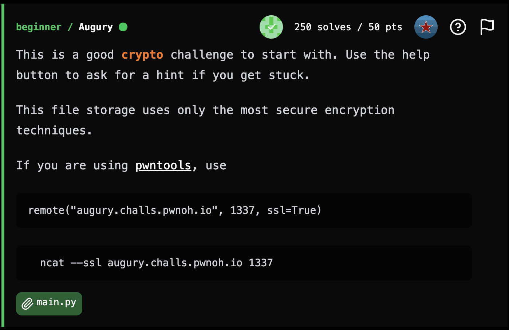
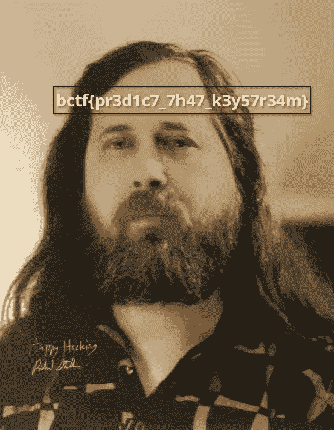

## **Augury**

### **Challenge Information**

<p align="center">
  
</p>

#### **Challenge Files**

[main.py](assets/main.py)
```
import hashlib

stored_data = {}

def generate_keystream(i):
    return (i * 3404970675 + 3553295105) % (2 ** 32)

def upload_file():
    print("Choose a name for your file")
    name = input()
    if name in stored_data:
        print("There is already a file with that name")
        return
    print("Remember that your privacy is our top priority and all stored files are encrypted.")
    print("Choose a password")
    password = input()
    m = hashlib.shake_128()
    m.update(password.encode())
    keystream = int.from_bytes(m.digest(4), byteorder="big")
    print("Now upload the contents of your file in hexadecimal")
    contents = input()
    b = bytearray(bytes.fromhex(contents))
    for i in range(0, len(b), 4):
        key = keystream.to_bytes(4, byteorder="big")
        b[i + 0] ^= key[0]
        if i + 1 >= len(b):
            continue
        b[i + 1] ^= key[1]
        if i + 2 >= len(b):
            continue
        b[i + 2] ^= key[2]
        if i + 3 >= len(b):
            continue
        b[i + 3] ^= key[3]
        keystream = generate_keystream(keystream)
    stored_data[name] = b
    print("Your file has been uploaded and encrypted")


def view_files():
    print("Available files:")
    for i in stored_data.keys():
        print(i)
    print("Choose a file to get")
    name = input()
    if name not in stored_data:
        print("That file is not available")
        return
    print(stored_data[name].hex())

def main():
    print("Welcome to Augury")
    print("The best place for secure storage!")
    while True: 
        print("Please select an option:")
        print("1. Upload File")
        print("2. View Files")
        print("3. Exit")
        choice = input()
        match choice:
            case "1":
                upload_file()
            case "2":
                view_files()
            case "3":
                exit()

main()
```

### **Solution**

#### Interacting with the Server

First, we can connect to the server using netcat. From there, we can press `2` to view the files and notice that there is a file already there, named `secret_pic.png`.

<p align="center">
  
</p>

We can then choose `secret_pic.png`, which gives us a very long hex string. Taking a look at the source code, we can see that this is the ciphertext of the bytes of the secret image, which contains the flag, so we just have to decrypt the image to get the flag.

#### Analyzing the Source Code

From the source code, we can see how the bytes of the image are encrypted. First, the server asks the person that uploads the file for a password, then hashes it with SHAKE128 to get the keystream. Then, the first four bytes of the keystream is xored with the first 4 bytes of the file (the plaintext). After that, the keystream is passed through a `generate_keystream()` function to create a new keystream like so `keystream = (keystream * 3404970675 + 3553295105) % (2 ** 32)`. The new keystream is then xored with the next 4 bytes of the plaintext. This process repeats until every byte of the plaintext is encrypted.

We can first notice that `generate_keystream()` is a completely deterministic function, meaning that the same input would yield the same output every time. That means if we can find the original keystream, we can use the same function to get every byte of the keystream.

After that, we can see that the original keystream was only generated with the first 4 bytes of the hash, meaning we don't even need to know the whole hash, we just need the first 4 bytes.

Lastly, we can see that the original keystream is xored with the first 4 bytes of the plaintext, which means if we can figure out the first 4 bytes of the plaintext, we can xor that with the first 4 bytes of the ciphertext to get the original keystream.

#### The Exploit

Since we know that the file is named `secret_pic.png`, we know that the first 8 bytes of the file are the magic bytes, or `89504e470d0a1a0a`. In fact, since it's a png file we actually know the first 16 bytes, but we only need 4 here.

With that we can solve. First, we perform the xor to get the original keystream. Then, we copy over the encrypting function completely and run it since xor is its own inverse. That gives us the plaintext, which we can then save as a png to view. Our script is:

[solution.py](assets/solution.py)

```
ciphertext = "f51f4509795a9481aba0a43f92a859a5beba6693d20da0807ad21ddac99960029743489ee6e3c5229583460cae586269d0da0a2da78c8833080514e641c66d02670b7a7bc2d8c9d927d052a6d64548eb4238e970f302dbddc995e57a763a5a0bc26d99e488985ece3ec1597ec898fd696109ff07519d837efd400f095bc2d56ef557cfe37765571bca128a8e60de4caf4aeccf15225ce0ba22fef0ef6f9bfad0ac5a8c52f5d64099ad87895acc96fcd680ccbe4d47e666672438f9404b92dcfea389cb85a6ba29a1bb3e318157645bc7a5fed8168cda17c39bfb17f1d0bdf125c7cddddc5108c39b525d6a5aa75a3c4cf74d1eb5086bccbe1061577adce471a9b7284875e60672cd4966f02cf33d81806eaa6c498b0db5ae4f4272904ce2b4e9df30ca72685816bc6bc518c6a361dfacd3f2c7d3eef0b8010eeaf84aa33c767dafe22acfb2b6c05e8f3d99c19de3c22e39c3b49448439463fc462b1f84ad12c5d0f7b394b0a417450cc2e9188ae19e87afb1ae812c39288138c903db36b2ecfdd22f6a458bc661dafb11e86c288c790bccf87651620022c019bc2c3d5c1d11f423d8d92611b58733098a1d1685be522eff0fc7cefa5523c8592de8a04555bbb2980e7550df65e6d37f96ddd3abb9c75f57250281b64a84d3622cbfaaab4c70834ee22a75da1f81fb6ac15ef0dfc2dd733cdc8cb8d4768d10103656e875045dec3e102872e954abb14658f02bb8214e6571abb9dc63a85220cf70b9579923815ee26dfb66ba0af9faf954a20e7a95c827141e2c055bbe460ea2d040b32c373ae29d92b30a9748efddadfc509936a2a769c1ab747968a21133fac5977e274e783e7e3ffb07e53a49b8e70087a9c48f4acbb3864c8be13a181a5e0943fc14d1fdaa9a8f38942d3984820f963b3697bcee643405a4ae03015ea2b5c274ec2f48b92ff46f37ab6710520e515c60212d6fd8cf0683e3bc95c698a7e3ba65bbfd62699b57356ce1061a0f13d20748a41d73c63a6dd9c2ee5946e843260cc8eacf36ea34573e00dcc4bcbd194d8ec1c57a511eb3e9c048a0726e8bc8d029391896cf8e4250618e913e8ef8378e01155224ff43d638ac965bba3bd34fc4f31719fe42add50ffc3be2db31fbf0432d41987f078b345bb2644c5d9ebb213b685a64b0eb945f4854245eb1c16ef2690a4bb4da46c7715e83aa5c8c64766a9dc714d2817f968077e0f2ad21b239296f08537e303920b37f0d8475ba9335f31949b2ec3f7b5e1a480e94d616394837444333b50985daedf6b27f68a934a2d736c32c32a75edb7821d0e50ebedc40076db25a0c713d476ff66d0739d50e08fc0d564bb2bf8d3c165d1be203f8c8ec627f37aa9e1d0385465538eac5b5cb471b323fc6d98b7218777db33eff121a9b536129684272f42da5a0f19911fe0610888945b66fb9555187d3cf5a01a64c9f1101c05a0b36dcf63eb6761c0cc0b31da90f882befd676bf520cb173f892920b0ed6517bc4afb7de3f9aa30d228e5bae786132ca6d41f9192f3e9cc34b414f0ac39fdd9ac4ef9447868550120ad1d6d6a5301114f6b1dc6583051989b3380f970e7f6b6e23626f6365e0d7722b0db7080b971ccee55f220d9773fffa0fff02f0122b7323f3c938eae7b2fb95604050df062e7a02f5b5a7b3091ac0bc645d9de5a30bdc2211a693d6018ede1cdde0fdb3023d53589419e9f39d12cae8b204c9820c11ed4a71316688ee1c0800363572c9bd1d3afbed1f4d28929b9ccba2bf7af591f1004572f1c2ff027eadb41f3c63212f162d8aa51caa090c61466feccbd178d6e36c23f99af7eb2948edca64b110edd55f2be31e98e96b72f6b78126c72813f833340894a12d1b2f85228929e4feb2c6d60c3a8f3f64d2ffaa4eb34c7674f5fce8e86f579a48b586fa1ae45e420015c938fbb76c9cc5e10f141ad456dba60fbd851c2f3c4b7ed3c2e2473c2fa7e325322326bf651905193c552fb9dc2ce04823a28993326994079f44609cf1c00685df711b2ca652a890778772daf1d6ac3c8b3243c4d28bb986a75e46f9be847e4d99c57a3883838420013cc634a488b4343695139bdf35081c39d66eac7a1c88ccf46fbafa79058357e014d4d47b847b2fe34c345accb9358f8eec15c35e2c17434db5901f0cdeae53858dbee85526f931880cc888895b3a236419380f8a56dca54ad54db4b33265610bfc73b6b6ca022e09edb5ac94be9cd3f655d82c83f8f3e6237c48bdda74853110208ca0768fea1ef6fe91d51d4637f9b392ad9a2fb1190cde4f3fe5b10d246ed69a5147aeae103802511d7a891dcda899f9bc8d7734b5f3dc678d1f492c5ac0f547a3f4031a09390fccab79ffbd9c8809da2875aafcb96bb35888abb3ee541b120301588db049afcf57c0664091fc81c7d3d1c54e40d74ceef194d49d739d7a90312f30b1e29e757aeeabd63364476f029d46f5b9bacbfceccb8001c9809bfd072a5c866d02e2813e9dbae8b0462d13877692bf4a002123e21ecaf578563c807b49fe6a8de4c8aa328fa98a48f9ffa1dffa3c1fb24343bc3778c88ec41fe6717627236e862e62d5ef0c40ca5a47defe46541d53968ddf9809927a92fcf74f1d1ba443aa5b71b3af9904cdfc46cccaf63903f0aa79ee13bd4f74349451e53992b54be6eeb794edfb319a0e2e6f2a445cca2fc50488cd4c6bc304dae7f7575ae0236756e2ee68378430609761793103b83c1995e810f545774058f30cdb5b48004dc7cace7258c283804fa1e758355de1b74dcc832d0b5b93f727cfd15da5e76590a9244c9af5702396efdaf06256c0748b39064dc641ba20550047ee7aef6a3bc3b1ac5a21065e1936168bfd0a4da5711121fcef8f1a4e2096fe25633750ade55de5ed3671c569ea4e0d170e2dc9cb450486122347f5d830d03fde85abc5559ee63d7b952a245c9c481aa483306ffdb607b30436b3486f9e62b7329985912f0218f7906d2f536dd27e1eb9d47da2b71c45d19e5f40d35a2a112835533a695049ba61f12c1fab8d0bc9d29a1db46c1a79ef4861dc689fe52ee41be0166275d3966dee313198b61d1e2ea5e3599163911acdd3dfb4e29b3c2b0566a2d38bad62a757bfe97989e1039a23fa7749afab495d851902f85cf6da27119aa564e799e25a7c36fa8cb339d44eeff4393d9eee510e76fe1ee0a679660ee31b88efb01e8412e5535d514205ccf17266cfdb7e19930c5af938aba8e213af8c16bbf01634def02cae681908bbc2c6a5b8b55ab27841c15955775173b6f0ab8822d407514f8db29d3fd8e3fe4d55a94e64557082ff534bcd8d0a74ea3aa3faa01ce60433a1b9d5775f1d17ab86a047a97fcfa607a377a15bfdde7e09c99d1c2df075afe95eb61549985d80b7a32d63abeb61ff073beca9fa901e69d0e7933e70c9b0c573b5cca81655577002a65f5f0c1b22af37c41599d0360fa2030870d82cbb8f3ce15fc05ecfd5bb6a24b56615f10cb98e466946ea16259cd5d50230508c76fcec828809ac5ac0c6936cf487914a49d68e17d9abaa077ae7f081e584fb2a9ecf1f33c9fe0706892cbda41d0abe61208b3d7fb595c56613981cce4173e585b21ba12d6c75ab350df82e087c42b53783671fcc3d6c1af1f680ff2507c68f02f590165a33e5a0f9fc9830447bef1eb871e1ea60dcea0d69dfced46cfd1bb5e7f55222170fe670ce1d9128ca27bb937bfce169c5c6f3e3a9a909eeb7f70711d5929d30123a17a2500bfea4f03243a4c15321814c6edd3ee4ed5acfab0bb3318fbe4b0052887ba1aaeaaac5e6d2df8d64e23adf94d6832d1c362706038be7c2cfc1e035d6f436a64a38644ecb062c90c6dc6f094323ead073387c2389ac9467df1e447da4aafe1f90fc9949c5a2cd459af4684ca370586cbfc05bcff555d2c4fb7bcc5c299e06e67cc78410ffeb414869493cd97f724eef870e1182e42e95ae996070fa7a5cad949e0a96782297066aed0dd531d3364c0965dab61796336b5af944d8af1c87a12d58d501d7b2ca4e8816bd97a95a79479e90f46287f33b11f38da34e2021079ccfa17590983942805b1c76e8520259f1c09e516d68c327386ce0f71425febe74e4be3c79b5364ac9d4f26ab0805bb3d9357406ad70f2184658cf0b2ee53e203b0022da5b8dafe241e406cc9ea2559e67d75667bc3b0f4e600bb908dcead0144cb40a8ca0a374dadde6a4fdaabd60038746084311de3eead1f86cad8cb4ae7972b69c092c981e8f1b4e7267478cff7c027eddac5d3444623f4b139f28065be38e402d6a95d38fb9b9bca84e1b7dfc2e9ab2c9ae12007d1721aeee9ebfc8039e26618c204193cdbd81fdb487cd1cc98ee6ecb5e1740dc7cdf07e8c9a0da779cb8eb74852ee382d4c23c4c100ff43604b6e25614fca5234a0be81c38fe319cc7cab4a7dd32cd5f302914b90e6d17d8b800200f02f84659c6bf45e35f7ee486f48c73f000d95a5a00604d45fcf788bd19108f2eafbab1d31f6cfca1593ab1c78cac71c143e2e3044efb6c9d3b8fcf1e1d491af4101a59d796285812a3fe93271e748524dbf537025d9a9c64ef611475fc74719ef768bcd5672725158caaa483e0121070ab632597f41a1e65f71731a8966aed1c178c6af41d6bff8bae8ed19b6f7d3170d6c048131de32df0a254f7f00d447c68e3296e987c5b89f74bb219f826267f12266acd69d81fd2e137fdc6168505b98cbda07030f2a94a9d97aed56b052665ec22d1f42bd557e1ce03d75a77560b3ad03ad8d2f6d958b8aabe584b06823c1ef44fa154cc6cb4531137bd8b0328d1acf9b3f0fc326e97d23e3333cae9e894c3063126d66993a9145fb2206fa319f11cce082252e62f0c742de131639c5df2f8db420fcc779348ef201d6457fab5fd7a969f3f1d93ee36f765219a05ed3475bf59182a029360b460185ee84098a9774aff71b1f6dc7e9edce8a659f42ed07b1bf21b101770cb2217fb319978c8d1aadd2a293d6c8de0b435ca8630f451084c578b08162aaf0cc7641060726f8cabe8ad9c7482ce22c3f8f82ce56496cb92836eb723821960327a35b5fe0f04728a828fe1d96ba76f113be94531e5d3a331b9c39ecc942456ea0a7e45cc5626c834003aa3c67d1ead13a4a9dfbf9a9abc8ca5840771ca8acaf67f33b12a1bfe523dbf1eda9025e36f0dfd17980fb6cdef6d65095c12d23bc708f199b3247acc680527915f77d9c7862e0277031ce8df96bcb5772962016159706fa4b92969aa35d4851d44ebc56bd03b8e6797c125be554cadd8d0e04add85011d687dd8e73c93c1f1df8170771f955dc23f93b2cba2dc30621b3e608a5a64b0c875421f611fa232253055fb8503d9bffb20958299f9e44559e3ef2713e0a1ab622661211e82ea6dfaa2c4400d15fea757cb4db3bcc9203c35e1f435dc7ec5e9a7bcb2655f1a72a225bc2c7ea0f82b5b4752517ba85021be576187e4fa908763d57ade9dbe7f5cd1d6a6eb522c942da90553b0dbac3ad62de3f5a3850157e45641e2a602f909ab3d175f8eb7882dd5c0202b0a8056735071fced0992550c60e0de6b4ae0e6775ee2ed47fc00eb2406e2ad2a0a2133e26fafc74ab7afa2c6793308a0c530dc39db290130865b9742df955b35390054d5c74933c514f619b08f6aa9cca7d4b5ad3a40327dccfba14a18f84fdcc510da8f45b109bb9cb340ee89a4543ce30b8aef7fbab0c6cc856cd6455d01e72f571561275f793cf28dc95de901024a1dcbc4babef3b55925ea0626911ce03aa8b20a09eec90f4adb532df81e00565191396d028b426e75c8f57cbbf37ac803ede5d3404b1929541fefbdd96db1f1ca73db236f72b222c331884d2091bdefd7e59063c1f95c846d9780ff4c66453d214f66718a47bfc12c5f3468077e00c5d703fe6eaa7bc67da202a366e2d814d908c3384bcce8f1879c48e891401fe70f4f12cd0f058d74aff2eca65e7ea86ee8515022912151a24801c546db019281d110002251f01f1af98565b0984c0dbafcdb14cf1dda437af720888500060f40128671401774d4b83aef7f756f5dcdec521ebedc79ae71eff14ed7b2ecf243a3230fdc4492e3816ce580f76e37f133a58bd902bcd8d136159d567a9eea0f105d04eea4a00af1fb862a8f55ba7412f36d83f381cb1a113793ed7adef60ca39303b289f2b0992ce08802d6dcd4691e156a89ae55ad9c08280097656e18b8b4f127875f9eecf76236e9714f6472bd54f5e088b01cb7589cbaac081411a28d1e6317b7ba0548e820b8c402e260bac2aa9fef88ab719294d190a44112205473bd7a6b853d31b5fa8d70c75097b9b708019bee53ee48f40efbfddd07adcc400e1c94c0bc3b90a285c4e7cc543526b7a23fa4d438271dbf70971ff05025ea079baf6fa02645333ef7b1ec1c09770ab5fa9faa1d4632f3bc7f5dfb1b2f23f0823f84ce27fb8d900367f1c661f81ab48664d58a731e27bd6eded143b5d9913d7d4fd984adf30bfc7ae882047e7fa0a08febc14ccf1479c929288ddb1eb6aaa28f9a46a145def1b434049fe7d500f72b33b4f8b97b1d6f983c8d70c69e664ca3329255f68283346795952b1efa296a0f1b97934cce64c9fc6819a0894e2b0924cdf8550f4c02e88c9b0713e6018b33ee83498877f184f414053276172c760c2584a15ea73af5427014cb33e9c85fbd57c5f858cd0234f056f02b05f678db172a4e02723ab3c609f2625d7e898989a739f47a9a24332407634e4dfca2f536e5ba5007626b65cf004cc8365426ee76029ed477e0abdda91eabe72abc525528dcd4bb0be861e41b76bd07f64b73b04ba504e264119a8728e109f323857cf1feb90dd5b7b5102ee9ea7de4a24f3145cf2056d92604a5c65b4847c4510afa093919519497a777a2e1a229be9349f38c7670d7eee21c146e846ab469c74cfa452dc333cd5e9ebc7d0d2e69fec17c92f2d13e081d58ff1fd6a874aef396a914bca454b82e77a4f1783afe4d5dc2c9e4c7a11d3d49cd681da03e737301440e653b822e4d053c56fab403874cf1886a5f9dbf0aa4ad939b10236adcdda6b495e3ba9626aaee840a554a01e7e1e0e694b1e9f8239fccbda577e0ea01849d862d4d33b9087dd3baef9bbfb11a223460313b88460bac551ed01daa507ca64800498088c93fa9e9103313376b63f79307c7ae643ef894557a4cdb4d61a30e7811a2ffd9f43a8df7acfd4ca95e4f6677aaec537fb2ed1eaf10c691edf386d8f9a695c21caaf46c238dbfd6b6988ad52a8fb9d1d4fc5445dcbe18e9b2e97b6faf28c8cd8018b982c277bbdffa738be8da36cef9a47f52f4c7f84abc7f0196809bfe326df07fb8d6b33e6ed9f60210be76aa11a8a12e96626dfb2d2172ffc12162ade2b09611f197c0466dd62a0f0f40312b323d2ca641a5f7772394554f1bd19a6698c3fa678c02cf0d6cb9800220e61025b71853be061cb62f4cee4bd76691c396b58e77b696eba23397fd7319c599ff6c1bb21553e749c534f156710d8623c323fcf4b75371b3dfeba4b4ebd2fa9d79d2d9caa006241faa342daae924a8dd2b7afcfa5c5aff19ff1f629af91c7501011600ffe17eb4b87bdeca6ce03296758c6ce4cf1354e4455480fa964d3f62f0fdb899a4739aaf17f40a95d4676aafe4608411784a852229c8e275560e161d0dd9f69b6602fe0523ae3a20c72e01afae3109b5de77c2e9c381eec7ab93c0c3571f416326c8e3e1115c1cced35f0fe5d4997b5f6c163f494081b275ada2989e9f4babb5257e23b22eee71ce15b79b5d67a6350dc9b2ce62696537a723be6647732570a8ea072347baff6b6accb0223ac8892223a671e1263b8344cc27fb8e91f8a49946b254e220bcef26e5aa310f65b4c17ed4736aad46eac1e668056d66b3c7b256f632c7f6158495258fad9254d0fee8b2a6e7749d15ec356211e26034ae7a6a709a7d21f95a985ef2f2053a50853685ea73dcb8aa2857c6f43b8f2a423b9201339583e91cd45d40ddf079288b1305f8cf16b27a64fac7f20a1b22ebdfecb11c6ecd36588f679177b9de77d74b978e4003a5b696614b27a3872687c03ae1665d58da241689a24d6cc625d7e476513e688e3b55435b4fb336c1f6a8076e2bc37273d3f0ebe826bc10a615a70f7414b7a9b937846af17182ca9890d233daf03535c3608b48ed9cd67e33412cc72e1905f9e644ca9567a352fad9425205191b2dc03cf95d1965322136829ea6bb3dfc273546f2d906fad75176f0d5139f0dceefd781c84b70a4f3a67eb6216ebd60fbb8b76d18d2a45b6f45383f68863b4c9fec8d13cb9b44afa54dde8b53ff46bb690dcea4abd634d8687861d7d1acf162d588640519e4bcd399d3ab584d5c5b5f96fca8a0ae1ec499b3cd3830c22e6fe3e5d3bf5e9835e3ab0e0e69bb7964c8d64851281fc7a4146aa2a0d1d928c0f8b664bb03ea0ecde5829e1e85ef74f084112f114507711d2b1339589d7ff69ef2c4b8e6dd1b7421fefa4b78b9a012edcaca175d094c90c6590d9881257d25b24a3c4a29ed50ec9ddf20518e9094e87568230fff5e6714858ddbd55595520b0fde273f53dd64690107eccf9cc25740cbd3a8e72624fcda942ae293704080010a275bcf2fec69c0c6b482a49f2240b1a69cfb118276014821375a326d0b2d87f512ce76390ad13f31566ea6aff5bc2023b57e2d5a879d49c10a669a60b7dde29c7608a42ba0aae61787bc580f241fb66402f9ac1d8525c1adc3ddb35c1a265c8fd3a253517c12584cc92cea58039ff5825007914cad88ac448e3ef242f63aa64694d3d84ee97c9a16b363c6ea674639233c818107b1af878dae270527d782fc3045a4b771681db2fd6f43d2099797c0d20850023180e18626dc959f77e7ffde2de493c0510f54ddca6cd692352b5efd9414dc518194ccba9b4932beec7b9ae55ca22afa52487e2f03971514d0eae582e718e1bbb6f7bb9f74427317e5af60591aad759513f0ad993c18e05c476840f3cef3a240fb420edbe283e05bf3cce8f7cf840b1fef2f614f7db07e8b2ab02f702b3d87b50ac4007f26257dd1c2121cbc6c30fc061a59dbf81841412bb9d9635a9914f784c5b1aa72d74413d6e04e7bdb7f7e95ec033aaf329a270247bb1145486b5716ea66e3b177f0e43c3af18eab38bec9587e9cbcd7fdb156476ede62c7f15799c9911f2addabfcac89493b6c6bb8a7ac26b0014b87b6a821eb19b7126e13a4d03d614efa7629dda17aa69a54b09efbe7c6b49514868b4d5365fdbcb9c01e85f9c65fea8c5c37e067eae67c61d001f19aaf01637c198ac0b044c236711a82fe98ffa5f89a7ab7f83952756002d9eed91c780bb31d8866da8e1a25b1ed4300d13cf69fe953ea17bb98a8f7d6f4487d15cc497effa58c0d786ff91fb51135f19cf8c4fc8ba85294ba49f7fd6a33586091a3ed9715de8d75ad0857a288771449bc7dd891577484452ead41a852f784a9cafe2ccae42279228ec1832f63c7cbe57794afb6f3c71a03fd3ae29ec85db58f4c506eac3d89a7da022e996cba89855d0b16a7c704632a3ec1c66ea380c45de64e582bd66f4066080a038b539f4e3dbad9c82948e7f94e5de9f1fcd8c7b23581995c9232a61756c86deffb685b25d3d1ae853e4e47d695fc251d82dfc69135602cbb494d0964fe4d0aae6c28d240abe1f0c603997031b3a34e6843730124ac0e3dcff61b243d87f3b89d5c8e68f1b4e1c01d4c7b62dd8877377cf51ecdf3859f665c6f87e48a6870920fc55241c27567402e578ce9fa094fa016697ea76b4803b8496809ef9800f018317ca371bb081da4064ed373ec03584526fdf79b478c45e8d923ce16152711953aba24174ffa334df935dc4a5a28423ba9ea5f76db36045ec3b24069040c21e8cb93afbd3534f7cf02d94d9e1f27e29ce952b617c9819829e7e742e2ae4e33cf13e55a91d2be8efcf83ae62d9dd0e19ab232790ab8b1bfd5fbe7544e6e8f3c02347b61d54f165a49a67e1c4291b9cb0666d444423a206df63ca3316cde7d6af899a1b083b0e68432dcb0e906c78f6aa03a9219bb11b5ec2618aa34c0834a99042db866754b82a0934c4e64ebaddbdbaada4018eca6c8094203f2e1457506821673db5eee337a53765aef538dd20d55c16388b3e971599ee45af2e67a196a2bcc9751f44584010d9b63f38af439e0d7ecb474bc5f40d26228b78b78b2b1a0efd05fac5c93fb092dcc658787db8f909767ac048040b1d9e8ad7688ffe69c0a5d7acff8a9d4b7b1402ffe7256c2c344fd5e93267869bfc172af8a738723d1fce5862aa16203dc680f66345bff03fd5a500fbbb8318871588ba9d9856328dc0646f8858b4e92b9f00e3e1c62de51c0fc68e26e2e60a6bfd3f095e0eccedea442bea41fb50a21feadb081e8242b547f7d1763ad291d74e8088899fcf849a81877649c35741cb6871321976cd251c5ac80776f4ec31d6be435940bfc9162cc5bc9270577c9d552b9e9012695c38fe3acfd2a7e98081a82e10bfa80fbbbd12f2b2272189d66243c2371cc33f25a2033b4857994a35a6498ce977df27a4c5cc2c20aac208838f64f766ce9da812f1fc8b3e23cdcef637de5ea7d54e7cebfaa1f5cc12823109d25a59be605d2384805a6688a4fd4e8ebf7822491ef40eae80ca2c3968b5a2514bd88d707ec83d85123d85c493406292939b8766473273024e46727df05715111971a6165723e2f8e95e0a1e76eae34d5077082dc53c56fa559dfdd4b460c25ed8b95c763fc544e8aaca07339d40e139b84c65d3f47472cb635d48ce5f966a07b573d22b39cff2192415092e80e460a294e26ed5496e55d05f47546e052218dc6b67b2500bc82988f6262cee280d2391ec92a9c638093a7acf30a4933017227f53b7ed7b83f65e1a927faf5101301cbf537401f38ba6b2c81662d6b6e353f1113768276e42b980775130b3c7bcd3f860ab25879c8172c0b3ac81933808b52b171bb380decf597007872eb63a6cd2ee58c9b1a7f194d3dc291603ce81626fe060626f036211581f8ecccd31c9f7759bfccf1a44f400567b460db53205a64d5601654b90cddca5f73af5d587d4b59227169f88c7172235893286a7d0c307486b5c7d218a95a22bbce4b5493fdf2c7d5c095e3fc9441b2c13bf8011da6b6c27d31c3894da31897aff0a32993fcbd7a87d23abdecbaae5d2663e252d83e6d9f0fab17ebe571017edcdc8300f5fc195d35bb13c97e3a38bd110d41d46f664bce1df68205b0d2744c6a127a5e041957636bfb943264a177dae2fb6b0b04cb07ba7a783981f1b070022f7724ddfa07aa9237a87df27b52481b77dbc62dd980b0069972d3b7ce6e189ebbc32876f1e15b68f3488cbea96ef1a5ffb4cb2a4d8010cf5e6b891ea1b35f5cec0cd480301ec131e389ba4029e45b09b54e49f0e5c9cd53297388a74e7ba4429f3e9571421034b357bf8245e5db8f9a24a305af54b71134b1f4b9610cc7553c022ede4b6c443a5c3eae4a5aab56855d611a064ef2384348e0db5c9e14c1efc0533a2818abf7d9ea7375a6ef50207ec8699fc2972cf2bb9f57ace5f6e9ed126dbc332be3c528601915615253d252218540adce0852db0b8222e08ada7ecd039dcca04aeffe9f616e5ff0afd02acfdb647488d9b3e2da6de0aa1ed5200beac9854ce3a0906d5b2e37c477ebee0f258ca782ce9e7b8114f7690e1fe2f57ba2749c2a709027c78f04554e227cd57375e17f22d3728c6c1bf67da426d6401315635051a2bc2f9c833d22d537279ca7daa63859ae9bab48c4b50f513b754de1949cfd27f59cbee27917b345ddb799992156d5b668eb4870c6ca1bcf4feaa0172048aa98036de6d719a468ef4ed8ccbb62071e0c28c7d1e6a2fb891b0ad10aefb8585492fe07e94dcee7311d10cc6a99b803e199265a8c9cd91e1f3e6295ad0ea9e34d14353d27185ff4e797adc6f629b7024ea60c1269ea25490b61ac70f847a51390c25d6f5d356b6b78bbbe85be14e4f65199bf60c0f7b836260c52d54f41b186b4d56b3e0afabde4db4cb78edc6acdfa773953220d4996bf8a2f89001d6aa33378c7b57ef927d56f5d6ce31e59cb58d5ad966dd56485924ee05422d598e484f39b7b6a0d17b5765cdad037f93d888f98ef45337c3ca0cabba1fff042d45a5c0964ec75285254a35e71b569a739daefb160aba76095c7a24d0ed46860403f9d979d77ba4a4c7a779526d6bef6918f5ee6cf345cc06ab995e2283349684d1f1c2c9d3c156c004960f55ddac63acb5acfe1a932eb1ee35fa5d23ee448eaa6b6d6b5b7bfe60498c7a5f5d9c79233ad2e17dc0b1c13b7777f85e5b2d07419299dab1a2e425e6bd29c59a68b47f0a425688b6c82614c7cffaa5f04c75ab6d9900ac4221709dd10e68bdf5def8dc8800bdc1a4cbc7a425321a213bab24b926b8fe8aff8a2d90aeae28528881312f7cea585d900885e9471ba2689823fb1572cb9b93e429dfad04803013b07802bad11290d03459c095338d63de8589b14c1f6b9cb14cff27635fc34c62901187727aeaf3148ac06930ea76e3994ea2a84e1aa751560a74105a97da9ee7d1d0838d8dced3f845c692eef93505e7273d9a03f779d9dcb477de04a64a9ddf49a10569a282e33f89539bc3426fe9c3c5a3249e3a050eeab256ae0632c59ec49d4313a54e0c6ce192445233dfbff7669730bdcc92aca43ac00e047d65144e271f3b5f0b26c08bcef4e8b94f8885a694545e46a1fbf1a937924913d1b3d37b1b57f04cf66c102a400fbc8baec8e9b41ca7aff2b338ef14aa30811aaa2c616e99c7d1ae31b66f6c8c51351a7b33c0dbfa7f92f3092a3f6129ac53cc324b4a0ca057543acfbbfd6a0c37b08b4da993eb68eb1c297a9be50d90f5da5659bb98a4fcab384daae828adeef0cd2390e5cbcbe1e47c2108cdc473d3b02cd5eb079263c77eb74bf2a462f082a4f16c5ac34cf62fdce16c45a653cd36b7904b75809a7ba961b1cfb83f54feafbc96326a7669cef946dd28f25107527302d5c871f1b154498fe99dc8fffe725f54d69cac2a66e2df447ace259cfcdbb2967e9d5c88b28f0bf67f32c53968cca7c82a885f889e649b106cf5dc37c38b2330754f0ab1676e2b5fde8df3b92b28f4047e5ca4cd472e4bf2cad4d0a6738b48869fc8079e37a87804d8d081ba337df387fa2f7037dc88ca33a54d02ae7ed778823fea80a3e13029956c8d2b424b34177a9502089996f035a4ae428e20965e77394f2fadb0f89a0e7e9167571aad2e6fa42c5fe1612044f1780d923079366e945dd59f08eb9f212935dbd604b33d2d8923f083d3827f7fb7c97eb43c9712045fba51a6a72cef24877c73db49f8cf8c71dcad617e7b2a19e8d51b030298a683427a5d9a7be041066b3fdf96b06c1d49940aa7eda78a7aee83484b3d029c9fb6c0f433df9fa46c00f4fb04f0c0db58c05a582a47dd08317e83202f71c2caac99e67d67fd36b9075dd0048a2759789b92e4a728250e514ed7e9cbcba143f33156bccd4a191a5477e37e0c03320e33bcc9add6d51ef97690697ba02961e6a1e59c3de1cda8cc53c7a5e5238b03d7d43ccf5ee4516bd84965783b6ba427ea5eb0b1168def04c9dad0f47b230118c4984d19a559303c25e0cd5d8ce7790caa62babff4c075e8cceb6cc9cdaaf8b9312b48b3b919e9f5f185fc5798f66ca9c6ab247ca3272465c2ae2702b2b60c9fc5710ecfeecb4281f5e5d9af8f78602873981d9e5e3e3ad35e3cd017b9a60809ac8afa471cf4eaeec6c5298a44b98b58189d1fa19b93bc673cd070596a1739ee3c0207eeff1d59e9202bab685984d487c82fbcf3b961e24770345b5eb32ab49e5ac1f701ad2b4e15fe65330b6ef69c0352be3c2507c07f1c4659191f6b47e4e2aa4e41c4ad126394514a9cd209cc9010762c35a69b0c39103e87b5de7a6848187219d5168ce08f3e78ccaee225fe38ea06a290cf91d93c6a91cc4673b02d0c611633903115c654e7efe998ff7578c54174bbec29836a89a136818b2607b89e3d87f64619a1a5f32e717d7a3c51bf118d4571ae325eac3fb4653077ef88f49d6ba9aa3a095af8e5bf6f0dc6d4fe3a90ade876ace96c3d2e97ee4d92a50327ccf146865707a7a54beaf159f72cb732d5a812340a4fb938beb5e4e02c1b5e7b6c0ba669bb9476969c6a15810ab4420e1948a3a8e567a7d7c94316131a5a0db1f0573e3c441c10eff068489211edb2cdc959e947e859eb70f6858c2eb7bd786bbb2c2bda31ad640a37a4e739d02b8842b361aa717291be793eb0eeafbc5afbca7e9a03edf56d23b1500b47c82770088b67da37a5ec563f149313af54c73eee102dd78dbd30d9f3cb6af1c0f763b0ba4ad228a3a6988980e2c69530a79f4408a0607b1cf00b8c9e797fae36eaed285bee3da821dda8c8090c2afe922f0d4aca998ca37e13b1cb5ca72d8a8dec67f836c9e4761f9ea88c2c79a7f29791d8e83b869138af93ef0eefad14f4f864e9c4e693a39bf7344581a36265a177fb284b8477502305441c6c43c9e6b0c46e99a0ad2b76010fc8a453933cdd97af372912e16e6df95b82ecf95daef751e2c5f8f68ca8ee77578349bf690a0f7746ae0a8abe71f6ff7ef60eba54a6edf7359dcafc9fd638fb46d43f54064d04fe8af7b80b4250fc8f559f6a496ed89d4adad64f8e27ab39fe7816707255068bed94c35b022a780bc1659e776006dd8871be567f2a5dd78d28819d096645378294acc9eca78909584138526cc68e07bdde0b5ec752faa508f89d51c8c0b491e763e0698e55f2aef4415918e3e920361197575dcb98f1270846cea562fc498d2121a34abc751f0001e11f91a90430d97e937ff99a3078aa10a67a0b38df9614c3992048d407c1552826165d2863678559af0effc115d144a5d593a31a3d830e0ef422eb5804d36f5903b1a0e4658815fdeb640ab1f93f40182c9888a90f74cab0ef59ec1fc5ab03be837a078bead6171473feb3aea3385bbb23aea727fb05109758f33a9502eb91dd2d3cba697a7d53a27612b1e698200d549cfdb1703ee09e368881ecd9953f26366ca1b0fd65691c2be35b7ffc7e81491bbb88eff0c0e63610d7aea6800f614a7afa6781ed749d1c24e07d35630bca6af1c558e077da4b7979ad1a865be632c8d1adb57f874f2ce700e4a8f4388047b03354c657d6ebd86372712e62775a0fdef7ceaf2ca3f9c2186f92ed141725f00d9d10bd26c0dc76e936c9fecc9c5e764fcc1540aea6ab8d77c7518f471d30e22162dd58b39436176563c41f8b111c1fbfaeee1ae3e8d2d996afe4e0dc5464a41b13f17f8e226767579ab2e860dbe3e9d2555accf9984a79111b8958d5dc7ad781232ea5dbaf81d76b61f8666a8b13615319ec05917beff0fdbd95f2ce38a5c76a74bcb6ab80b5fd379531ad5ce598c070280b89356ba4095a388c4b981f7c7b5ba062aa239331411dfb1c401853220859458f1bbcadafdd434a79d44cc78ecb5c08d75832371a00facdb9b704cd9d922fc4dfb39510657bd7bf1d4e969144f3ef8096d37912c2d3697fc62dca92bcba4fcab652e5e7a75e045c20513550e5a9bc87c8b9e747ddeb1209610f361d5c30281349f62f0ea87f480fbb28f925f341419aee4a68baf10768f231975809bc59d77a320143cb44c486f8f30257e531b91b5f17929cfd45f82e710e9817d793c6033a595ed2c4e0b4d1c4a77c07b915bf6c6f95227b8a557532a276a7c52d87f9d9e4a98786e4fe902d41f5d3875dbaebfec9cdc4f9b54276b49dbf444219428aa7b890e73e259fb53c1393e1e02072395dc82295c2ff6d41d367a9144ffecc7eba7e3333ba03c83c1a3a83a210bf3bc052ea5c988cbe9d09313417a836070107e20e16f38d8a8dc70f4c5fa251fa232ef8d4126c34c1dec69f1d287ab17fa590a29e90da67b8e05658827c4a768004b7ec2c7a7a1dba7153700f92047545313400b5dd30dbebfb8916ec64e2d9619b590e01885f88e3f0d3057ff4fdf5f2ee08f76a908ca136406f2a5fdc16670ebb554b6320de9dfa502f65ae01d943cfb84092e1e3f2b8cd33805d66fcec4ac669ff248c6a15bc37c3c52917582cfa09895fbdee549e4272561e854ed4f0611c6b4cbd3db9725298cdee2773c4f9cdd7d3813dd89a915bcfd43c5baa641367db44dce9baa4d0d7d3aa22efdcefdcf1a7f6384644514efad1e335f3fcefd92f5c828ce2139f0388388f5d0a8d73577fa41636a3f3edcfbc0f72ce26f7272af3ccc733f438e4f14845894556cc8786e090092ca34c6a7e6b6479cfc3c86aa906bd58e5629810d0a141096e5d6ab759357175be8b3d640d0a057cbcae69183ed9688c84b43a28c936a45f34b1330d97c63f331c2dede5a4b068c546882d185598bea97f823e9d72053c16897d855a83d2d09a9f729784a007f513b54a1f790fcadedb38634f17fe8eb5a87c4259dc98ce3a7738eba87e9dabdcb89db858c774f2df6b2a2198005c17e3dca01153b6f91f8690c4d8515cb0103424f75ab0f755c49d4f3768604d8935814644fea8d4fb38785460fb2c1d10e8c892f5c9a9864970d27a8fc31e7b749a60539f2afef1a7a5e5bfa14c8caa9836e73d1422fbf4e65af6a4eba4619b6c2f811a502263a75c9c6f50530a9f6c12829df8d0aedae0d34da6c60f1ea29c8f5d2e5ec619ecede7339abd0d69fe807ed37f0b99c5db7c5f553decdf886af726c483a1483a79439206deddd375623eefd9f32e0af037f3ff9d82441146168cfb3b4305d410b3e498f9e5178c250cb632381416fc0f9885616787ecc7dc455e0cc0e9883f0bb733cffca45f3aadbe8934e919110378edcf5e2a497c25d7ac8afc0fcb359e324850170cd7c3c232699aa3d44522fad4174b0e691aee8b01eee785f2444e0ad341bab65a30369c67c49dc08dbf5b7aa5abebd166ce460aedf84fd78d3e8af866b397314ccca03afb5b72c8691cf37b10f163b5d66e5e61eadf6c58fafce0daf5e8b13137172e8f4e5e79e133b134e56ee9fea5f9fbb396b249a734a224ca92b7d742b0eeec3c29ed95b4d36ffe1d790e713a8c36c06614a4bfc93229c06d0097b9cf42283a6f2313dccb1a68b33a0aae8cd02248e1f6bef18c4a23b0264834aaba75d7ea53aeb79d6f3ec2753bbbabf00befdf7d9a1b40cbc40e2ab3d3d48574dfcdf65cf558e8eb503238eae8d7bc938fb7fc5f7967e7a25271dd8eca1c7c1b3de6fa44d39e0a9daa074930f172bab14e783b8f1790cb48464bf2f580ca435517589604228b4ae53f80f7c0690cc6ede94aa9722f436bc89ea990d90c049b71e01bdcd3ce4fb1429b0fd548322e18a28783d758bb59405b44a63c7e4a61ce92e516de2d584b9a5c96de930189848f9cb062170d2d8c83f9160a3bfd86ff7d4eb57f12f7b73895714c8f0b9b927a1fd7881e2730152920d9e92ff3c30f207420816578087080fc5131974cbd649c98f7894d185211731f05849f6b36004509fcbcf34c1d6855d09e6fd7111e8a05246812d72faf3bd07a9e938f3e21004b59e08b16f6a417239b72f7ec3950e36b7c05d7b35db7a09f8f70e9717780043e5488924520e2889e9fab0fcf0a9b8d5c36ff87d6aa280a95cea9956306fba8f14afd340af5c8679e73111e66f1d7d15d02e1812480b9f4f213ef453019dd02d76b409a91b5c078466c016c2ef1704c78a3a2d3b13fba3640317b057049fa2a97d3850385f61edd26186548c2b051b4101733c7413219d379a867df5fdced2ee50b467ec8ae14639631d4b7acdaeb4d9bfa0bc7a722d361c9dfa0de3f8a8ffc1a832989730ef71ce7655590b2121db8532f2b20b068fe6cd8b4738b1348959a2ff3065fe3735b5d66fc3a3f820318e588d67ffe7fea855b5f8e9150accaa26e650863541145f0bd0c751e1ae0df744cc56e767f0dec68f59625c4a14ab293bc83c927db3d6ca55fd17ea9aebe28aafbe60b5334d45964fb1af862a50edc64047aae854b3f5c2ba1b81ce634d8174a3b27cf08fdf9e132d312ad3c308731104f8a9d0f970a8ed76a536b2393c4ba3e6c25732a2a2ab68cd12841cbd543b9f5c306a961a71eb1d0a6da398bbb5e4a6cb42f16540b29695b6c367fd24a5f706b855d3b7a2ce73b48db327662adb45b3190277f42fd8810c8ac05147282a9d611562bcb6b119ec99ed3d140c34ffd8945e7ca8e8b9c4a4082fa581267b3d43ff4de915290be9dd5ede7710f6454783219362c2c62e15625e3ad4550569c4972364b833f442e3a88188217a8123d35d381a50a713e18902ade49bf96416460400ec87e5332c3e767c8fb214be4481439da8f129782037b823e3f63f2fe778e4598049a14aa4417021e807be1e3a4d082741428b613a8c31c68edc73a39e6a67164e2144565d1c00b3c7401844e6bd1a48e1f3c934c22fa9c0b60a58db63d2cca6f7799c9bcad49957f07abe6738e1cd19f0e4e11513a747aa6d7c17b31d21de3e72ad851a7c03b1791b171b69e8dea3d76e637ce8d603fe4c3c99a32d75e9ae8772deee9a1dab65a2aa5962e285a3d6c7665507b76f847bf48493b849324b4f9881ae5b8e021b2b126887dcbb11696e8acbf655ecc7d8625be976566131d42ee6b0a8d28b213006ca07a541ffc93988bc00bd18feb9a3832c91f2b021ba4eebe5a476d77ac7b63e351355b72dde35503cd0ecbf1e55c4d9e0275eb1c2421ddbf16739db1a2e6fb22541b8173e091d934084923fb8d305f09949bc1d9ffdc69dcef76114173e50d50f16f5f6f405cf264b64731bf683c9df1c330133e9dd501195208c444a046c44977eb57916b9d586ab60939a4d0d08c6d38cc80d8c0e1a7116c94c5ae703387cb38533a7e61f3649bc42963dddd461d2901e67ce0fc4f4c19dd06fdc2d986d2c680f4836dacbc087bc8818cf3924bec70b0c15f2d47b3e2337132709f78808cde5eb3324da4d36c105a7f026c4b743c5f08798725800fa6badd96c9b6183f073bab521f484e21c810b54b42a5d371a226d961f761201b4530b21a975d42ded01b362a690018bdd185c4d63a2a301d273f6486774bdce68ee0157bd7f3e84d71778fa0a2ccf2e323931fe047ad662804168087cb45eff9eee9dd208353e6a9f71517f6f81e1ec1f125f85a919252f50a2318c67811e7a2efd87fe73425936d93aea7787b88036f360fabcda230fd65b7724a442208d6a25519bdd5527f79f48b4eb0ef5db800ef9d4a3602ca4cc0beed3756c47d6d9ee4843dff73a4de35a32a05285d069c0231fbdeead43afb7bc3ea645390580ffc2d4f29de72d3750ff1babe09e10205dbc4f25048b142d3f99d2d9ef8d3598fd7fb36fc3cb9a736230a8b1d417eb6f55f1425cd979f666a53b6533c1f7943ad53fcdc5f5b1492207bb0ca4da1749140ce88ebd8b20348e2ebe7ac2bb2d0b359073e54136770f39abfe26a39fc2b5ae8292049ba594ec0cad218a3a0f8d815298133bef213b6542d4475ede512bd36aaaeb72826f14b7483bc3c30c65ce8ae6134ee8c22529535dd790c598f574769d7497c42a7557046a0ebc4fd00ffe46b8a3b275aea80d81a2e534dbf24c280276d02f0a7446b619f3632c774ef619e72ffc24d7a6a510b6ccadf43fd263a51de8ab76438c3974753e068f27bd8e1877c8079e91d67b03de7674610960099b49b8f3815a667829a838d26c63b8a8cedd19af9662145c636c37e773fb1d59f0378906e80b3db7e5f88d61ff70586021dd1dae65cc81e1880d3906cc10caa82fd6fe6b7f2782b3e3d4dec5bd41510296f2d3a47ecf6a3a5e4d66eddd878f63aa66a6cf4e4b4dce18320a2cae1a93638857466ad4edf20a7795a4f4f1f269b34514e90d67b8809b27bd6bc0cc3d71ce76145153948190d0f0c9d5024c11e6cfa2c0395ee00ab2e73e213b836ba24bfa20fa32234ba222de18125be1734d383ce206d5ccc1dfa4bb75687b2beac0250bb74e6fc1e43331beb8ff18e4ba97804bd035fcf7c00bb9cbe913cccf2314b2136341b6f3207c66b8247ebcd1be480b9c17d1fd422cf1540603a0460a8699c3823a30ed74d97e55a27d3222cb8536b939a65b147abcee4817c90d1c8928c2e7ae7c317971efe8627f08d09c88d915a9a1d1b7dd620780105a9604610328ede1f59e3f640b514b3d589d21f035ae642b01f25e687c2d7ef7625988b3adb0d3eb8129f6288bc165ac870c63cd55b63c244c68e77122e085ff9057c912f1ab1a23c924142ea32683f4121cc9f3f5584067e8228563bdd7b7c566cd74083631dfabcdfa368e582baffd702534511549cd3e2e914d6b2bc1f50af9f6d9642a2b5658c3e1d0053017b90ccf732a90804e54289fbbfea541485d95bb1af38ff7e22405221887e796e685da46edf3499c31a7f7725738ba00671e06083b3ef366087a5245e6de8e61888f921169f58ce93018becd5f8c21ac1d8368df802c0f21763fa20b31ce03a921f3e4a9034a9dce562bbf830b7ab71a4db65a6a138d8d7948481f5f384377861ff0d4d7af610ab72800544d70ff6b39af9ee0ae413ae106d3e88e7be2bb72d341a159f84dcf09c4923f545bf3bacd78ebae190072631d376536666fa01e2ea115a4876e61a25c5e8ed778a44f9bc6865ec6bdf76173fe253ee770ae6c4b9b735512e46da9ddbc3542340d1a61a577c53aef9375aacff807c390f4794d1ff1dd3e369bb69154b36ef003d2c2f96361803e82301c7cc920f219b21f8a6d407822732175d7133cebf6f3e86356d3abbaaaada30651beac37c7a8ffcb5f44b88c2c018a5437f1aa32fbc86138f874d88bbf5e9a1168d325f704902db7042499dd634cfbdf7b18ba5694e61823d1f6c9273ca809454b699fd39f57a7c377599e45f473edc49dd8d84ccb0297957cce6bee099c40049aab39edaca27a97d16b206be12683d50de8b6cec5e04f8ffb6d8660b423ea487fa7182948ff97efdf8173a06aacfe19525985b70b89644d2f435b10dbb3daeaa319c9b4eb7263b1a08b22a569364d49ccc5d08364f17eaf72b125a99f5e96b2ffc1ab6c0414b1cd7a5bd0b83aa1305b6ce8faf17a52443587b497f05db522a9ff7c4ce06a53caec8f0c772d77cb6c10a79ea4588bd4bff6302a938c2e61d3cb80144c26aa951d5c0e63bb12f1cd45a496b38093f162475e0e95515f943594b1f50837a0ed699c8b159838e6a733c39637162c0862dd07a707158c3dedd3ecc8b138fa1c84886c5eba7d66c28f516ddf9e376a18537c22ade4d37c45deece76e07920d5cb51c8d056e90fcee88a11d7abdd788293e4d0d82d4930858145c293319cb0e2fcc1369f7ea73879e40eddcb6049b3a3dc65b585697e1baab33f36b459f2af78d6498fc74e64153e7d15d1de830c1a44bd9222f65530ff1c4e11e1c85528daf53bb313292e7d3b5e028f9c91c487b53391ad04cfede7ab78c555ecd6f5faef7c687259c35e57d545f435b29492f8a8f501e80c99df1b14778b50592e533ba9ad2f3c4284ae1c4ffb0f6120c5ea792e8828c682d5b3bc0d69f968fbddb63d947fbf8c3c1a20c8d6c121682621a0809381efb22a2a9fc85a36d1d1c81a855c465d8f947e41c86d1f55985e900e99fef44e205af00fd5c1410a4ff03215dbad6b638e943454fdee772757f555f0b8e01e961f6169f59b6b8ba17e9008303a61a572502fc289397391ce9dc1f1f1a4ea6fdc920e74bfacdc1c3a663ed0040033e8c2e29244e2778bac14cce5e7f4af29412df272b5af142d5961a28f2f7270ffa99d2346eabdd610b9a21b219aeadeface6bb5a439a42af7065eb3fc8f13df1f3fa73697737e0abcc5cfeae5996df32addd66767ef1a128893fe48dc9582c0e49374680fd4cc3b35ab21c22608001ce8a0d7a55da6179c4610b11cc50e23e81f8cb152b6e0b56242d5f589482e8c1dbd042afceb57a69ec755ba3853c5e1621fd1cd2af8ff2467a76fa8c89fbcb2441b9df03259d5c12b61afb02428d775fc475f37d9ea69d2a63a12e847a13e045d31335cf53452e58cd7eb4c41c87dbc439e4781c60504fc1993bbc07d2da72737e985ea5ff296d9f06bf6c0714398b96539249d2eea4b5f22cde85215d2448cd2a1e3fb89fc4e03c042f34bb3d76429cdbe3b07d5ac5a82f21d7f87fd2bd50e5c409c66e2ac901acd3726e7b89a4f82b16a75663c8302f294317261d5c130beca846818d61f16b4ab8c7820aec2016f74909f19eedd79d964202e8a8f36577a96ee3ceda828e951f9f899ef5e345a557dbe4fa5363c5c8fe08190e01a65af0376b5f8ebdef232ab077a96c8be6593c94300a93d8f665d6577c3ad2aa91dc559318207b9490e2fd41fbb07ee2ceced37b50757b3e197accb0ea779f658ccebf63a8a267cca27c4b884c46b1ba8711b92deeaa1929582e093acae2fa75b1066f34b5fe166f410f249cd03c9d0281fe1f1d758c60b91cc4d197857d834d27f84b0b2c2800f9384167a6cb02caa792ed80378b9721581ef01f5ea3fa7983af9301903d8ea205cd6032a9f99f2358b46c8e88320db4c408b0e1239100e0d8b90c4cdf91a42fffe77f59aa4132076419525d5d0deec79671218f3d4bb287629eb5521eeae8fde145df5b9b601b30f957eb443289a96e8f27d19e9872a695dbd6f71485f8a35ee1c797ab6dca8675edd60a40adac942196d52316e835a2986f4820d00dc3afca137a500d5173528de0e7186490357e3d042d682c4d3ace38867cfcc5994215d3043db9a09f273969b1968fa3bcdd232391b7434d6f097ead01a54e9f2be6805397c4f827207c5a0295afeb09efaace15aba36b258d5b67e8be0da5bfea3904a6d934bc8056716a4f47994c302294cbdfa1a87bacb9740a70dd80802e8aa93332b2cd8aac2cedc1e63a9b08f5ae5acb74d9b7bd26063b9915f0f26171df886dd7b0f6725d6c7c15711d2533561b6ed3825404a61c5250fb1424d75b4ff8f33f99e7685352e6c0988557a0415db25aaeff5be6619d401a8d894989df4b9d040b26edb2a90340716116c1b2f1c1f37d454f96605721e3f7b5405e60f68b89762b96fe5559f2d5f016f212da8f437ab8967ba570deae831d7338700baf15b9b76bad3f6cd8582c6172decd94960c834f7efd22cec97396cb4a61a42557a6d6890ca9929a9ed384ef02c9fa970ba6c8536661c8f444d679916cb5d6886ab9a9d0b7f787ffd6db1e51f6877cdfa7306f8a36e554aba3b73a5897195dac937acd0e4adf1c21214b1e6cb898315d2e11bfe945f3deb5862dc48d2449d0e3c6f1273cdd558d89b0e31a012fa971c322545151c76ed5725f14ee412c5231d78b7d324e1dee9e9af6db27389bac07d196421e9c2c88c7fe3c799fcb533c545d6eabb9a8db813a45b2f2facb02421a5ff1ad16949dee9e5dbfb07a410a420641eab97befd4ae0b49a893758bfb4699d88d9ef218759c26ecc10af90ab51008a5f9ca6a83bce4d1a7a39ef9cac99b0b39ba899f82cf1c36eb0a5003b8c62533aff02dc77d537b075541c1347b1830a0c3a8094017eadefc06231bc70db99ed055cfc962c0e8371bf550ef608edc00d3209a6b40b5420f78d160d023a61eeeaaf127a1a1557ebed23a07a9e649df69e57bd1563931addb6e61e2ac5ecb0ef41910cab54d9bc115a590a61194cd009b5c3ed7b66e052d7a7d74c00649fe8d53a6bf1a3ff7b8035925aa4f2169c476a67626f9e2b7d80a2794e7fdb5a46802ee111e878e98202a81f935a5106c0152e302a6f7e49cbfbfd05c186b0961a7c07817ff6ecc028a00b5d8adab9497ed959643ac80dda330894486fc9a1e02bac93ac62e6a1d0de49b85fb39076a07f54007fff3041ee1a02dcf1d6035923830dc20f76eff03597a83c8679f00ac47607720eea41d573bbfa7aba24c60436e5a1e28689916f997aa4b74129f666e80f7a865b3944fee2f7bf8d0618e4e6567d01e1249d415f7af60a649d961fb4f24e856a7c266715fe81bafb33b45c823e6b14bf515968b4603e549b2c22ed51e03cd36fa26abbeb6b4168668ed6ed010ee27a8d182e9ae8c50d8caffdee09fdd525002161b2cef3685c019dd16255b3a74333a1aa106c17b89f83fa070a80dbd7f61cb46af023c29a29ce6edbb2ff9186ff2a149a232c062123aaa46d170e71bfe15586a218c102a3443116e484a2fd69e1420c3691521c8f53a60bf596bdc0b8ed87447bdaf8a0ee127e6b08953e142646151294713c7404e11929b21afc64960616bb7cd86ba63e3dcfbff66f39e0d179bbd80da7d387bad200c202b28b7774ebc9c7107591c0409159b6277487068dc1fec9ac5238b3bc6380311cca1efc86c7f48d47710ba547e35cedef8524964f67055a4ee2fd7f335650c6338bfb2d37c7d6e5605f0342345a4685516a3f46b12c3a74ab19e560f89f7ec1d572c9692bb5913af31d5f64a296502874a794afa56277556c474352a6ef4eef35c46b3995cc994efcdb3de3a1640b41410e5c3903914c40bc495474292f3edcdc1c19e3e07a41172fae267c5e76c8856d1b6dc2e03ab3d559fdae941f0d7f648d1d6efe9145d297a47205f49decea072cf499d9b722192d4c0228e4360c5b6afb1a767f4278233b8c1ea75dfda42cad75a9ddff5db2d98ba6d07470130bfd7d412c0aa2d10f532fd5d65747994f97ca607a8385c3cba6ccd018871f78ace9c12677264a7835f757a3c45726cefe8713707a2e47d3777700816db40a446783d09ce83269c06bdc048434432c6dc3f55fba7904b4126f202a58dca5746daf3428830a975ccd980da2d6861efbcc5eb88f3af8503d01051d1a23c69f2f68ce0b199ca0252f45d27d47b671b284f5120b8eb57be484953c427c80e1e2586be21ce8167d43dbaf8c43988a6f98e35b3e24508f8b1b6e1ada8b248b9076584179d9a137ac14b4b1d5abd60fdd8577017016e9fd72081fe9a93c8fd4075aae3491e444319124dcea4de467df2f3c78012cf5b09d2aa2901b76df9d59232c279f8f4ffcc6cd09c24b130c41da7e31b6b8c4ac0b2114f5f161821d0cd36a7c2e92057c565863938ec5cfeca4dba1f2c4ec0a4a37bb6b73b9147f96f2b5951254cb18bdbaa10ddfd6ef55174e5d5d0188c504616e5a530f8165b79df451df2f0d8d73b69565899cc6fda9a10448215e3ebe4da5fd011672fa27216e07f89208f23cdbce84f7bd2b7d6dbb4c831b4c21682358d5490dff2e3d8d274e61a0ca7429316f6d2a514baadf22c62b8dd1644bce78ce6a1be25cfc91c24ac086c7e30d086d8e1b621b631c4a337d266007018bf865bdc0d6ee86a79cbffdf2f6adcf7b6975ecdfa78f828f9afc4ef6c0a2f456235a634e7b09818afbf86885eee5e0fe197bb5ce065e9c988e4809eacbb858a4e59b41096cfcfdea5f65a78c9277a90a6a9122c046bdfa896fc66ca87e051a92a20ed7f5fc776f474c8478ad069c3ce38fadeffb81f05b0fe62801fda52306a96e266eac8162aadfd0d06f5d81e8c8c04da1d13f3999a9bf0ecad5300d798ce8b86c6ebdb1e19ae99e30f0df9dfe49d58e7801e7eb38f6c7085d1ce3d50adac9da35e5ad47a06d6c961e439ba39f01ec3a5f0a3f2a6d81f161313a7076606e085ca45aeaad48062e6f08667204e833747b0580b0509127f00010daed583d1039e79b2a58704705a93af73d192ad66d0e4ce5e1b2db4d23294fca16fea040680853b2d39a64fbd7bfc3d8ccc3e771dc41938c66ba3e00e0762e52b28ae6dcde91e78fbced919f27c2e169953e0102abe67b0f4ff7acb163c036de793f639a9bb956e915753408c43c172577423ca3b422d24fe9b8c5a7a596a52500ddd440ae9e471881d84b16b1d8f5da3d56e4b32cbd1cff90919895366e87691f4f14a737a504c095c33fdaddd39cc84f4b0b1ad9aed2198824f0a9e6fee7b441c759168cf70d7d4cdbb5500ead942b3f55ef634a1c92ad081860020429958dd86243a40b7cd821ab0a1c0d73dba9bf03a8f4706227d52cdd626a34473fbf42cce795ef3fc5a6707292f82544e6f485f529c017506d47a66ab8f0df77a41993a7c43c6e8eecbf2600c9f1690e77dcda896916ad21a518345fbf48a9c3cc81a025a52e976bc706bd2898e8588c6e7bc1db5ebbfd192882f820cdd99d8def0892a918dfbfe63477e3adf86e6c9fff87355bbb2e15a968114205602748ba9ea48174ae4f07d2e399dca25fd409d3b33a672f0ed8c352e9c7e11b41e33c4e6ef09d1377125cc5aad026b3273763fc1eb79a08714107d202c7986465ab829bd1a5196df2b60fa1bc3a02dcffbe8a2c4face2b825253b64e0a60cc2e47a504d99c8a194120a73c6aea1ea44ced5c35162f4afcff8773bc8d2004f1adac1b77a0efcbd36142f2f1446d90aab4bb7d599f82a7b467aeff1c098c3981e939b416dd20bec5198e9261a1fa26265dbef9bda87a3f8e64555120f88dcd16daa200c84aa10db6522ff09c218c08982c49bce1f328a65ffb6af5de30e4d7bbe2b3c66e322f892c34f69195b37ab4dbc7876e395a32b32dece08486dae75359e3854a46828be6d208c3e82a7c6909a9659e0046bff04eacb530fa0f879995547b5cbff52c0d4db1e8742d050ae0c4857ee0ae9de8f3f239f6439de882336b5869df1bb7ef51de17a3607c35993497e5d63c8987d3e4885f63eecf95066d0f8034170d44c54376e9f732c8a9da2a080163b5454e15111081fed6ca2e44e9811f9f87f4fe4e26d5c6c7e4e015ae5bd5a75f9d2b4930694c024e90e0e02088209cb6d339285247d48ac9e6a723a2c56bd6fe5239318d858bf9c1ba41555817c15170d98ffaf3c90f42f69ab21d51f30a75d97b7c0ec0e96b396cd1382d07ac0dc31884715346a7371098ac354d81a79cc6a195332c2c9d3825d066e4379f13c9341f39d17fdfdfcf56cbce2b5997893bbcea001a703f816b0a381280afe5979c3d630eeb488cf0ed1bb13aef4b22587e1555bc370adabc28f19f476c33eb2aeec60921c1665588673aa7c649f70d12c5ede18362c1a8913b6ddddb0d6997b541d458a620a106a59e62d82d0f082ec19b1cc084d5b528f9343353fea79a353891d7eccd1cfd1f413129857efa22ac47e36f5ea24e2be07594d1e94acdfdae1929b9d83008c384ece6be874204801204725f0e5f54f3061d29fbb317e0e88790dcd221be70766d88aa1d551f62f0c2145a947656df0c524e0b05e464c0bdd068e3fea646aee71c5cd6326d98944d754e5fd67b304c85af3d0bf9f39c9ebb04099e5f48118bcfec70f88d7037ba9680e345efc5709c095f395347bbd67c35f4dd141a16796a914758dea9fb829de02aeebc6d845e1d13ea7f0fb38052979176d66cc5085f1d0cd1f5e8b7e870f2c32b96b312df792ea8e5cc0cd65f2ee28b75655075b199eae6e108e856cc0f247f7ba0b8f504df73abdd9f3def442127ebb3a6d079cb36c3fdf117488de16cedf55a84b74491adb7e1fcd28f10179c4c6c3bb677f84c2b514decf5a8ebd5c82187bb3bbda76dc3e32d384a9b12696ac0688e5b17235314e83cda92a76db5283115578b79ccfdb0531c47e026282ed967eea947578b57d868e800e937f3aa4c2e01aeea09952b3536b9c5b0a59c56faaddc3df72ae1f970592d06bdf1bfa3a808ee04aea5ef7e5073df87439b11234f06f97eebec92b8f7b6ff28fb7f6637527de4a78a31da65192dfe06f2bd1f58561a5ecf57a9a2e51de39b341dbf152cd575318fff2cc9071ff2efea1c397234120e37f7b95fcf94ee7dcb9b4dc489b82327c89a3148a53d950e2c6e6f550fb788b95815a30aff01a5b31ffdc512842fafce341c88da26336d434793dfb08ff2b421daaff18274fd372e797e4c2027cddf7ed98b91bdb1e9254922a1a34f1a434658c98597fd30268f530d3b58dfd7c1ad043dd9291b5ee56f1fcbdefe86b1334936d99aa54e35d287b757a2396989dd16c0fa425398ff1936fd4a65c77f71cdfbeac6a190339beda1889618a600b8269be63c81109eb544683b9f32a91145cfc4ffeb05349d5ec17be99707c9ced131cdf29d9904bc9ebd0321ddafc2dc66073a05fcdce425911d6fd786bb20b9796f67e784a8ba5b65b754f63b998e87c070a46d59265a673135fca30bcfd9b16e1e9e102b92d9b8b31cacb46c844e5d63e6a9cc37e5f9ce4c14367a6f6f0c9598647c192a7ba9cbbd7c4c30cc2215655e656f8ac161c8ce9aec806965f1e86dba0bb6b91584230cc0b49286ba002600231edf77b4740af1bbd5e328bf71a2def5b68832273a21b1762f293af61532568c6fc084110c0789b31839ed7df0f011b7a0e0bdf2e45db87e2b427b6bd3709cb99e328fabce8f382278cf868765a592c17cc79afdb9ef98eb8e963d2cbb9362d969b655f8435695ba56b92b81152f5e13270cbe5f7bbe041b83a56f3ec9d1e2f3d01c41dfa589811555ad5362f2412768faac29f20e05d5c0d944164e1c570349ed2dd40cfd7098353ac7562f5af527a85aa537ce8a64a98cd0e20624f345758d8da24ea74fa5e52de7f5621a5dcef5a707e40c21e03ce233bc325a1a8e35e1f8e0c8d5e3ba91b5f5979ed4ddf8cf0b23c33e6a5635be5bdbc4704fe58921d01ee57e339ba704b7323672c4e5f3318956de5570095a271f4e34e128512e83488c9a3a27c31d48f137445e13548f0f42f5aab2172bcbe1e4df553535ac00497f71068bc1247a4d8ec0ccaa89c47e5436a4f42bd7ba3bb134cb3f1f52c2403ad23bd9cc9314e51e705bfebae475d1f141207b659f784ef5c9823f4d3dd098756df3626b2a3311006894067bbb3e5e9a9b29d928511cef5f90cbaae4a38071f85d3f73d5e0ac2cff4006bf6b09cc03db53fe96d2861b8356a55839d82f1bf7eb458a55cf44afdd44727a411ca330afb8d109c1d0f894395a3314b183f0aa1af4d45fb3bb7d0dbb2dc74e0ab130c37e03a0714b84511d38d3f99df27d2e95d4865c914b827db408fb30216cf5c7010673c691179a4fbf185b9879871cab8619e5576ba47c204e0b3adfde3bc6239471b42861d0025708d505c261203ece7e8885e7105e03da0f1b1c9a06959004d9a9e292d0a319b80f8aa9f6aa50fb9c15d2f87789dcdf9b2aa50d54cee0a609ec0a956828b6c214133266bb916c8ed4af8ca6d366a6b3f5cdc2ce819b25c29daafcc2d6ebabdb7572987e2b4f7ebe42ebfb0aa10d2f841ede0f98f44e37ac451d7f190341dfe26ef8615cbb3772e5bb95564c497aa202e519dcf1a9255ddfad5773d50f192f18bfc5c20fac908576b5ce9894960e7d2b1e8165921c7f4a7536ddba9948a4b9fede5608ab3205c122cac38e17bcca5103bf80037550c4cd3d909ca15a859c9330a9121be437866623a4f5fdfa909be983733453dc3e66fc722be543ed54820d27233163f9e9ecbf4e4aed365d8c1d5212c5f801c99a0c70361c0b2e3b98a448a475d681f362e1a9a317da0f18a71333d8707b284f48c5017f35a76a854a74bb44db4a7245b9124e2c3c4163f3fb8fc44bc3d5b4ac5e5ca56b10674a078ce6100f997c43d78f5449c569e697cb07f356055da3f5d0c2fd333a33748cd494d1963e08587c72546a1f4c94dda1a6939131fc21b5228641fb3cf384ff7f7e182a2e4a34e2f65f3ccf41c079a5d830afaf11aa17495bfc220fa1439423051937ad43eb8f9da8edcd14641985bc931c3e69ad886f85ea07a62502c855508edff273e7029b8d1e2b36783b6f87103546ca13ab3630bad65a59ee6f2cc45e326d853797695ae7598b887a01794d70d42ad84afe735149decae3b9527347e4bb523c6f6f019534e4b27911d93a907d382fc8304be3334e121a7cff0d9427ef317dea77056eeb11109b3ab650b2d3e8bf6017f64421c6755aec58ac5289a3b1a34b276d661356b427d97ee055c24614a51f2b48b9fdaecfcae5b8a639479b9564d92af26eca4231755e67796f9f0e58e4a777293572e2d794ab451936d2af8278483be43d82f1ac225095f55f57b0c872ca3df715548e3fcfb8ebd87e765304e2b958c2a9341411b1d5264d1939faee48d33a8a70640495bf320f2780cb7626643c5598cbb93a35996c58ad657417a252be74d10a419ef01d2a56927fd3a9ff684a976ee5ddf737170bbf9beca48c22aa0c64c43963ce26c5ba59e9282f4bc89809039c7cf10488559ff20f4c3be0be7f74ebe6de1ab8bdd5e28b583b9af0f5cc9d77dab9b8a50437700582405085ed328679c2daaac82341cc7437219721b3e503a9cfd6bed0bcf33421b728491e1be702cca0b5c0b385ac0f1c549728377b96da2e7914c9be8386e213b3b4d24d70a9b1aa97989f2491e0c26041bc392eb79fb46ccc51624aa52ce47f1594cfbef2bd718f784297580e7dca2fa4699e4bf711d1200262e8fad2b0dac8519cf9a817e54090b273a1797a45b6f464796e68e80b195d408c6e7321ede9aac1399aa5366015f2064c1b91b271c553fe79c38f52ef75175c3e302759e1651faa660e4f9c32f199576c8e9b9c193a790bed00658b8796f241101b474e3919485bb2159db934a6d0722d2cfac4edd0f874e0db7f597ae97d5be952d8a405cb2360a4b644d2335ecb2a781f72d555744700ac102864d722bd18ea4e43767715d1c52c2d6544cdc71223448e3213a42a0f45a746a835a4c56623a3f01b9eed105455cfce401b1864a93ed6d2e85b164fa4b988e2b4b0c3e1591288f957f54fdc0a7971d363355f7af2ab5c113d1c22dc85e74244b6c47fb48e47e1aaf3144582a8e1489b786b5de320104d8bbc3dd425abcacb4028bf678e5a44bc78241d3c8e1c72b9fada601f079c7aca231e8396907c03d4f617f638e17ce5efb90705d001ad34c7d719355e4afab2b8f5fec87046c6a1ade62e8d45153aa38d2bdb3a03fb7c25c0427e4c8c6bf32e88dbd8c2bc51864d70715fe324616546e6c44501c4e6676de982aa1ef1b84723498a021f88214f61858f60534cba4396038a267f4a4751b08f0c887feac88c43af8d3ff3d4cee370b1f0286c2fe06a0053539cb9742fd4d0cf349fc656ecbed70e4c35d20b92f8667f478f7797e04991edc2d6e5448d0f7e1e934942b1854e9e29b9d6a94f7a75179c3db47248de9bbb9263eba56017d4bd91190e7a880c9219d8afb8e2b1358c7293686e26ab36b84fbd06ee068ad6c553d4dd0d18bb6ea537e31fc53f38b28e1fae9f488e7a85001e64c5e75df166d46f6b12acbc0e63ceb583b9e0227841a47e447edfc16c34466315a959c958d20042bb932d6eaefb4b008c3a8b480bb093869c94e523a284183816dd9faf2e669c576535fd41ae4a45b53892c06243303958a1f33bf4090b41547ad1cb5f43e8da98a5f602ea12105c38be53dfd71b2cd1a99b4c56713926dca926733d930f6f4da4e10eac1fb822a94a63fde28f48699ad84195c6a46d3fbb207ec5308efc05705ad4fbfb9aa3ec6d961526c549e9d95fd7edbefe10fff82f6e94ec3691b9e8200061197d24f33216ed58c8bde879fcad9592eb3291ce1e02cdf1e930f915372412e0ac4289ffc5cf9c0c7cb08da901b86ec2b169f65be0dd657e9db73371d2c9a44ab88c04f628484af2d9d2983c62e9c3b04bce0f7916cd220d0fb41fc854e3d6dfe96515ef78ac1b55c107e45e4fe53acce5bdad3a3b827436b4080e721182c23c1fa6f607ebd4817db55dea4f49871bdea274adf35c2cfbcedf3f9fac5bfff19d2260098ea3ed264f78ec614d5e56864521cb78cba1931d4a3cd1cac07c02234fc583a6aa309546d37b4ca426233e36a97f0441e7c7e1dde89a175320acc8384b85caafde809c23f04537336cda64d2af9af01b68133e5dd44ea072ded6b096f593d600bcf9fed1c2f469a1434e40ba78836470a874d9da6cdb5a620ec5db990d4ade6d77ac85a8af3622ece2cc61b408dcb04cde31df93d0c436d732f216efa3ea483861269abf4a7c84a6f4948e41645d74e99609efa5f2aec468d493c0d13dc5329d6c4ae29cd30a9bd29d5d4e869967c01cca452a8ffa8fbb317b8734838c3a2e37c5e080ebaeb43dbbb6a76a43aff362a084987d603b4a73cafec0b27bfd4d2a1a3065802745c0dc849d73c285e4bad461a337e3bd3d9cfe59ccaded2dc75273d139a390f2af92fab1b6f6ba6d64b3af8f6af959fa04f164a065b0665e880e9279d960c463e3c60ab20cd574b7b9be4515937532b21849c6d03d9a8f74f3711ac70835f1119e2ca07996020df2903fb85406a9d043af0a5bcc287afa2644006d324791c4cfda98c81b4c63f495d3a825cfb8700892af61dd5c57bec4d722061875358897b2e5af2cfeb4c9f77324239591d978ce551e674292afe82205cb50d96c6b0626c1e09963b42b48541a4a0a69a3fe78b588c7760754aa8a27ef15e01466cb54e8b9ecd73caecf567bcd1a77977b87ca6faa41fd234ad3a02612fa11e2d2d969ed39c3369cc0a38785a25093a1a66907b5f6a15349b5c9708f401f038ae751a9c33042d719c79b41c380f373d12be40f1e9c29fd80058734c5b5be7225fdfd6ecbb2bde24b5361342440978d1559efe5e54377dc52015df2eedacf88f8339959b0449d752ef1ac966dc2362aa9d6a8b7ac707eec0ed7340960a82daa21313448e2ff3b8b4b684d4843d94fcb10438634bf4a00335776538ee16eb89ac2951bcb9b5245adb20e198af488109f790dadf59e0e7549792fb89457230dadf65cb73e620f6973826433b6615dced4da85b40fc0c0d048ae738b6adbf2fca3eaffe4565d1f212e403e757b1d9f641c71dc1ee9b2e75eeebcd9a9c9ac6fba693efd41480dd9aedec21c27cd44dbbbd6cb3a431be605cfbfdd8b0184d399d7394464cae353692edf9fe120517a7dbbc76c4d37ef48418f732f4f44005e0cae57d34a5581e1759aa6fe63b97fd9b2d5e4dbe7c07c4ec7865c7c0e1d2a6ae7bf3f34597e2802f96c3fb5c98e1350d99476928df59a6447cc707ed630ce8c281f2c925df497212301006747a891f68ee3f7b70fd8ed20517f4a9a2c72645894169cffb3bf22b82f734ef1bf48ae0c6c1e889359340b6dd315bc9f45dd1367eb4968c5b427c881d4c5cc79ac9a036f1d671ec72de0d7c8de44834e982f44c903b6239d4992a64899579afaa07d763c0e4cc7a3c3965c6808a96b1dd9787bbdb545e14a1ccba12813582e4009fd2f8b4fc0b1dba295b7f838f41e60deac19b7da64c4af6a05ce990454280108c71ec32acfbc208025ab134eda1da239d9e71eb38b4b9c8abc6c1d28e9706e0f40f970ade08f85af233e02f77e7b1b95c68013f5a98af2c27d8d78d666ecffe75cfc5acdb5c682a238bdf29d53ee50a193c44f2b48bb36291b0811470528736d103ad7032afe8c3b73a3956fb2b73f7867bffa3e577c768060626125f97d56eb00b737f4c3072100ab8e96b98e6806637d1ed9ea5816153e87d99d7c7504aabd82572a66ca6752214aac25addd17a66cbce0b3f01b3f67813bcabafc5c8b2a0361c62b9c1eadc5e14ebe5eb9b202ae7e21c9e4e8470a3593d494c2eec3078e24b19cad92e77a25239d649c2bba5a34789905d100179088af06b0b129c3a5ffeedfc89c1d0121fe39d3558c20f85e6e6483046ec11967570e4e457d1b4f834693b91a2204e5fdcbb23052633dd8de4930bd3419489b8eed9351b02cbfe4b56ee0a79eb3f6d7e70876fe1b10544021b4da2a9e45080ab688914fa34b414ab0b64336357295ee3002af99ea006ac71c5fc0fd54f999fbb166b08b101782c10f2ca2d5ed4edb62b606951c2e592e4f24fe4362adbae7e15847b2db68a66ef935fbb37706da758e546fde47f4795e4cf8bd2e7b657c598d600ce0bd91a1b50c8449c92dd537be77fcf8d45457aeba79c94f3874185708276724b16e6d1840823ecbbd3e6f2c1581c3eb44f0e45966e6b73423aad04be0f96c6d104b8c43cfdeafe3ea31a54e80de39ced6c275328425c7247e3c1c5954f3437ce91432cfb01a91f2f9c0872a69977ed89c99a3e7d336f9eb7fc920bff52a5957a452aa31de322e719a7c840687b2fb9f6e0095e2bddbe5c36d8fcd56544805978da5e359ecd428673e41b7e9f7a678b86a28d44f9d5b61a3c33fbc81cb8cac0777507605e399af3c5d06ffababe783f88cf9c3ab4a32056a2fe5d385911a193371e310cc9c7ed0d4459ea90bb83f0b99ec9c06dcac2e96d94542edd416236986e5a1abbf9252a94c340a80bbcb58fd67d8fd0467673abb24c883da14e7dcc3962459c5d80e2b8bb47dfd3cf148055a900bca3bb46a7da9334b439cef5d4c6e02887b1c2a0d20e0e0cf2e6ea2a46bfe0f9845fa55b903dbdb1e3f3cf89fa7afa670cf50fa81e9af191dfdbf144a955baaca540c199fbbc05182b6ca9dd3ce3c85c2355664cede4d11273785913337347a4631229f56be504d0b0e89d19ba2a5aab586a742be5885e8b533072858617481320479ea94dd96a5a30467a496172a844c6442098fe13d4f266d512eb675c0ac10e2e17c89382a685d3f65676dfd15aa12f9e8c5539740a45a428b1b1ddc1760ffc095a95f9ccb35438055ed8e1fa24945835a7d1e79c9978938abf442f840048e9975248408cc22b698263e6df0e9f64bdfeaf15cb7cb63dfb8850c481c57e2f93222b9402f2f8811975744e7a38726d73de5eaafec084b4c0dc1d81c77bdd4660da07212d5e41b10354411da8a811ecbcf6737113eee47b1053ddd1c230915137f358d351245299e19b877d3974fc140744d0971628bf9fb7ac6bad3cfb2518177f21d1a2756c1eb9250adb6ff6e2b1e66cf8c09cae5589a0ee4d7d481cf4fc6785b8365dcf8a0c8840f0098f2012df13a784436d857f1de5bd575c8fb0b50398bed747dd3caf7a2f2f464013ed43cb9e56aeea4ec2ae8274a4901ee54ee65eb68881b0d8bed10875dca2e617e4bc3d3fa97c4df22f91df3f71c17a156b023f791bf10971fd7ef6e5dcb1fdd339dbb05307e8281e657ae8e63270ea52eca6adc5859b8ffee1dfac128c622fcb4c38c7f51ccd8c821a645d28047be510509f2458c0d717529edb4cd60e9de1523826530ed6d3e9c4a3dec21755bab2f2252d43c3869d2e42bf1b93e7a6893560859d55837e9673619bbb6fa6510b1cdd1a2549d587f1af27981e6bdf4e187ffee8d5e832ac39e1cfbe8beceff0ab6af3079f3d9639b53281b7b061c8a6f07bda46fb901e5e5db4c706e5c27dfdf3b3b5d2d63108c102b15f1a9169f8cabbe04197196299fc6e64e2a8a749fa158381b666a5000341e96d975c40de7da8a37bf2e197385d11a4b811ec07750cd346e3bbe24c35d2983d99dba1316cbf555f6249874962e10fb29e2cbe0f69c7d9c196ac475e8076950cb014d2ad55888a71b365d9663be66aa6ca62da293c4cc074f8a5ec8bfe4c0afc8434edc8e8dadc183e7a56522f22441591e1c6f5c38e9be6434363260bde4097ccca8d0a35a381efd9798ef85f8f545f20912351ffb7c173199933689489712cc326ce58e711ac8bddc5886b81e9e5f2263971491c33db4267723f66a8c0636b5db7b5890f8439bee995fddb65cf1128eac690bb4ab9bf1efb21030c956d9204787cff15cf6541a95541e3f9ec11f6fe35f62db34802e35ea43f3b0c3ec0c8fd1b882d908c24837d752305c66500b93a35e4890adcc78305b1821cb3f47dcab1bea6d5c85343ab374e8b3b2bfdf882ed1c861e669da7e8126d92dc6535af1b902770e5939b1479923b86b2520603e61c98fb8e3d1707a85f6b41ad0214ed18ddbc7b4ed80bced723cacd2f86a77d33989f5a67ec7e3cc953af05d8636efaf4e46c01df22bebfcbba424a82e3abffe3619718c7770aaab707afe12e6a7b28e277f17fa023b8dfed14d2f8029784a919d9f5a55d6e9cb3f07c69f7a39150de36250a0d7e1ee11ed4abda5af0279d38c453de88efd2edb72c7c4516ed83089b7b0f11d9b4856bf5bb9902b23de2f9c062f66bea50e8f2564aaaf00a9c385115d1710af53a3bac97c2b1afbdbab19d704aad059587cd3c9a16532eea14d08747ab9e86dec98b4d7fefbbfbbaf479737f401e06de138d310bc2ea1728b73109320d8ed87a8c7a64ffec97900f0b34edbaa8364586dcc14d91902cd1ce02958a405b8038160fe0215ab9ca1d21b8b07096a9dae35f0980d7561d2be24824f493b58c2e044cbd3c98e574e4f14d1035cc15e9402b34c87267bdd4b1a362ad2294a29a033bd56ef35d2bedb6618623f63fa02af3a1a190be762fc884fbbaaac531370b979bfdcf1120c207ec1c4c98c778174cd859506d66bc1a125fbffc1fdd8924a67a39a030be1cb3ad3da02b5469e43697b4c796352edacc9656fa284257f47feda5551d9734d76ae2ef57d72dd28e23ea6da242c252b6ccd1cf7cb09d3bb842af407b71d774662293f4eb48c04709444d93abaf5b362e3abc41feed244cf9264a62a3a5fc3fc571576882718b54931e1a2ff6ef37d693ff9bcee05591844ced20ddcd69822e7eaaae0dadc030a3d746621e1b2de59996f7f997094bc52d7da32569f6addf7a2ce2eb95b1dc92c0f0cf874851d28eebae5db57cc9b9ee729ccab711da477075831b8bbdccd2248fd82f32713fc1bc86fa2b57aa0f08eb7781a8966adfe91c3003e16a3c42a60c85e66bdaccdc754ac5de2b771374d24f6d795a037dee56607d20e8a7bd5528540076c73763b43a22c414abe97717ce13578fd62819a9981d4fa3796a611f2ae48813424b737ef05d1b354aba37ccac23065b008c6c5d827fe5b8a94100886100f791c2f044e4260616513a94fd3e2bdfab3f4f73cde1e7de15d89a1221e2a5ade984d6a33cf2eaccc76eabec5ab5db6111700d906938decd7572fb5bb9e7534852edaebba4ac63fe698ba6f682cfddc5d0bc0afad46455dc0823b924825f198d4ce0c1ef7274e83a2aab6581666e60e0c98a1c87b0e6c824915971d7566faf3142a08abbf045842c9dfcb2b63e6035910fb2f330711eec7e5c02caa429e00521f826cf9bbc7ba480e7605bf0f4b62a3b364d90f9737f70be26ee38d8a02b41ad75c5861528f05c32518678e3c0d3b4f204c6094873fbaf8e7fd36c25ffe7ebe359a13a10f88172c1f6e9372b658f82c459024d593f959146866dc93e81f851e652ae4497b5ff94a991e819f1af2be3a50a75d83b2bea59d95ce14583e3c182243515e9cd751eaf548cdb463ac223b63de7ff926af57dff236ca22b797ae1f101216435a9c3fd769c6d0e91ecc46d2cdc018e11503f0b8b790937f311938232d4f63742893eaa64b8b2d8ff93bcbd6e84dd8ed3d7ec7384b078eb6da7a0e1852651b87436ec10ea2e8d7a8ed618b0eccacf04dd01e590468820782472ea60d9fc7c3e973ef4c2bffb6c72e3fede55656bb2a95558f1506f6e911a038e49a4e0b008cc49dcd1d27225c1d74b76469144ac8182052fba09d5875932aaed3714cca65300d74f602d898cfe10c1c7986c886cdc565dd24b2bf737a74ea19b06e4e54dc0e772b11d772b074415ffd69ad10962d9bbaa651126f898cef0ce23d35e674748ed42cebd7cb4e332b80935c380460308aabe575fade1010ab776d4a35efb7feae6a7cfaa463a92bdabbc09335cef0495069353f1eb06816736345b411fe33c343cc61c44c01ca3dfb844ae702abb97d9e0e40e12c8844a05dd913d1092597f30466b28affdea04d9ec9074679a82600080023796d9e04a5e1027bf16ea3ab2a323431e1dc1b8f4ffdddaa683374cea259d4636843eea6b90e1d99d648e655cd559c53bde3b19eb9a2c91dbbd1372019409fd8f6185c2f197e3910157a22e42f16b7efa721671ea4f04c8b82df8c5fbbd0c469707111779cbd128163acd6e249b14a591a2a9d567bcf0bbf956c14b84fcf54f9b86b42d497ceb43a581f859e6fef7e79986bfcfef129d82bd4c98a2c092c01f26a66b5af8fb1f47528ea9e6859dabd8486dc7ffca0a0ea2173295ad7ba3128caa408f2ef6884f05a6861b1f9329e3db37d5085e9f5a0bce36ca3b7783bbef98e0c13bbb11cf21f2349438f624488ddbe5f695fe6638b1d37caca7c81b61a59440ccb80d7cc4586c00a5e999fc9b84c08dce39f6a840e71069b82b86a7986f3deadeaaf3e9f59bf8e3dae2522616bdfc438629a537dfe4aa399739e872ac0c4f0e519f71e8537aeba3c11225d6abc8f850706ba818c0599a92a0a7987f1d831700aaa62b219980074e99b8e66c85f39fb23717f4b5a1f345b5929a165be8a2b30e5963cd390235bd91d893b84db0499543bb85e42218205b982dc24cc584cdeb1b9a9905d82b4a9515e82d6642f0d225383e16e32652c579e1018fa6da490bf1ee6888fc394388534252152d53db612a2b6ec89a4cc79b8488263855b36f062e299acdb85167155e09ae6ad8f029d9ce2b7d0aa45fdae166ffc0d4629a10ae9b12a9d0a3fa1734a274f029b3aea8d95df0f1bd8a43ef27b405b6a746620881f7cb770df19cb303895d8a45abe5f4afec17d155627f854b17de41666d94705275aef7ab5f06b09d56cd7f642b09f9f6b4a3fbbb670bc112c16d29f641cff1d6c84aaea0ea5e21c8b38a587f4b48ff8ada87ae8109faa7cb92ff9dbce76749bc28bfa2008466905c7604bb9a22df9b521ca592c2a06a2e0c729fbe415bf61ea19b126391d578e90109335093adc0a90fc265dd2e7ab2d04668c770b3f1138aff404a82272d9ea393ab916ce354db996fb98f90f1b1cb3894e05bb6e6818f19810a65915223e57ca5edb81df96ce1d5b3fd8fa4331b58e50c46b7785dcd5a42bfbb066c4c1742678212cc01c078f4e12a25dc689dfae162d861632279ba442e0ea02fd483f828914c5d8deaf3b42f0dd28a4f43b6d9143dbfc6f60f37451d75e02c65ba62a2973097ccb33906e127da81abca5ff077eb42e25a055f1134683ce2cd840c42c6e5bd6a5a314afb20bb871571f037428f34b0d56efded5c8f7ff8459342cb9e0d9a0d12ee0e3f6d8182cd06d8e0a47a8e40c3fe82272c9c18b9782a9fd3f7d18fb567854c87d8eef1345200ebdb3cdeae9f340c5bea661b0b9ca3467b8f39be20d533a7baf29863541e374c058fc9aa30f421b2add65376f7444a8612196e4748bd6a60a9f5bef7588689e8be548e734d115c55e825b67bfd95040b88a4ab52bc835e0e3373770ac4dbbffabc603ee09c4bfe075d02914c2a01e8633b00b012367470a10c4d7a0717e0fee1c3d063ba02bf698bd71d5c8c1d1c63f7ddd52dcdf13dfa8c25e6453cc50d8be73185c79136d8728cdeb8eaaaa5606e3bbe4769a4cdeadf0e848f81ac63e5c173c980d7e03bf8875343f5c32dbb35f331c8654d199c702d106b49dad150b568ac5cd31694c12e0f2cc62bd2b3b37bfc2e4e8ac421f77b4944e32e64c0a25036e110ff18ed22b478c89ee8136bae21d51e54f21a9ea7975a5a1b3322aaf00808ca641562eb5895317e1fefaee112e8f65b4f19f4c2618a0354dfd28f18540e63abc163b8f1a12e2ee7513de75ca1c5657b0ecfce43acc7c6b8318e4feb7dd0a4ce703cd4d94e9f7f3d4223d3f0bb53334643221e72fe287854e7f12cc06bad7ade9b826c99969784476c2e19f355011fa7a0d893b103ad8634a3ae437dffd1eebc28c434c89f81b0a829b1ca6e8adbce8b6edc4d8a2b90d553289f66a8ea4756b810281a47de8220e6b11c310fe0d5a650388a8f00f4dec822264f4920a11f11bb81402da0eebb9aeccced3e2486a0c044cbe3c7946164c956ee8a066c15521045e0efc0ff1e321116ba88a712fa8f3941b99aee339faa8f54dcd24704db398ea33e09658fd0da8c9490039f28848c7dcb20b52caff4e8dc6d1e1e3a5a32c42f9935026671dea729a93c6f5dbff54a648fa8e312226dbda7807c95544d430927d1966879231fafc8d98a814a82cb98a726e4aa24383179898cb8bbca4fd998e9b478f214d2cebe61255c67a3220d5ed2823b600a8bd77f370d8ffc32d20bd92ee8ae21a65d77e67109292e372df74df73aa5b2cc4623a4cb30084215269a12be53e4a847ed4e1cb816924eca803925aa4b366990017cd3530df4fd7e0d2df58538132485eff66f740bd97b8268f33930793b6ca34f427292489ddf6f12ff20767f4fe04352856bdda8bae739ec5a9bea9d71fcf67175bd9b8ed711f951986dc42b5e823085434fc984c818941576dbab9e5620ca34b59895ff58db2300715cd2d25bab73f0a8089622d8b668108b93ae5bfa80dd76de89584f394167dcbaea93e6898810823766a5517b751955dea39a557f5c2df94504131f2e8bcf8c33dd46ee213c60351dabe3e947ae344b864c5fdfa2e3d033b5445aee0e0eadf36d2d7c827eac16b1c1b53fc382fbf29f301e19317317c5acbf92e0ec975960d205537ef80f355b7b7470d22df37ace7bf57d48c9ddea5e509d3690a0aca7b81efeaf0b8eb85c6996f7558a65fcc99ed44394c38df006993d601e20ac8c2c5c81ecc01ad9949c09d0754c18a23e5cd5800dace73e87e1fb4ed044ec1805f592e1667ad78e3b9f9e1a1ae094eb89d9cbf0a7114714a74d869aaf17b4ff3c5c4d5758fe109d73ea0f411cb24ad80337c0028d16ba70de4f75aea278056c0114980200ff2883f1a946ead29a8932ab7e1ec06e6a85a9eb4d133995e726ec145d1a0fbaebabad4b56da656074e9f546ade3a8d176f389f549ddad8c6b756d013ac0b6ad9c90241b55f4097abb21bceaeff6e1b6bd9529ccea55b5706b7e39b44f1f4fc89e6197f595ef201fe621a9469da771ac9a4acb1f90c7c7d6fd7dc48ebab8f6d525e2cfa125db74d87e2cc6a77cccdaa073c4bab78fdea4f134071e91f3da7296ab1607257d8ddb0d5ed80da4a130c2a722056a4cfbae2b68cb73c18702996c99367e2a81bb40984f06c6921744ff69986243ad65761ca581ca9043a30985cf92be5c66b8c3167edf11d69c0b03b9a9cf6d11069a2119868d381a4268b1b6ec41e2b4389966994c9741a9701801cbe4848cadaf0f5bf8ba7a965891869c8fd1eae089b32b3e26e26f89e9cedf5296557e33756ba630b6621ad09fae46fbb74ff7266a3f3406693616231aa4862c9460c2c3878aa6cd019ed6e5638e11e266261cb5593a441512cacf85ab907c16dbd306a26e8b06dc1d348e8f701f144aad35204a2e8564b271630a4503f7a313f0c10761d0ff770fad68c9b3d59ac15d283c7b098167e6e6232689850ef20549e0344803f96b27182ee20c0e97f3c6cfa3bf96f06468af6406aaf2386eb83973fe1dc9a83c561e1de592b8622eabd41f0ccff465c7115fc7c392303726bca0c519e827e9abd2c84f22ddea7d9dd3414e2e374e8425bbd71da1d268ac2e1719757f65fed4d84d2fa0c13214f65967d1c8eb2b919fc70c1c27561aa724d52511695983dd5b052539443adc9e0973c7c567d95e5c2c40d261cacb2e750ecda2cfc77ce4011e2d8b6684b3e6c0b932bca52d86e789cba97930109ff28253b4201722331f5cf75f667d89d9f2adb896764c415242d7f78978a01d7a0297c1a97b0114dfef9a105bfaa00d161107825bbc2ab0e3787128f7798a5c9320aec17fe99c6177b50358f8bc7494f44d77a174eca2e6d5c7ac05bd6f265ecc8d04f47f9888c83e1b4f9e21a7969b7cfcc99241487e147b0f96dc298bb418489f448da3302c50361aa37121e57e2a0c1b3a4008e3a4d3f329c44d7bf9e4d6b5af8ba6459c1054fea4e7ab6395ccc53ccdda430b939f427d00eab4df904269965bae3aee3c6057e9a1ed9f50022ec70a3577aef32da416f7ad900003478ad5993ecbea8e98fb42118deadc15c15ccb5347ee2e3f27181a5dd1c11369d480acc1c18224589cfbe42a3a4e28f46defabb1ba82dc81ea0ab1cafca0532ee393a9be78054016a3b01f5aae34a7dd7f45ed9eb8b3d91bd8c7dd6040016fb98bd48525579c4079b9af539583b42174d90677bcbbb44220df7d4d9e80d7d3c86702cf157e8a26adf38cc5dbd8ee5fe49b1a0561959c50d0047fd6c471683ef54d06cfffe5701ea92d8cd0f8465b08cbce24f0ac27628b9b111e501c4256845e73eaf12f658f5a109f8d2a556899e4a9c832d44f18b40fa03fe3fc244b6d0d60ed40571213dae0d5bad759356d862578569124c5c281686e5263b397244be76b71e8d8263ddc289243cbb8be6e9651c91e5aad2dd667403db4d28214a5850a44f9529afeba886cc4479575a5ec43b0c0cbfd089d629737a31122a906b552b14ba5567a5b28a79d21eb294f2efafeae348876127eadde5487b07aabfd3e1082ff4ce29b0df3aae0b2c8d0c76e13d5dc6946ebc2929ff6ae25a7134e4ad1da2e5ddc57021773eb88a61aa7b71311b78a17f34acd756f572e560a73ba2cf9fe06a1a2c7aa7db419a29b4ca5452749b7c86bab1c9faf259912ea813fd07749c37d6ecc0a619690d88c46fb441d8505ab21796d9c87c05f2dc714903b413f2b958070b1015fac3dcd1c7c625e829481d073c765d12fc8fdecae54d03cac20950f0ea21c7abab27e94066028d44bdcabf7067f0f5e7879d51bc18025258edd463aee722a9e6d070a6ef9a73c3af3a3fcb8ab5c20de1681dcb02193686bce70961049cc7020ad1edcf581eef062c3086b750af80d9c27df1775c714878bae0f6d909a5f4200a7ec0e262697cc6eb08e23976fbb2a41e2a6aa3ff4d678cb0579ea34739c9d4cb779c5603a06fcdd48b167281de38efacf2e033ca8f7532466e4d36ffe0795e2d603ba5ffa6d93d9d25f36665b383c7561548a17feed1887b6b3edd5b1b9ecae45f63e41cd1e22e789ac057e7304fdae318a35f908527c13542707abc6561cb2cc615440af1bfa7ca76b6ce8d31af820a2ce926c19b5430ec025f4223be9cc1fef7f6e247db40f1b5941562e196162f4ee22e61589127d0259cabd564a7112eab50bd892b10ea7b4ebe43d2f29f450df832962687447ac29fe6992dbdf8c1465fe13c5c2f97d9c1a89dc5172883e933c6ffb674169713f3e6eb734b1ad1b4d3f99e6fc1432e8c71255427947bf15ba31f10f2cad5fd5f9983b1d6b21d2b2eb25363b5a1d4028fecdc99525cfc19cf48296fa445a5309f61032ccc9f6105805d65f9fc68ebf2965b4f11b71c4c29fe2993ef8c33543f3cca3540373b251879da73a9dc19bacde044fb17c1c19a5c96818030c3ba422eb2d6e1fc3e9f872ea04f7e6672a4fd1cb1bebff5f1bcd63b3fb0d6f66024c7e911e9e8fb67954309a9f4517efcbde348e1d7b3064681b5d6f667e48ebb839211e22c6eadbb6b9171ac3cf4f78f5b7392d8580f82552612b564b19bfd6bac6471b7f438e7e2816170842bbc5274e1a9cf832359dc4ee9c5f1bdb0711b7fe8be90322abe197ba61cc5f01505574f15c311ed95473eafd91a201e7b3ed74ba54d8475a8a654c64ce1565a9a9b834a9122a7ade2d86856e2d9fb2c86a2a256d3f0342a5a156646056e9cd4f79b19ba5c0137a0439d01b7e48c713c5b52ff1b71321a0708cc26f0ce51c487093bf9cdf86b2c2d92782d713b3e2ecf0bc01e38a8346d38c489269105a0bd0ff6f909d869edcc63806253fed6562d6b2c60cfd8ac682c085034ce947023af0b1205cfd08418e9e676c9935fe97f3f08f35b24cffb0302111d0ec546d7b827ea5b55cee143b4018d21ddbe7adf584fe66b386d8db695b66472ed8407ef2544c6ff5d774bf426f8123f499e44cb597bf4e9f03ddddf2c54ea41784ff02f46a054c1274a9d9bbdc835aeef944a7331fa106a128356903ec8ffd34184618b75c51aae92e1967f5a15493e44b65ed572ea8a20321038176c29600ea14eed38c0c4102c70c06567a486e317b3f52d4e4207661c3fa43266453407bb17ec56a049822557dab7893fbd5694015935bd1ec8e8463b480364dde23b1c504dce49cabc46786bc641498a88488f697158a4e6a9921f22a30ddc2657a88d30ea2e9c8e63d454f0a429628b8401f66d7f40ecc07387850ef2fa360d844abb38610e066bb6f620077c3b16ec1b6ce566434965e5333f93a0fbc5d9adb08ba6e011fae01c8621ecca78adc34dd161041eb7779b52acdf935dd1bb0c368598173fc40fe30086039352b01654f8ca43dcc0ae8dcc998db4370317fbb23002df2be9a6e364f521fe234c199f8783561f9a9476403bb4ee26e8dbeffd77a6dcfa4e2fc7681ef4d379e2bc49acb51d1a1e82e4fd2645e9dcdf12fba3efe81c3f1eb5baa6209101d48051b5e9becb81ced321648ba85048b052cfb5ad7c784fa69c388d2fb08186af6dc2feb3c0ccc305896bd5582ebf32fcb6a30359c2c114490bbb36fe1140c90ec57d89e562f4197b6e490b253227043e8c0e895186bd17b0940239b646c426563c362cf4d8b81d524658d270b9ecc96ecdc4f932fa03f91c622c36774cac49e2b75558e343ed8acd9bfc6795faf4a82a508756e75834a9aeed1626efef4624ae209bd156df78e1c3b289c7edba5690ec2ca7458850cccb52d8b6c148df06cb8a39997c2de05e35f7ae785e50da39c6b9df8d434261b2713a2c22759c82d4a121dad8f72797f2143ebed8694328978ee4e6d48d558fecfc6e06ed5af4f8cabd12590dc4768341b4d26aec255366afc2b000919ea6ca95e5df9d435e2d44c072ca337778b7add6b17abe507d5d3357e4bb2e80a470bcfd29b232eddcb2aac835d4e74b5807b9a2b711eb138481e5e16d6f224dd551e3ba26c8a4354479eff875ae2df983c90792c4479ca894694af9f6531ca695f08202ad6b1c026d91965f476484c08b562e6cb39b816631853410a696afc8105671d8b2dc753a7893c700b19cc1c24fc7967acacf4e8def78ebd37f95af8f93810c4d6cb58a005494e054e4d9c7a154303288f7d3754e660af2561d10f95c0a14aa1a04cd8fa87bb7f0610b098ea51c7ea5e3e384e39ea6265946c01172d3fc06ef15cea7ee877c3eb4437de64789892e0a6bd96ff71f13fb03933f1eea98c788f6cf01ee53343e01b88f7e26423884196ec7a94a7105a8073ae9f93879b1d85b04d8b3517e304f62606ff15fa8728e52fed1a3fcb85086f42fd58e5ecb4036bbd6ad78b1eca4933c9bea98ecb73e062be11bea281f3faceafa274e51e9db4a029f262b248c09872a4b5b799a278d9b8564aca23cbaf3b07b6dbf8184c50b3b1f24af3aaa899ca16b5863297d1e4f7ed5c9ba63ece624af8e586a4f9f66db13712100fb8ab5240619211b4d42705e36da3ab4f3660bb048f9801b90435cfb36efa058941c8e3441824fc72b857d2731333d88989cbd5878b0aa76ae4a5ace14156a54a9b53c15be191f3f686f6b2d1ac0afadba14f7087f231731d42cfcff3c65e0b6863a24e0a8f4ba6173b7d91c5aa8964159ce74fafe2308a9dfb152f3193c46713fda4f9b8d874c3565023373f5f5445d169e6ea47c06f1bf5fe228b39d7484fbbbb83c6cdb098dd2ed03ab148e898e8f901fe40707a3e4f9ebea8d1928cc7e2e85daef80fe2df75937afac79a17244abbc3f1e911b87327a35bd6b91ac8e95e1b414c07c876dd53f373013f0b0d094e570dfa1acc7b27498c48a9fa40092c5a832be3df938f1c31e36298949c90f6c7ea91e4367b64c078e706c006e13b3f507caff95e0dffbee301154ef42d28a3b49bbedb2913165558152e551be1551d963c2ec1a12e943babf67f4e3da58f00a6d258d5c9443a461514a72535ce72b4249408ed0fda335f4fd6e7f14de187c3a31a0f18decb29e0c26e0413e6d0c3cb4eb7197d0de4c840ba17b2406e4334e0e92863baa0cb6f92321e9de853ab10cd746c56810b3fed12c6c7d81fc7ba15e47403b0b281b5741bd26d4b187c1316b65db741901c0106efe2e2d0bbb8abb9c4899a5c87d2613b0288ad224bcdd92c9c9415398697844b304e3483f82b8f364a35708102c8e8aeee22dda7639279f682553853dfd6adcbe0d8731e9cba18f3fd2b5cbbf599869af9f74a84f3b60c2c197dc6504db6dde107d78563993bf57386ff985aa1b42241d474548ff6eaf44fad39fdd7713ade74f189aea43c949c7cd49502a28bc545f610f37f911966d48edda17370d4093257757c5d6edcbe7c8f784dd518f9a86361982e62285dfae880126f213a8930d382a3da21390b4e846b70c9c4eff96159e789527cc651308acfa184507959c79697244b4bc9d0e0c636ab1637a27fbcbf73adff39c3458781893a37e1ebc22da628e5f58489b474a00691e660cf1a570380baac0bc0f20a86263d1fabfc6704effa5d5d4afdbe0a7495af9610ee49f2eca1b2e84c210cf6ef171a2e0002b38be0901cc8d8c6c66e2003a9fc40e8e138df7ddcc500fd16a60023ab3921980465682eb8f0b245d4e3cdcbe26bc1153a8bc8991cbb3e27a829d31b511aa644992d8e215196a437b9f68534235bdcf9db9827e4f59fbc70f973ef45ec5831f3c6bf264500768779047e2767c77b494d45715d2758585d84fb4f8ea5f192a6ffcd2c506ae492997bd2646a3fd371478c0958e847cec9bcd43854410713dbe3d9ee79a4695884db12c0b9e53dfe16389d2c801c097ae3e28b1b8a901139ac08010f9f1977248469c3f6695bf0459dcf1707ea97c7a931be9b5c450cc9d6ba0d55d1cab223f707016ceaa8e48697956472fe4628568388c604366cee5d346109543ca082e13dfcf7c3be9c44e95cf740b6f17268fa6c22a18578795031373c0f9a8e991f512a90cafb342e1bc24922723a7faa64702f90bfcf15e78526d8069b9ac0c074509b85089bf63f12338595d72005c2046e3bbbec3f49178b3a73ce6bf287634a7c4517300de925c33aa2b14dad29c4e51fda50ab6803e928344a32d7a4881d581978f2966c22f8bc34d59293206b627d263a1a3e7c692f0235514f1db7340592abc14a99ad7ae031b1e198dc95ca8bf006432a735ca4bbbb4a0a4c915029b6d883f5b9654dfebaef9faa9164411bf1ccb4333284e1594cc1e631cd704175ffa7aee96f8e87054d7118051c32f298a7faf7eb39d2a4d770db7587d844ab842604c2dc58f29a0ce5766bb5fca18aef416425fee364025fe3fabcd7f84c40eaa39b9de1a33c6022565e0a6285215eac2d2fd26600fc93bc754af83ac6b24d1bd8955f636f8caeec3d5d4b9c9e069efa0f57e34fbb7013b770dbc686ef6f876d1b89c9446446739c783115c11634d78e34638d74b9de5e07d6f499ed4c22657292a8df0ccd3222c7a42e5c27c67d51da8c39310ed5fd5769b4f3ea4938281e192bd8c44d17e3c5da0c98c58c64804592e054e1658fe93eee3911d845ecd0742969dba3838991da3032196e93b5fdb000fc58f052a2eb3467eee5624f9246f7f567c2f1982626808873052e12ad87b32e866f2b42855cce3f0c2e1b6594c22ca825490f9a6b61bb316ebae70caadc85040cbf6578b5eb6e1da4d580a0c8ee096522502cec505cc84a87bf05ae5765dbc9359a0ab04c16b0a0f382ffb5cef8aaa9003c54d9d519d5e4c4be2ab433096f0ed579c096fc1326517d5b7a058a55ca62622cde437144ff1b91d310ca47837269b7579998f64893167cc9f8127b75494590a453e340bec0f717171b64724a02913a12671ca95f56c64fe5a664bb1ca877641d3d936a5732fb65b1a31b0ecaba4990c99efb474c5aece57f412b9502afbf91d7debe3d33f338ddb885026c1e74852d5d524dc50d1a06402cfaa3a0fcd8858ed80494ee3bb9fe57c09dbc8ca901e4084917772318a95621656e3487136dcade08c282df0602e6354e173003c0d42acb07e551144b89fad3b69f5ce0beb2a89316d414d0d7141df7c9c4ff018a1d5015a87dedd25509dd1a821f137a018626cb95106698fca8cf49ddb89e55b2ffe6ca0c6f5cf624eff23a176b4b570f1ddde8466532df4d759f28a7075f73454337f3d430491fdf606a06cd79e0709bbc62042e54a5a84c3e1821a937bf9e1145dc139bf36dbd8f5f40665030645a32c9982f29fd4b8b5d8e520c17039fa9f2072a71d9fe09d037f84133c09933c74edc72554f8c326358a48c30385d26c092a174b12748bc10a61216542a881048a7a7487fcf87f72cdb7dc11b146c94360b238bd045a3aee9594daf2797c0eff33fb3a8967cacf19c556b4de578a3d78e3d11f44ecd69491e775cb113f9a4a788576f6375f7bcde03d6e532e75c7b1c4ee9ddfe39a880008d97e35fad695e9b89199f1b8f8a764a0081fd85489e7c99ee859e96a89b894fa5c9ccbbc2c748243bc3165abd26b6ebb45906c83ebc470ff57054fdd7fe26b1bdc085d086489a3dc3da01ed2eded4ef712a28fcb5c136810812502d450ab57e22ea141410040d2b1fafa9628d020945bee8206c8ef5f664eb3e9ece0239d65516812e3e4b1e2b4a8bca2315981736eb904c7d64ab240e616b54f4d896b6bf5dfe7843d8ddb47d8cecf031cdbd976b3ea6cd080e451d7738df4b5548b6325b1751b2ae383adcf13619560aeed4a79497dd3271cd2d1d79f27c23583c65ed1b605d76065ac32031bd5d9a3a4bcc785cfc5b622c2fc993119550a24551770567ae3f7d66f7f846e248fa11ba9a45b6c7e458e73d9c4374f061b5456bd78ffa9e627c6945cb4c63680a294b759e482d55bfbb2b45d1b85da50dea3f4067ae2c2d8cc55150575b68c254d425933837ce18ec620e7beb67c071ba39989f581429ee8446aa187b0dd1ea9f46f038b2f663a0399c1ca53b873f948e19eb3ebbf794be8b49a9a0fa10d175609acd0bcaf609226ed478cc9af0c75fb7040f3107e24baf1a44f100bd3e7b0966f7674b600f1ed011919b51c5b6123cf448ab96c4ec33a2867a8866923537b08f28638d29db85e6741da24e6ad2f584c195e5a3ea3d9d9548144a5528611ed872c5a86e8f1f9ee3da5a1ffec7a9ce4e023db19f8e10d91b3978467156fe8b63b73e2dbb45730d3a24b62ad35f0394fa1056ec3db3cf1b1deee4cc46f18ed0b3aa2012b1217840799975da5bf4020b8610467badc7a71359fb814c4c6bb682378992543d3a7b14798129b2da66d0046ce0064e38256c51400577ec6d393f0c1254f0e8759960545d19f3be5d04fd2cde184b481557853e890c6afd143e755369a6ed4f776ec2fc271e07a72f851738dab39bb0d03589c9f756db29aa7202bd1f6a7e656be997b374b58e389e8e5bce392ade1ed23a09bfa0e6a0c0b6d77c9d8d42626f3fa6fb5c1e3fe83b113c2ee0f22907b946eb2dcccbadadee7b4809a094f8f2bd2d9794f435302b555349dcffcf8fcc4a3fab969548bb4cc90735644652ea111f49f4a7a0cce2cbf7a0c5168eb17c2245538181e457f121574fe0e14f6712a378497b8f122eeb8b4a743eaa0978d208632d2fbb8243a706750948a2c7e4a93a1d5f41f75093d1d2393dd724a39d54efaec75766c4be878179d786e00fe304d28ac1a3adec288107616555562500964dad2b17306b8e193b8a51763003843fb2baf9774d77afa5f01d0c00b1bf5eef6819266ee6065e69f63383df1fc99699196f567b95a0b9cc393574375131077b98eb6f17e626e3a7820d5a37a634f8e2960486090b5bde5a4211fbe1fb4765d9b082f23e45ed9ac151b4c9803dbca654695507ec2b303632624a186decc40623a44f0710c064771a733c6d916de9de3ce6626282462ba40158a6184f8d2b88a3e449753d979d8212d23400a7c482c312a292b1ddebda82679146b0584b42a6d7edac085a0841369b79090b894f889d4c71ee478262213f3304fe9bfc57ba23de71c743487aeb588e5c1fe47c849add9ab408e7aff4dd9a8883e56cb3ea00ad56e4e87f5877e8c26d3cda6081b3cfc775af3a170fc7fba3f69795716530ee615521d9cebe4fa78eeacc7410de71b5d685d5574849508164ce90ee45d1b4e54ced67b95f273ef4fdd678faa07c856ad052ab97cf4f6bbccfc91d8bf7b2dec9fb89e39bcd185a445772f179fa7654988e4c0d7e0c3737141d73e3860814b57440531234ea90fb4ea7a3a676617af6368c4444f0ffecbd2b7f9baac759fd25e86918d338a7b7b82f6db6639f1a4fbda6440927ef73538b48fb8ea671a224596e9719cb15c14362d379acd26dcba5adcfc33d684745fa6263caa6bb29ea879d0659c449f2bfdce3a65deb2c8159cd5d2789988a90c3015fdbbeb1d2a24049fc2d27d4545225915126361e602ca386ebcf4253bd6c1d34ca5a8ac9bfe896e1ab9a5c6c8ef5ceb618e11450794d65496f5bcb6a0e80bd25cd0ad53f8d117390f098a584aa579b90766748a7d52462694bb6561100c6b47f17801d91c905d7202202cead2bf5e294b38565bf1deedc8e14e8ec43bc60a8bcd58cd27d8bbaf9beb2e6ace04e2f5fb4a41d61a80bda4945da16d77de5975e3e3b6da307ae8a17a7d740cd8731ca4bdb7e195f8dff39cee03ba780177642268e4f51464732c86c2b43d7b102d39c8f9eb4a61d129e3dfc859be92f50bca95717b19cc30bb9adc28e715f43dcd3fef5e3fa386936b9fc00b9818507103bf782c46655098bb333bca29840375e96be499b2374002fc335c690de201df20d07aece30e9f6233e49b640e82a6d224dce2c51bc8fd2001d258d4a26f3450968b7be35d604065dfd67fea74598455fbfa4c7313c1e59851fb39ab688ec38386825333cad202b95d323d94607a0811a3d15a29131845591cd81483dbe9460ce17e8753bfcae5289957e7d6290be3b84c84831cd30b44780ed342b87e973c395f585ccaca921c7a70533d8a5aa1c6264f96822a9a9600286b05b343f6302f5d3b835564fae3dc6637b5b22699e656be6c2cc6ddd4c450364a4e366b0a441c4306097f4c3f4b753b86f7c0a7bb667274dbb972d842bf15df2885e0755e7170fc5ecc1f2b867c57bf70482decdfe4352858b80598c1b7b87259f63d4f802d9a8c448c579de22b4b08267b26581752889f7d758c0b73da6610f5cbb1662f6a5f030ea084db53d4b1fb44d8dc914f9ea55e5e1a7802da7c71d0a881060eb86f4f9faaa2e577f4580a0c08012323a136a2b07c976fa4f9213bf71a253b0386675dbd177b6e967ded118bea0bb2cc2f5cb8f23437e11e985d202b4428ab1f213ff0a178f247b0147944ec21827551506ea45539e812ea3527dfb7aa7b967b4991db3d6c3eb6ece65264888417dbeb9a626a4ccb14c31a069211da6b19cec40b600fba1c1136cb3e14798db1abff0453e58f556b1b6a395f3402b2deb357258bfdf762b8d43ba4ed606f53ed56e425fad292cc123041f1c33149a8f8223a09e3f5807d49ab42b25c7629795d3f202f55e0a3f152c60febd6d41bf58553260917789348253bed7aa7ba1d537fddad9eb2f4433ea6e9462eba88e2debd6fe196f38797baf52ef8fdd29a740d41686eb9ab01bcb142e3f3f6374066f25e9752f24353bb8e33f7938c948f8370285ae2aa1d0ddabb1643e65920ce10102f650cb52388b4db74fae3e332f4e02bd72dcfb5bb8e9fe1ddb4a8f289c6315f460f40ce5a346064597d59465b9f210ed4e9b889168055e7c4a6a9f616f741c48e2182bf512030ec871ef226c7a5f9cedca597a35cb0c53cb87d3ee77d308eb912744fe29300dcea8a96797132ede1554243e8fc04d1b090a29c1f373c4a6e39974ac86bdd2c7649ea81e5cbbadd3cf6394905fafcdace3fcb1e71b7d392a7171827529f551cb54a93b3f23dd40b394392e91d5d133258b41790668c58f9f3147a05482e2dfdf5dd0516909c0208e87ccd1fbb527205dbcb89c91791a17be5befcc24ae734d15412f088a39c98f9e0ee48e9b918f301474b502cbd4d6a82aa9d9f0c68e4d25797f39d8adb485345c3a9e1ba4e64021b52df0402afb18b21666450112c1b3d25f8e515a7609afcc8fb8de8dfa02983da58efcf0250e5eacd0f12fd718cba54665f521e52cfea0abd44460be8783144891101ec039b5bffce38cc791be364e02b36191ebddbb4328245223548beebb86bc4b55c448cf2779c18a62df966a8421da38eb6ab13332eb82d44d5e53296cc69dcad0b402b636fa7ebe1d3b62c68875d0c67eb43b58452c14bc925f80fbeb1417a375091b1fffe6ddf2ec16b39d2bc45d71b707bce679c27065cd45e98cd6e2d1fe15b21e84286163296f5b29f68059cc3464c40b0814a23caf0f92bb658aba9512564aa3b0eb7ab77e9a537b932205164a2577887e773e2efe98674e6b3f9a209fb575c915007b62bea14699f038430b7e2f24c92aea2149eb067dc66c320375ab3e0fd52d499c1b015553abc472c2142c7af440bc3d4a82f8441762efbe86bdaaa547c6cee46f8f903746970eac2e07c14e4504ac8358915fe639fcf12f82fa571cff3661afceb1206ed5279227ec00ac76bdf7e2976fb547eead0d932464c911308f7c8c92c66ffa4c1468890e1627f90b9ad21c8ed05c877d6aea188a42f6eb4eb98ac147846e9f6f34f43955ee39f88639816fce7d18737083e7c78fe17339b9ed4373af652ec884c0851efbbd91d589dc22270b08f5e5f27ce9c0739dac1e1baeeda51677ca8b22006274ee3709fbe3dfaaa26ce2bfcfd815d7712c97e323edb0521c651396a230054d2ed1420cf9f2452a8c95fdf0441f8a23ca2fb95a87f1ea5d14d547a0815f6362892f39d32cb49d7042c570dfbc5dad4bcb5686c9d1c99e1afbc55fd2bf411987a50a386f2dc7e72803024347f3ca778de826ba10880fd67368df660553e0f868e92174869fa9a13088fcf1c83a9f4c6abdb0a1ed28f976ec59d2ff8c499664605c29e8c0f373413a991fa636153a133af146c6b4f09d0a731910b747f6e5ce1c96b46e5928cfe1fd1207cfb14679aae2007b4f0906bdefe237df0dddc3959c8085eda4d7512ddb027adfe4c8f2e44c27614c3e4b6878314d7d246ddc928cf76ccbbe6c28c6370149a9c86c1d0b92d09ed4ff3126f37f804572a726f3533d1628eb9b9d3da24a9c53cb846d27987f7b9c1a015c638c5dad52839317565b87e2750db527b2102080ada1f6e1854f91735b5653cb6213880f57a1231788d7dda33bd87f32c7bbae3569f84af65bf3aea4c02a554ac22e380f3fe69ae2a011a8c285dda3d43a76a94724fba311c5202affff9d2d780f1b5384b552e26e929352c7f92492b7f40f3b329d94ef8d333f6c6794e0d41240878d053efc7d66d5dd524c40cd20b7e29fc96f48d311bb6e44a9f483bddf48c596fcf63d873721474c874633e4d4e53fb990cdedc5aa4156a61ae1bab988e8296e1ab525104ebae5f7e59d0cebe3f47f08230ccb7bbb245ca22bd707f81ec4c03f01d92d3b76a3e2e098a6c81918e7f543a734a1bc78882a49356cf5e5b54ef3fc9b128b6e686bc9a9792139d90caf4ca9df7b6e5eb49bd71487682cfa9ab738011ecad6731faa1ced8ccf4ea15237bcf0a85c67fe9b405ebabd325c12acf6b679d83713b6726bd47324bc14a6fbb2144e4850a68be49829af9151c7c474fcd3aca6c3d0f006b434dff58d74b83f3e336b787a63750b2e4f0283ad8d1ca58c143c7fbf007113d944e276d31f88825d2283fd560ab28b66334a2d41dc69d5b56d87c6e4a22fe3bb7121c722149ed2010dd39a095b6684b92c3e997406d4d74987747d71d03d5cea1115c5ab54f7a0077645ef19fece0085cb7e3cbc7376ee73889368249ca3a117f020c7654ba13d15a97b4b47bdcf20c3e5e324f7113402ab671bc92b76090e4cd76e70c15fc56f696bb3e962f036567112aa09558257dfabf07db06ecbec6a7ca9b92beb60ecfbf5236e13d06fd705bbf6fb01441cc3b0471f5e36aa88d3fb5cd532f2ecd37a84366dc01e6c9bc0240d5c028c979a971d9b0d54722406f38371fa25c5f460e5c64462de49c98d65477416c7135e85fa1b3ff448530d6da9a303ed3bc7974b2d39272496e14e57c5701313079629bb86b81a12b7e95d8db38e9830271fec6c4fa0ebc77f2df40fbc53b820c80c38081c08b676068e67258070307677deb9eee4ed458130f5cc1e8a435647f8b046271d0fffc9e7905727c8f397bbb98085415dde8652335e02a638d893fa6cf92891d141d71948ece6ff764a984f5bac5a5a9601ca56aee77643de6336fb77b173a9b669f761c2516cb37f97bec673dd0c9d6d317e9166643982286d715270513ad6de386d0b1b694906c8accbd85892e258c35be3a998eb9d86be0d6fb63cfaa92ea72bddf43b729911f489342cbb6ece900076548b4906cee3338e348edb019f1911bed58524ca018f42607c3a67f375ba48e177abc41f95cff8a8c4526e8490adce5faa6c7241ea4f93e2d093417365627b6fa0a53f261063ea881d9f9a8ebb2d7b27edeccb652c06d0a29bb7cd723381632737964e766299bbf31c2b91d50893168cdf183257b4c11caee85dc90a359845a3acb14fbad2f9b768890b95c1758c507bb24ce9fe76e006c6a4299f71a12d869d3173a8debfb3302cd38b390cf615d149c683cea2d6277da7f8d34555d98baa3ebc3cacde2ff81be7969a9e82542c6c6d296c4d71e4af5d53c4dc54c0d0e89235a54481a67a62dbd2c5e5c81904873a213c6cd66d293bc84491f711d970d3c4f35e4911131310b3f3e6da13f57db19cd8fceffad1b567d9cbbb4ba41e79378c4a1bfbe2a5982d9e0b0979b13616ed9fdccb85ee5c7524e1b42b8d59e014bef025856a552e2cf6d7aa2d4488aa661f8e93321fa4aab5558be0d73b85b5ee48687240f3dc61c8512fd97660a21a17ab80c6d36dde1e7d3659cd86cab712415ebcb1df2a804d673b251420f50d7229c7215a78c8899e18fd30a9785ab5f3e7164d9364aadd1280a85968dde8383d58912ee3cfe73343119f7f07d90e55f867e48e4c97a5702dd1454c243f604572c4fab1e9881bc2beaf4797e37e68ebc3dfb6f82ffd940fa694be3001dafc2f80ea6c4ea11f0a4144429ad2a8788349e10321b3b37b8d3c0eadddd2cdc663c40038f3ace8cee16d3dd800baaee5c83f2b43c8e363244e94902d6fc87a458e98275b0e8f8ce53d51f4bea646576a9703dbb091d2eab659e5eb531bb610e9260fe1966e12b49d015fdc5a5a14f751bf4d26a4b264f8c10439d96f741e413196b3794792243ee151fd3d44b749eb5b023e2b3d86498bb0af1751b1de26cc9f73dedfa758a4d796e45b416fad8448198167a86db41e86f53467ab8cfa700570255a064d6fbe178426262d04831753c8516fd18ad4b985568b34aec55c16073b957a91d694b39872165545ecbab9f08f4e86343a48d0dcd9457ecae95c3343313f150f59de781d4f3f8d58c680a9c1e0d539560e9fc8c771433459f11e7b62cf689426a54ec66606b85d40bfbf62a48ea41a958bdd6e88e0160fc2a60712409f9fd8b7be702df66621a5ba2061dba52facf757b119ff20dd62e864c1ef96c08e6eaa897d94aefdab42348f4d7b443974dd342adc3ca92421f372b0b3a29de8d981667556fa9427d18799ce0c968b1369c084e8f0452c0447b05066a39dc63978ab693b15dbc48344d89f5b7ea03f1955bab514fb7f54e1e632f7e6939c0a12ed4451d0f49ff549358030f2e8c0f91a057b5f4482596542c2085c39139cb43f63cb1432c6aa3542cbcd1a280bbdf649a42130917c6042bb161daf1ef651e55f0085e4468e0f7ee3ab463ede13e29ffc322af1fbcbf420fa8ddde562a3188020a783333e103c9fc5b9121b64f979ce8fabd259e978b96e6ddee7c3c6c5d759859b41b5cf2a2fb64a35ab3c7a070d02ae6b39ea3d2de7ba163b53cb023a61cd164516fa6ddb5036292eec51c9e43d04935fe2ec92dcaeb7cc9015d1d5fb80081f227035b186e06ba05cf80d4898d12ac0effba7e55910e8825db900715acad2e3b283003ef4822d83628a63750d1b8b2e03e625e72940795785acb4c407b97832305f40e15ea25dd32e8b3e7e1e2b7960d7337fe634a4897ab5cf8acf3c109f613563e084a9deb49fed0b500d7f1bff0b5b9bd4c4dbdef97864c4b610ffa0144cf40a454802df438b7d7c73206f1931d116a269a01bde388d70c95d467ec131b0b86b203eca1fd48102275737c7c86482b2e0766dce5e63c07ab61aa621a4f2abb8539bda520c4efceb43e6e9985de82e8c5d685ad59ed6832931afa78cbc2b3578f200deb2b828ca59c89f675a4f9346e55b7aaca7720df7172c3926ddecdd4f5587d20b8a2b684d20fca6cb1d1cdf1ba3920d2d5aaabb8aa8b1e246135f7ec415ef475e8a762abe096350315a7bc0d3352a88ddc54c845feda19d03132192e9aa874b0e28fe19a7c3a8f6809deb3f1338d50419ff33b1fb08e49479872057ed0edce302419291152a8d8e0ca09ac3828c8fb742a293615c6cda4ba19e622f942881d16846709bc1cdad74714120b1fb75ac4f4562bf6c005b1eee6c33f3a75979e43321228472a8810fd83fe8dd2a85a86a55479ac3df4eeda65fb5dfb4fc5345be03d6419af5fa70f234f623fcbc3809dfd10cfafcf2892f910ceaefb27fd3160137d558b247ee836af97bdc78d8efbaaa2be97e7fb0e9a5cf1956209584e137ac63ce3646c3097d8c1c7867f53876bc7904394f8989bf9c72a03efe2dcf0b56d4f24d677a1e43f517225d98955420affb127c0126be22d8126d7d7c15a7fa95212321d2640a52a9e3333e92a43855d5bbfb97cec7ddd0027781c43dc5b6d10931a13582c47afd7e7e6aaec3749cfaae58fa6e580e45a33b0cf661b7f33ba83564ed1dc0b50a0373b407b36812c2f96f7b520fda882fcbbab233cdbadf42b7a23296504591bcd2a98458ebc044cfebc3b3c03904ed5ffefe834f371137f259a4bc0d01cc9947dd9eedc9d1ebd27826b273e0bfa18fb0125ee17905ab2fd022be5d20af6e978bf85375ef6fcedddad96303434492792ed4c6b407d3b2d1660c3c3b118c305124dc548aa735b172362212c99b33be987a41c4f1dbb15048402f7d753508d798f36236912a9197658ee767f772660fdccd62928d183833fdda911aabec87d21be19d155471047bd8e64bc7bf6179e183e4f01aa563e9e25175877cb87ec4ab5252df3bfe24a1bf3ac202dc3a55c1c14e1b180ef9245c399101de3b0810d5b85d8932c31831a44e5f8bebaa9b2fe8d3d895ec7fc0c0a818f39df630456bd4867a86fd7de3d49a90eb533cb1eed5aa846592ac830a63590a43232096cbc0d12e460e2ea97020b9b5a6b91b67ce5d79776f7168f9b3f3e77fe89773f69597c769ddf229c5c3a569f3f012e818d02df2dbeafb4ebb61838d1a4f1829152ec6733aec90e648fd60310cf15e2164bc912189a4f5d8b206fc55c3e3e38126230493616abbe9084b8edbe8f868f64ee67879b323576e49bcc6276a27b67799e115780ef362aa9a2ff508085d8311d271dd8adbc65bc9fcab56fa3718a4377a8d03e55ce186fe8779be22ad61ccb0238b2d5b01b47a46fda8a5a8e322bf03e7983ad546155d58b77ebb9a2da8dd024f0cca5c964ddf3eee32ef66f18391037169e01f3c136e5000ebf6a18021c75a8ab00db80918e43d2a5a933eef754f47c9d59f8a0ac7ab94284846562b39ca07915b28d70baf8dc3b0c61dea874996c5ac2b46d0dac0b22629783a3fb1788d7854da07e2cb843a45d6733d31cf0bfc7328d97b4e49f66e2564130c160efa5914c98896ebf1d8daa78bbd00325c879fe6d14030fdbd34f410c16bc618098b9c543bb87ce99a4c2685a2a10015db3da1ba40c0b91472003757b7aaa46b55c3a67fa0f2baf6d98c4015896264f79daa79995d5deb9ece36ceacb0bed191775358ef1e6f1cf04dda79d529cf13a99556c225f9784d93d9cd28486f51c190591d77918bef6f93bee187c1d9c18c802aeaaf34f263e09c643b4ed693fd44b5b02a574afb562ac36d3a7a3324d8de56941e62742959c73ccfed69559da00a91372bdcf5566b732c0cbe14afa0a6c35082da571f55b85f72787f2d0cbedef3e73ab32187d282cb694dd661747434f8ed012c89e6b0f1a8be83b1d92a49d7b531eda53f43e8a3077d09dbe2100208592ca0f55a9c1449a96721be0f9ce54615d13f83f107a3105ab6855847a136f54c5c17c07da819b4848190005ec2dc198fd81cd77a63014c25f32bcda1eb396c3ea3fb1da0e066b31d97c7839d7a434503b219a57b1fa94a69ad9e46f2b8c28b23966317912a5d8d8b78b5de799bcfda448ee7201dde513170a90308b046276b362c309e378a3f92436c22faa7c3892699f96faab5cdcfc71fa6327fc7b6ed2a9c7e3030340c28276c43bfd873179e95d444b74ab90d3df7d5ff6bdfa419612d4efa250249d81585dfefd6a31f48547a037e1b7e5e768ba84c1f0aac1fe3ad169ae04d50ea28805da3cf740436e4f17463613c13948710da6cb696c4f3daad8973a04dbf3adf9e18fa16838ea31afd7a7d49672a887d5c619f95c19dd05b7a51e3e66cd099ab542d60526cba3784a62ed35581500f0441cf15edd4ffbd65bb5ed6a27a9371d3ae1c7bb101b68061106f2702b0b3b7155cc0f84f7e13c2d946f639e78a98cfdbca20b93368891802545f06fb3f0788bc12d0442c7896f0bd195619e7685d72900ddcab0111415f5d712d00e8ad785b647b7ee5702b59de3988fc8014b2492ff4ea49e662bb55f4797dc8f84ef66f039b679acce62bdac54b37203f5992b42b60dfc0799e9c4e9041d574ffe3f1c976359974e5640ac9318613d16d064c1a1a068673e772eca61084f67d9eca6eb6f9d0f602f43d0b4695007736cece86e671e81c1ff8f1f3208f20d41df3429fc585004aca1ef3291fa5a65eedcdaab361d9bfc471e5cc76722da1d326ea942e8f40442e78eb12f52a2d8a720f3f4a15f12c9ce6325efbdef8d9f65bbea161ae37760773b7d552ed49e17a4f9c58424bc4a7c74670f73d4d1b25c37590ee0e71fec93385b0941ce36e5243495e004f46a46f27a30c774b8e9089d0b8f81c8dbb5f79fa4c86d3a029f7068a7bd2e5e01ab583f40e93cc96ace869efb6a38df478ea17945f7146edb3bd7d4bf2bd2a4c315002a79b348704c4cedf4bd41e58cf6643a70001124b22fbcb2b8cfe0c96eafddecdb616833b4a055aed19a8293527e48ba4fc83721299f422b58bfddd089217402165e1f0b053264c000c1a7a4782435e4c132801e6b194b0271f4b86f1c254102f02b644d042921a1346cca578a5db47ceee0b8e10350d0fb291a398fc530ade62608b71217e75c43bb2a5fcb0028c42c7d2844dad99a469dadda9298e445acd9a4dbd9dc7a2eb314158aa11201f57b426b870c6e9bbe49c758a17e3bb0c735c48f2c091b80ed51fc3ecb13a119dd63f65ae2062e8112d7921dc457b9bd25dbe2d52acdcf9e91059936dd337b64364000e76ce4d7acdfed94e2c53fc7cfb42a4e3e75c84a7038fc7248d2f19650f4ae9119324ca2cdf226be116a63a724be826dea64cd3c92a46ea1bebc1efba1521e4a459794420b7a2d9027e694673efaa1cc655015bda4e3369f023a89d78b2d042d84a20f303c0b7e236483d1788969e6e457803ac9f121b53ae834e668d75e8178fd7521c0e7396903e0ff7f0470148e3d6833a86190897a8e480505d049d90b705c598f00f3190cc485c95fafc1ce15303558b0fc82c0a227acd6714b0c9d6acb162c4e3af211bd855173b4f82f28b6d0b02872cad3f80aa69d11f495fd513b862718336164392a5b6a340b516801241bfdf750e63c3d5756bc5c289d6bf2bd9c6f210ae8e0743320efebc5736a98bd26bd2edb458aa37c3cac847e3a3d7ab62c74e37bb94f0f82e7fdcee99d28e363ef9f76a874fa6f5dd2c88cd9b82b96e1c1ef1e243872fcb4fcfbba5b92014252ef6facbc6471c57b8de1682003ffce6813b14b3c08ca8cd5778450ac01b4b05cd0ac5a35e499d83514ce698581a1185e736d596a4d78f7bb043b16266e020d05e9dfd47ea851c7bdeeefca3dc7430ca6ede13b36603504a2312074b263b2e212f180c78d3582af5bfcfd1201b7d23fe3cc783d12a98d181b418e44a724874b5374f2d28e2b94023ba69ff1ed823b6cdf5ecdb3f156407d87127962ea549d3c76285b5388879fddcef56c31a4534fe9a1786bf4f862b6ab2ccb55fc5e84846e64860e1a8d3e214965e9c3f60e67424fbcf0a2d0f27e62f716ae46b3f77f72a0ecf702225d6e7c2c2ae39f50cee095d164d09b0a61bbe0181426917ede40660e99df776bc8838640f33532b2ac77309d6366ac93e5ef0b7eff8ed2ce7e8f81309d0c9e2f92e4fc5bc32bd3880b66b1ea6f31763fe5e7dac2a06a26dc794a5f5c0de3fcc656ca6a05d0efa75daf877d6e2c1737c1fd4ba802a4758a94edadf20e9829b1a52041c5fc14f7184bee9abf5c91f737733179652fadb01235a9a29057ddbca05a51319a730d6b1f08ce3e871301551be030e89eb8c7fa125f3ce4fbad53ebeb36ade2085ed93604140a654f37623875da6771be82567391b60f5b177539236842cb530bc35ea949b3889b51724a8ad3dae0b70f545f9f102e3c91ebcd9de4af26071dea7373ff2da7a776b861441e2b75732d8277c8eff8208f68357668f99fcdf1cba143c130f3fc65cdcaa817e52314d5931695c9bf535bde3eadfe87e65b27edb376fe27476c6a31922d420e5445cebfdfc50b8fe587603faa2f075a11c95712d306b0bc3019b122e07c974b452fe3255e1f9897905b4d79d9f8e296ca46cc5f6cfdb0a9c4bff9e8db952110a54e8f94aee9d5834aa380d38f34c5653ab9982866b1bf547eae4dd17f917899e665c1301d02ff44842931867e75d5a8ce2c6fcd45fdade020847f8b90884dc52f9d2f60e976529c7abec26b66989f60f517f4e444216ef059073c798c8c587852813ff6948d9457efdb027a629093d96e536120e61ae52b191eaa3875ae6ea8d076491445207ee60d2cfec2e5630799d11e6ceb28bcb520e5ef8955d389e389b7cd56f09a6fea734fa83be5a25aac3f19c448cfcd5db497d494cd8976092c4777b252c756933b82aeec814ce2e46e99712d7dbdd59fd64d090a8be770f00fe890df706a9cfe8ad34d30f8420fffe221adc2ea8d20c6d9d5f9e5cf6333746ed2b945d660edaac49f27f40a8ba2bc82d23a6e4bc00956cdecfcb8e2738ddea5cb4c7097642ff4bd9e6cff258f1bd248439932ce1710bbb910b6a7be535fb50abe8739126416fc6a5323d4c99727eed6b8aafaf6cd1833a7ab3bb64c6cff9554579646111f3bba24a54ee8e56a3da4219b250919077fd0b916e48691962c302b7d77cbff6a2075d388c53f3b4edba326b17e216a0a452ab9af8b7b39659beaec81967a1621bd7ff637cf200e10716147c515645b8da27a74637dc1ed243659a21c7a1f69829d75a45475d3e39398897d6720e49223533575c0dc113b46f57026d8873dbb8f3e0451522a3a4fc1f08ad223434c0fdd7794b59ab2863fbbe0aed70a020a088fa1d39582ea402326b3f5ab77e1a16df97f9400048d4690199024dcdf52c9025610e1680eec00ddcf5a394b3b981622d1175780242db160ee11cf9f95f6bb9f45ac700b2da5701c5c14f17f5830db99245c319fcc9a7aaa5f71232cc2c2df7f6bd8d22d830e60cbc972f6bce26c1a98a73784f8d7aab138ff7aa9fd8ebdc9406c93cdba4c318ff219efda68008be28dd16364169b8c6fd643151d23df81cffb490714569cc877349aae3355537110e46c53b39e9b97bd3819bd6739d31c0819f2390787a90fb95a89deac09178f892afe7b2d29d6c8f6269732aa681d02ee89813020125e162deb3e675df53e3c83e729fca927f55e39349fc4ed4f502fabf025ef4852d37e0bb9c2607bd3ff0ffc0145ea1d25c87f6e844d880d88fb6aba3ccd25289826b86dc17f6c69a0d8f99308a1331b4ce21fd55f81edba13a53f8d9a449d0138bd01cd43a60e53939331228afde4a2fbf3332cdf3b8037ac5e8f6125b0c74c9c083e21deee149d9d839b409d696dde2ab34b79eca98cabc1da36e306e355d5213c2ad469ee4220ad318ddd31e052dca1bd38a9f2678b7278645d69886fdebba0325abeb81e18d7c9b2e9d0cbdfe71bb59da8a7ca0f6beef2a8d4c3bd5e71b9e31eae2ee5fac0089cfbd5ec669b4ef0c01f8e6ec185d6fbbdfe3b5a36df6286467a14e9c77c873cfec4e541b6de8be646020882a4999a874c6b953a114def72791d3cbaa1ddf822325a08ca3d7ffd1b18986aef33fbb9adb6058cbdf6f8f1e08ad3f368506c06b4599c012bd968d4b6a3b27ef120855eeb7959a090e9176d30d026d6033a6c75fd6df1bb8182762f81f6d0ef122aa3f988db5eccfbc98eb6cd63cca4226ae9ffac40564c99a3350c85f32d02feb76604182a7d4658fcbf37b8d83b5594d7795c30ccb08fa7e66058d5c9b0c209b9ba52cb36e9dcf4c0b93848ed897118c1659b524571af8c11d78089d301fe5eb7588676afaa60376cfb90038be22667580f97f9a385521dcaf924bdb7a76670bc5ae8f197778fc50e96ab346493703e72079c24b8f9dc5e1c54a4ec7836272bada1c69693391ea92cbf03975e4154712a9cbe453ec2ffe3d44b27264baa430f0bb6758cc4ebc87b74b6af2b974eda1a6601577efd44b667486d83033d296ae5a009f64a68e36512395552edce0f452ac46f825f2b7a58a675e06cb733c2a3708a89fe004cafcd2a91382e5291a6f8d41d8502d7a532917d6e9d9f87cdca69659ef03b1e88594b478707cbbfdccb11928ff7bdcaa97d03615daae70dcdcee63dc16279582bd23461d0da86a227127a82f5d03dbff3fb0143e6d6ca125d5a23c50cb170094b28f51b6cb9c265c0c029fd4b4eef93632a47ab7dd5a6676c0b786ca6428343c02d05a000b18499fcdbeb494d79d2046a83078173db2a4e057d3f042556a71e11939aae29c4bfb8cabdb53d1bc5eaa5f5bc395aa48b0485c4ae6aadb949f1946197d29488e8e9571eab1e78fe1493e5a4012721655b7c8ab962a0ebefa8d2ee75ce95e93f5350791a3988bc80ecc7d74d59976cae0a04d9f021b5a2eb3fa9a6763fce2a80999999886201459e6ce965c8585de3e545288075e1478fd5ea8e673185a4db5afb35939744252aaf9d6f4ec556b4926c401567bc21b750b543f0410768bf0312903c261d83d9aafd9969270cf7a6cac6701a49c34fed29d0de3396b66823b59a5b289dce2ff0a2ea8b0c37ca386220927ca80bc190477879f43443b090ccf471f81554c4359747e6de16623c084e485a7df2ede43426593c34aafb7d4480b20e3456a80e606f9baba705806bc8a488df48284682a55ade276cec3f65ceaf91c182b5f3077a6479df50606716cf4a659babcacd3765ebdb00d1af2b85169cffcaa6cee2be637e3e1211c47cd51e59607c8ef2bbe7af0ac3b1e06d72ff8798f5fa8dbd29b74c00f8bb14b15fcab701fe0c240cca51acff3d7e68fe3845e8631805adc173b0d405184faf2afa7028ae9198eceeac258a5189e1dab8efee3d362a7ccdfd6db05d8d29507ec3e40defa60ce2c2594f54143c580597f0520d914f966ca124832da678e40f1a3127d9e08509a495e59ca6a039a4a3608a3122656b6da94c8711daa50806389a1c9d635ed08fbb9848c977ecd370e898f479a43421965fc7ad396d52471b99277f5e8530d4334cc823b35b896b0e32db5d9fd559a180e25f300d2ddea8d3d73de7f44c2a64a23da98b2075e6745d952e1505114ab06bf2d60f1a3e7b4470e280b7fcc5ad549799864e5542d902a8bd438f9274d7286acb011ff03773bb816906f737b4166f1c4e00ee52c30ebb64ac28fb8dccf2edda21b0f455b698950737b15014e1ad95c033ba17c94f6a0f0f807e887681d9e73a033d38a31b1d25d8e3f0953d025bc1dfdcf5f356fda15961f577e70c2c79acc3d8249f8c20e839c5d3aaad1dc04e63ef7d370f6c166e18ea783224a7b63a2e65bc577547ebbfba3ede42ae6df46c6a67b1c01f760c36c4b38a16f6527ec592b993b2054bb5b5d7d7c2d9e16ce49a4e500a97924bd43fb5085ad1820c4dde309a6d3a8aac172009aed9def06df39d1ed03aab2e091b515977e0c986b388c4e8b0be54531dabb4d820c6202ee6d7879c6b04702effc97e4a9daa15d3af2b9d5efeacf7078b7af2987b0ce44f79c397bc81c658f37e796c869e795a460e9475399bc22e7fc665856651090b3e15bea15965b039ec7092e8472217bef69616e12e46660b8ea823a2720d8e3a76c4a3b935733838ee74a19455a51a58dfdc22dac5e49153813cca0a8f180e5778054da47984ff9269dcc8cf47e7523c6cb5c853697ddbf2a63305581918f273c2c4195151585845761ab4e0bf610a0d75d02b30f11f41b70cc63d39eacd0b62e17374e4825753ba797103d7c0a3ee01f35a43a4a1aa1ed4456a536b5053205f58651eadaef50cb96af4d9302b9eced445a78b5e2f0b236710ed9ec49780f0b15cdb4e05fb4b32246314d42804df345f98b517c0c9077cb04da9a41509a338f8a01a5dc79e851c10f091774ca9a45f7a04a547f583e00fd2f6fa736619369550a09aa92ae8c1b6cf03dd4a775af99caab61370014d143a26ef73222a71b196a2a2675cfc3d5cd7ae71e28b75dd7ec1e8c27e10be85bbd1d9314d6fce1fffed0a1bf989aa01eff1471457ddf537329b05cd3df16bb645392ffc1972a10dfd3ecfca0f77d245439bd42a72aff7f47831d2703eb87a51ade31b6a4fe9da295bbde7282248909e351e3e85d8a3c8564e9b6e13ec3cf374c105d17c0835ad9a1a1c859ffe56544b835f794193b8bfcdea224b602183b6466cf8bd88be30cade4ee0344a8ed7f99ccf0a604b449ffac40feda67420d5d14ba71c41bc1720177b44b318e640fd7e45c21670887e14d3b639b686f77a9fa09f77ab1532594762a9b6c7d490f2851e831568ed3cb037ca4651ec74be0f5734ca78d9f5042dbe1c99fe1fa001636075ed00ead1c73f2cacbcbd616e685d653aeeab1dde78155d4b3abda90dce92e6cca9afed90cf450cabfd101b22b7a555690c72904dbd7cd0f9c5c1a6d3c6d45308c073546b5ed01c929c3ab571715ed6f5088b9ecfe3fee4e8c71ad51b0445685d15b563e7468bc3616935313d4f877b6b255c8f752b29ce8e4af3e531b943fc23e4f71cb70e2adb0b0619223e3a2639e02b154d7208b63b7698bdede78f17569d92037a675b4d395faf5096bdb7ba5059a9808b7a6143e3bfd91d9b2a7f868e01df9942436decffc9e221d7437cd6e3fa1d0e3efc4f27a6a937846d82d3c7a122fd218fcf677eb978cc729dad6c455fa1c9498cfd3d7be84db6976665c834859c8bea28c040245c8da060ce516c9489441685d0bc3ab4ee57b35d59585ad4cd615173ecb47d95e39b9e6443fe54d13977dfc38dc923448f9cf37964927d26aab6621f891b493305e082faf029df38dd2be7deb44b25109d5d865b8c59dcabe24c7b799a9ef0090800994d3625014a71eccf3184542ee9f5b0d1592a85b73a7f0a0075ca7fd5c18c962dbc5f759bda4dba8fe9416c6fc8c362dc0311a280be51f64a432c70bfee70d1e4f9cd13fdfbd9b3b22e8e2746d45048e7a2364631067c50e2cd9e09a2c004a280480f59dea4073d71fc9eb379a12b32b7370f5c0fb381e3beafa6cfec372d7bff4a18637cbdb8aec0ea1c2c30b89fc96a0ee5de02e36e1ab11ac47acc7adc681a4dc23e05c89634fa31503466d5a501d931160f49d2d8caeff31fa7555c5cb0faa8491b24bd4c89fd87a3f08d6bce42925bfa357ae85b8bda6682253e3dcfd15ac45bd238719126908bee490bcb755ebe299908ccf9601b0c86da2ed2d4280f5dd78a8fb6966e1fc47db2a569039adf8ef38985e36f8e2ef106e4a3ed6f8cdd9a0d8c5a16e104ab17d7ae45536245947eb211d0c06dd5be9172276af7b42e3b4068327200124de5d7c2c4a6c92276bea9b3eaba25a6a4ad11fc691293d7fb3d31a4f9ba9a0b2faee7f5d9b27bc1f9501406ad4106f1b11ef6d661495a1b55d49b53bbf8fafa9b394b86eb0198e6dd9c3bc3dabdce24229d160f8642137f727a64e61eaa33c60fa3410c58862caf0690c95b4ca2a2e111c9b9e86288334f1861fd800f5184d648d09d5e9033f491a8a4c71df6a33f97b73a8dd56ea093a0a99a086dfd7ae54b7b4524aeabc8ea7277e736615de93219597e8d0ed217ce194a18ac6bd663353ae6c9146a225e607e75c1080d4950719a3925a07999bfcfd10cc8f8f589924c67fe78d4ca694e50248934e76a6df8ab0482c3c321e5e660c10d281dda7fb86ef11f8cdf16570882d374ab5b6b96c453935f3a27edaed475973e44de43abddc71ce4d37f225549b9f103d139b03a57bff90655eb7272a501d4205611f468ddf67c70553bf33edb387d5f3436843422f3bf0ff8882ae91795dd4e64b78c97382499aa9dfde5c641d1095059e0a67ec6cc0cb7104305ae2fa4a8d1314c6967a1c861f37bbe76bba2a2644c5f484c98171b85952f4842b5240ff04d22e0da231f8e74952bd9e4a01c6f15500f970ff5126fc93fb424ac1e396677731b1a0e5ff045d0772a05fb9e5ee4c93282c73ba951cc55c40c5c5224c4fc7e7e45b805a3f0d246bbbc2ede8e64262b7f24cff67c4ac48ea7a1d1008ac5011ab5f7c260e1ad19315f03b15f3c7e099f28cb32c743cfee65cc3d2d4a2504709ae572172cd674d17bdcecde0e3f56c56e4b7b47d8fd8819acb018b41a7d901878e0807603a342ba016b4983294af6d4f5d642a225a01827c5b846ee8290577d07a5152845a043b464bb06733cdd84e53f2b0b94bde28e95ce595b7c75601e4f2a5b81235e372dcb22cb1018927cebcafc7593a70aa91a88f53ec24629c54944738e2c5e72100b0c445fdcf7daa37a36d093550671a0ea31fea9b641f5d0d90bc8d4ed8a2dd3ddc854d3db778245b0cda5d0501c549574d8b3f83e708f9886fe6741f1ad26171846379c2a5395b0624032213a06bfb3a86ce3c3d042b36f31cc0a7b59b1e1452bda7f9e486f520ed95d3ce709a725c3419c82714fd745e5cc2839d9fa81efaf6357141bb2b989f0a9e1ed7fd5cf096f0ae20e90650f594a5437c8c2d2d128e8473a7c26dc761478848625026c04ec077faf956888c4ed6e1be0dbb6a71e7039a6e250f87952b09758915192e8dd4fffeca083746aaa53002d0838ed721a3279573b9463ad39eb34b2b2517202d4272d5f73517748d8a09b20f39863fbb3f73793337c39112cfd66f15736d9b3901a6b92a4afc1090e6db110b45fa4b7dc93cbe1f5f53f870fbe095e4c1614cf4b2abacca1e354c8a8c1b5535aa6706204203e5f3cb4b9219a688496f47831f7719d46fb692adea92f231735029c6dffc090a0dde71e122d8f4ad536ddcf40582ba20ae431ad6cc74bbce7f6faa5fc33d8c95ae2467a9f2334479795fa0a92cd2f71d13a36bdc52e90e4e0e27da477d14ad59bbedb8fa01973871d1032958e493d37a4292112f47416787d611f650a5c8083c70a8e8f1deb0dc3e0a06734d31e7b7dea70e11b077d0c5849b3c6eb7cb97cf034c56c7adf63342ae3f964494b53a82040296399558bc3ac6b6c7c4eebedfb21329023d6a7d8b09540e90576f42eb84d0fabb10faaaf2e0c30bca9d14dced4543abe40ddfab169e2bafec3eea4b444127721f45ef2d7b84288ecdf990e171bc196ddfba98d13a1d109fea0ab2cd0472d97574cb165c3509ccb6ac656ce272de4e1cf76c0b3a7ab7243f55fd3dd5458891164f024e82a7acdd0ce6ca3edbb168c2abe16d4113683236a327070b698c77012285a7c64e243413b8de7c90045d6a526482b546f5d747277bbe694c03e8c894bb0c837555d85c74a273524100517f0982084cd6caf2f5d1eaad09c216425f49558cdf0da18ca1c2de9815963ce7c565a8264e34c09a895a0dbe31a3a809f571781c57de3c3536b643a8ec63ee4e7bcb8cdf724e48eaae5420d28ecbd2be7206bf14bcd2e071d571625b16dd034cb84e330c71b2cd4a6cf050bb419d57a10ad5275ab64937a5e0c1a0b2"

magic = "89504e470d0a1a0a"

def generate_keystream(i):
    return (i * 3404970675 + 3553295105) % (2 ** 32)

ciphertextb = bytes.fromhex(ciphertext)

b = bytearray(bytes.fromhex(ciphertext))
magicb = bytes.fromhex(magic)

k = bytes([a ^ b for a, b in zip(magicb, ciphertextb)])

keystream = int.from_bytes(k[:4], byteorder="big")

for i in range(0, len(b), 4):
    key = keystream.to_bytes(4, byteorder="big")
    b[i + 0] ^= key[0]
    if i + 1 >= len(b):
        continue
    b[i + 1] ^= key[1]
    if i + 2 >= len(b):
        continue
    b[i + 2] ^= key[2]
    if i + 3 >= len(b):
            continue
    b[i + 3] ^= key[3]
    keystream = generate_keystream(keystream)

with open("flag.png", "wb") as f:
    f.write(b)
```

Running that, we get this image:

<p align="center">
  
</p>

We can now read that flag from the image.

The flag is: `bctf{pr3d1c7_7h47_k3y57r34m}`