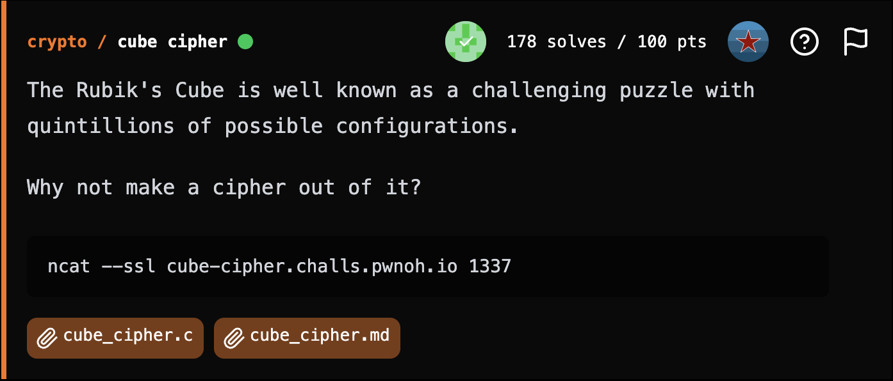
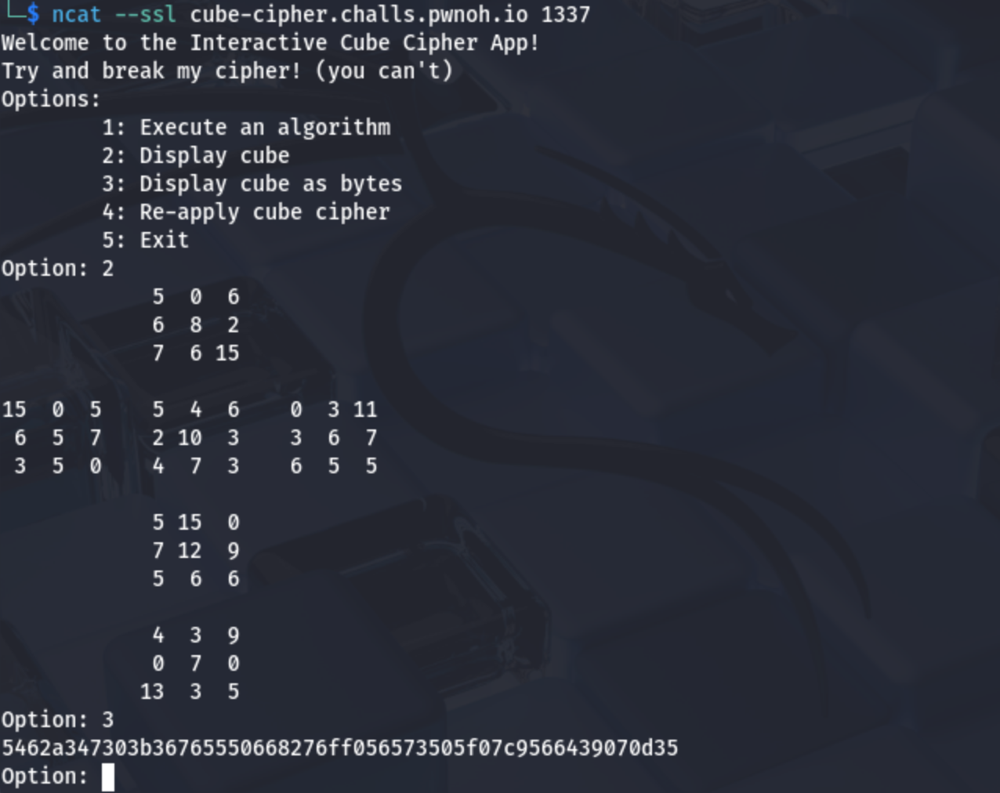

## **cube cipher**

### **Challenge Information**

<p align="center">
  
</p>

#### **Challenge Files**

[cube_cipher.c](assets/cube_cipher.c)

[cube_cipher.md](assets/cube_cipher.md)

### **Solution**

#### Interacting with the Server

First, we can connect to the server using netcat. From there, we notice that we can decide to execute an algorithm, display cube, display cube as bytes, re-apply cube cipher, or exit. Displaying the cube shows it in a T-shape, and displaying the cube as bytes gives the bytes in the order specified in the challenge files, with `a` representing 10, `b` representing 11, etc.

<p align="center">
  
</p>

Displaying as bytes would be more useful here as when we connect with pwntools, we can get all the information more directly.

#### Analyzing the Source Code

From the source code, we can see that the same exact algorithm is applied each time you choose the option to re-apply cube cipher, which is a fixed permutation. This means the cube cipher is a deterministic permutation applied repeatedly.

#### The Exploit

Since we know that the same exact permutation is applied each time the algorithm is applied, we know that this goes in a cycle, ie if we apply the algorithm enough times, we will end up where we started.

Since the original cube we displayed is the flag after one application of the permuatation, we can write a script that continues applying the algorithm until we get back to our starting position, then takes the bytes of the previous cube to get us the plaintext. As such, this is the script:

[solution.py](assets/solution.py)

```
from pwn import *
import ssl

host = "cube-cipher.challs.pwnoh.io"
port = 1337

p = remote(host, port, ssl=True, sni=host)

p.recvuntil(b"Option:")
p.sendline(b"3")
original = p.recvline().strip().decode()

cur = ""
prev = ""

while True:
    p.recvuntil(b"Option:")
    p.sendline(b"4")
    p.recvuntil(b"Option:")
    p.sendline(b"3")
    cur = p.recvline().strip().decode()
    if cur == original:
        break
    prev = cur

print(bytes.fromhex(prev).decode())

p.close()
```

From that, we get the flag.

The flag is: `bctf{the_cUb3_pl4yS_Y0U}`