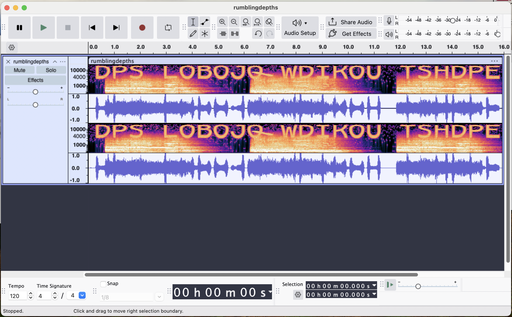
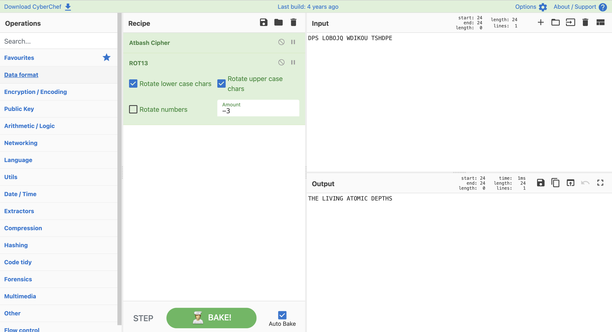

## **Atomic Depths**

### **Challenge Information**

  

#### **Challenge Files**

[rumblingdepths.mp3](assets/atomic-depths/rumblingdepths.mp3)

### **Solution**

I first opened up Audacity to look at the waveform and the spectrogram of the mp3 file as things are usually hidden there. From Audacity, I was able to see this:

There are letters in the spectrogram, and they spelled out `DPS LOBOJQ WDIKOU TSHDPE`. From the challenge information, we know that the flag format is NICC{WORD_WORD}, so I tried `NICC{DPS_LOBOJQ_WDIKOU_TSHDPE}.` However, that didn't work.

That told me some sort of cipher must have been done on the words. After trying out multiple combinations of substitution ciphers, I discovered the correct combination, which is to first perform the Atbash cipher, then perform a -3 Caesar shift, which gives me this:

Adding the underscores and the wrapping gives me the final flag.

The flag is: `NICC{THE_LIVING_ATOMIC_DEPTHS}`