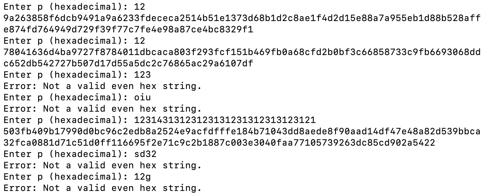

## **Chosen One**

### **Challenge Information**

<p align="center">
  
</p>

#### **Challenge Files**

[chal.py](assets/chosen-one/chal.py)
```
from Crypto.Cipher import AES
from Crypto.Util.Padding import pad
from Crypto.Random import get_random_bytes
import random

N = 16
key = get_random_bytes(N)
flag = 'NICC{placeholder_flag}'
cipher = AES.new(key, AES.MODE_ECB)

def e1(p):
    p = bytes.fromhex(p)
    one = pad(p + flag.encode(), 16)

    try:
        enc = cipher.encrypt(one)
    except:
        return "Error"

    enc = enc.hex()

    two = random.randint(0, 15)
    txt = ""

    for i in enc:
        c = (int(i, 16) + two) % 16
        c = f"{c:x}"
        txt += c

    return {"C": txt}
```

### **Solution**

First, I connected to the netcat and played around a little bit with the server, testing different inputs.



I noticed a few things. First of all, the server only takes in valid even hex strings, otherwise it prints an error. Second, inputting the same hex string twice doesn't give me the same output. Lastly, if my input is long enough, the output becomes longer too. I also noticed that the length of the output when I only input 1 byte is 128 characters, or 64 bytes. This becomes useful later.

I then went and looked at the code. What the code does is that it first creates a new AES cipher key called "cipher" that is 16 bytes and in the form of ECB. This means that the encryption process first breaks the plaintext up into 16 byte chunks, adding padding if needed. It then performs the encryption on each chunk separately, then concatenating everything together again. 

I notice that a function is also defined. The function takes in an input, adds it in front of the flag, then pads it to 16 bytes long(or any multiple of 16). It then attempts to run the encryption, returning "Error" if it fails. This is likely to prevent the user from using non-hex strings as the input.

The function then converts the ciphertext into hex, and shifts every character by two. This is a weird function since each hex byte is 2 characters, but this function performs the shift to every character, so we need to be mindful of that. Each character gets shifted by the same number between 0 and 15 that is randomly chosen, and then the resulting string gets returned. Note that the random number changes each time the function is run, so for an input, only one number is used, but if I try the same input again a different number could be used.

Now we have understood everything, we are ready to solve. The idea is to slowly recover the flag byte by byte by putting a bunch of known bytes in front while altering just the last byte and comparing it to the flag. For example, if the flag's length was less than 16 bytes, I would input "000000000000000000000000000000" (15 bytes) and "000000000000000000000000000000xy" (16 bytes) where xy is the hex representation of any byte. I would then compare the first 16 bytes/32 characters of the outputs. Since AES is deterministic, if the outputs are the same, I would know that the xy I tried is the same as the first byte of the flag since the flag is added after my input. (Of course, it wouldn't be the exact same in this case due to the shift at the end, which we can deal with later. For now, let's pretend that function doesn't exist). I would then loop over a bunch of characters to find the xy that works. After finding the first byte of the flag, I can then input "0000000000000000000000000000ab" (15 bytes) and "0000000000000000000000000000abxy" (16 bytes) where xy is the hex representation of any byte and ab is the hex representation of the first byte of the flag. Comparing the outputs allows us to find the second byte of the flag. We can continue this process until we find "}", which signals the end to our flag.

Now, as mentioned earlier, we still have to deal with the shifting function. We can deal with that by brute forcing it as well. I decided to do a double for loop, each looping from 0 to 15 to cover all the possibilities. I would then take one output, shift every character down by the first numbers, then up by the second one, and compare to the output. If none of the 256 possibilities matches up with the other output, I know that this is the wrong character, and would move on to try the next one. Thus, my script becomes this:

[solution.py](assets/chosen-one/solution.py)
```
from pwn import *

p = remote("45.55.60.238", 1337)

flag = ""
alphabet = "abcdefghijklmnopqrstuvwxyz0123456789ABCDEFGHIJKLMNOPQRSTUVWXYZ{}!@#$%^&*()_:/;?.,=+-"
total = 64
done = False

for i in range(64):
    if done == True:
        break
    current = i + 1
    found = False
    
    for j in alphabet:
        if found == True:
            break
        c = j.encode().hex()
        p_real = "00"*(total - current)
        p_fake = "00"*(total - current) + flag.encode().hex() + c

        p.recvuntil(b"Enter p (hexadecimal):")
        p.sendline(p_real.encode())
        output_real = p.recvline(timeout=2, keepends=False).strip().decode()[:128]

        p.recvuntil(b"Enter p (hexadecimal):")
        p.sendline(p_fake.encode())
        output_fake = p.recvline(timeout=2, keepends=False).strip().decode()[:128]

        for one in range(16):
            if found == True:
                    break
            for two in range(16):
                if found == True:
                    break
                final1 = ""
                final2 = ""
                for l in output_fake:
                    a = (int(l, 16) - one) % 16
                    a = f"{a:x}"
                    final1 += a
                for l in final1:
                    c = (int(l, 16) + two) % 16
                    c = f"{c:x}"
                    final2 += c

                if output_real == final2:
                    flag = flag + j
                    if j == "}":
                        done = True
                    found = True

p.close()
print(flag)
```

Running this script gives me the flag. Note that the script took about 90 seconds to run. I also had to add to my "alphabet" multiple times as some of the characters in the flag kept being not in my alphabet. I ended up printing every time a character was found, which allowed me to figure out that the flag was a youtube link and I needed things like ":", "?", and "=", which were not originally in my alphabet.

The flag is: `NICC{https://www.youtube.com/watch?v=NeI4jwXLX1Y}`