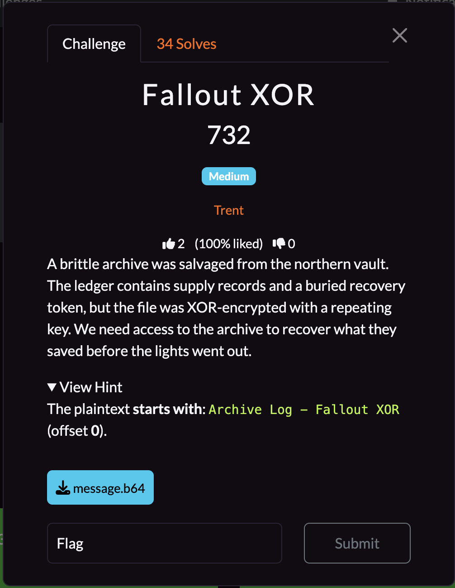
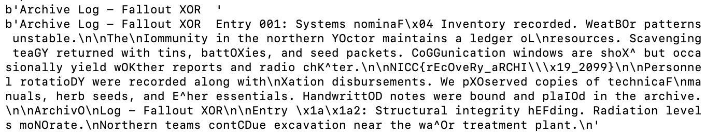
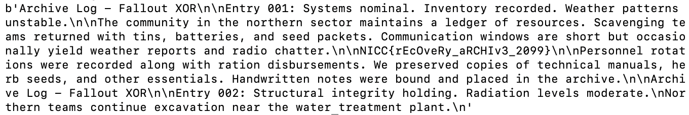

## **Fallout XOR**

### **Challenge Information**

<p align="center">
  
</p>

#### **Challenge Files**

[message.b64](assets/fallout-xor/message.b64)
```
FzM2JD1bURJtOSZ1YXRrVV5NOTQhbAxiZjgrEy8hPi0NBAIQbGEGNSdZUV9Sdi86IT1DVV4Pdgg7OjFDQF1TL2EnKTdCRlZEMm91GzFMQFpEJGElLSBZUUBPJWEgIidZVVBNM29fRgBFURJCOSw4OTpEQEsBPy91ODxIFFxOJDU9KSZDFEFENTU6PnRAVVtPIiA8IicNVRJNMyUyKSYNW1QBJCQmIyFfV1dSeGEGLzVbUVxGPy8ybCBIVV9SdjMwOCFfWldFdjY8ODwNQFtPJW11LjVZQFdTPyQmYHRMWlYBJSQwKHRdVVFKMzUmYnRuW19MIy88LzVZXV1PdjY8IjBCQ0EBNzMwbCdFW0BVdiMgOHRCV1FAJSg6IjVBWEsBLygwIDANQ1dAIikwPnRfUUJOJDUmbDVDUBJTNyU8I3ROXFNVIiQnYl4nentiFTonCTdiQldzLx40HhdlfUQSCXNldW1QPjhxMzMmIzpDUV4BJC4hLSBEW1xSdjYwPjENRldCOTMxKTANVV5OOCZ1Oz1ZXBJTNzU8IzoNUFtSNDQnPzFAUVxVJW91GzENREBEJSQnOjFJFFFOJigwP3RCUhJVMyI9Ij1OVV4BOyA7OTVBRx4BPiQnLnReUVdFJW11LTpJFF1VPiQnbDFeR1dPIig0ICcDFHpAOCUiPj1ZQFdPdi86ODFeFEVEJCR1LjtYWlYBNy8xbCRBVVFEMmE8InRZXFcBNzM2JD1bURwrXAAnLzxEQlcBGi4ybHkNclNNOi4gOHR1e2ArXAQ7OCZUFAIRZHt1HyBfQVFVIzM0IHREWkZEMTM8OC0NXF1NMig7K3oNZlNFPyAhJTtDFF5EICQ5P3RAW1ZEJCAhKXonel1TIikwPjoNQFdAOzJ1LztDQFtPIyR1KSxOVURAIig6InRDUVNTdjU9KXRaVUZEJGEhPjFMQF9EODV1PDhMWkYPXA==
```

### **Solution**

First, I saw that message.b64 is a long, base64 encoded string which is unreadable when you decode it. However, from the challenge information we do know that this is likely the result of XORing the "ledger" with a repeating key. The flag is probably also in the ledger somewhere, so we must find the key to find the flag.

The hint also tells me that the plaintext starts with "Archive Log - Fallout XOR". This allows me to find the first few bytes of the key as I can XOR the plaintext with the ciphertext to get the key. From here, I decided to try and brute force my way to the flag. First, I wrote a script to try and guess the key by adding whitespaces one by one to "Archive Log - Fallout XOR", XORing with the ciphertext, and repeating it. So "Archive Log - Fallout XOR" XORed with the ciphertext, then repeated would be my first key, "Archive Log - Fallout XOR " XORed with the ciphertext, then repeated would be my second key, "Archive Log - Fallout XOR  " XORed with the ciphertext, then repeated would be my third key, etc. I would then XOR all of these keys with the ciphertext to see which one produced the most readable result, which would tell me about the key length. Here is my brute force key search script: 

[bruteforce.py](assets/fallout-xor/bruteforce.py)
```
import base64

output_b64 = b"FzM2JD1bURJtOSZ1YXRrVV5NOTQhbAxiZjgrEy8hPi0NBAIQbGEGNSdZUV9Sdi86IT1DVV4Pdgg7OjFDQF1TL2EnKTdCRlZEMm91GzFMQFpEJGElLSBZUUBPJWEgIidZVVBNM29fRgBFURJCOSw4OTpEQEsBPy91ODxIFFxOJDU9KSZDFEFENTU6PnRAVVtPIiA8IicNVRJNMyUyKSYNW1QBJCQmIyFfV1dSeGEGLzVbUVxGPy8ybCBIVV9SdjMwOCFfWldFdjY8ODwNQFtPJW11LjVZQFdTPyQmYHRMWlYBJSQwKHRdVVFKMzUmYnRuW19MIy88LzVZXV1PdjY8IjBCQ0EBNzMwbCdFW0BVdiMgOHRCV1FAJSg6IjVBWEsBLygwIDANQ1dAIikwPnRfUUJOJDUmbDVDUBJTNyU8I3ROXFNVIiQnYl4nentiFTonCTdiQldzLx40HhdlfUQSCXNldW1QPjhxMzMmIzpDUV4BJC4hLSBEW1xSdjYwPjENRldCOTMxKTANVV5OOCZ1Oz1ZXBJTNzU8IzoNUFtSNDQnPzFAUVxVJW91GzENREBEJSQnOjFJFFFOJigwP3RCUhJVMyI9Ij1OVV4BOyA7OTVBRx4BPiQnLnReUVdFJW11LTpJFF1VPiQnbDFeR1dPIig0ICcDFHpAOCUiPj1ZQFdPdi86ODFeFEVEJCR1LjtYWlYBNy8xbCRBVVFEMmE8InRZXFcBNzM2JD1bURwrXAAnLzxEQlcBGi4ybHkNclNNOi4gOHR1e2ArXAQ7OCZUFAIRZHt1HyBfQVFVIzM0IHREWkZEMTM8OC0NXF1NMig7K3oNZlNFPyAhJTtDFF5EICQ5P3RAW1ZEJCAhKXonel1TIikwPjoNQFdAOzJ1LztDQFtPIyR1KSxOVURAIig6InRDUVNTdjU9KXRaVUZEJGEhPjFMQF9EODV1PDhMWkYPXA=="
output_bytes = base64.b64decode(output_b64)

for j in range(50):
    hint_str = "Archive Log - Fallout XOR"
    for k in range(j):
        hint_str = hint_str + " "

    hint_bytes = hint_str.encode()
    print(hint_bytes)
    key = [a ^ b for a, b in zip(hint_bytes, output_bytes)]

    for _ in range(5):
        for i in range(len(key)):
            key.append(key[i])

    flag_bytes = [a ^ b for a, b in zip(key, output_bytes)]

    flag = str(bytes(flag_bytes))
    print(flag)
```

From here, I noticed that adding 2 whitespaces behind "Archive Log - Fallout XOR" gave by far the most readable text, so I was able to determine that that was the unrepeated key length. The result is this:



We can notice that most of the text is completely readable, with some weird characters here and there, which are due to the fact that the whitespaces are not correct. We can also notice that part of the flag seems to be sticking out as we can see `NICC{rEcOveRy_aRCHI\\\x19_2099}` in the image. Some of the characters inside are still scrambled, so we have more work to do.

Next, I decided to brute force all the possible combinations of bytes that those two whitespaces could be. Since I am only missing two bytes, that means there is only $2^{16}$ possibilities, so it won't take too long. I also decided to add a check to see if the resulting plaintext contains "Weather" as that word is misspelled in the result of the first brute force, and only print out the plaintext if it does to save some time sifting through plaintexts later. Thus, this is my script:

[solution.py](assets/fallout-xor/solution.py)
```
import base64

output_b64 = b"FzM2JD1bURJtOSZ1YXRrVV5NOTQhbAxiZjgrEy8hPi0NBAIQbGEGNSdZUV9Sdi86IT1DVV4Pdgg7OjFDQF1TL2EnKTdCRlZEMm91GzFMQFpEJGElLSBZUUBPJWEgIidZVVBNM29fRgBFURJCOSw4OTpEQEsBPy91ODxIFFxOJDU9KSZDFEFENTU6PnRAVVtPIiA8IicNVRJNMyUyKSYNW1QBJCQmIyFfV1dSeGEGLzVbUVxGPy8ybCBIVV9SdjMwOCFfWldFdjY8ODwNQFtPJW11LjVZQFdTPyQmYHRMWlYBJSQwKHRdVVFKMzUmYnRuW19MIy88LzVZXV1PdjY8IjBCQ0EBNzMwbCdFW0BVdiMgOHRCV1FAJSg6IjVBWEsBLygwIDANQ1dAIikwPnRfUUJOJDUmbDVDUBJTNyU8I3ROXFNVIiQnYl4nentiFTonCTdiQldzLx40HhdlfUQSCXNldW1QPjhxMzMmIzpDUV4BJC4hLSBEW1xSdjYwPjENRldCOTMxKTANVV5OOCZ1Oz1ZXBJTNzU8IzoNUFtSNDQnPzFAUVxVJW91GzENREBEJSQnOjFJFFFOJigwP3RCUhJVMyI9Ij1OVV4BOyA7OTVBRx4BPiQnLnReUVdFJW11LTpJFF1VPiQnbDFeR1dPIig0ICcDFHpAOCUiPj1ZQFdPdi86ODFeFEVEJCR1LjtYWlYBNy8xbCRBVVFEMmE8InRZXFcBNzM2JD1bURwrXAAnLzxEQlcBGi4ybHkNclNNOi4gOHR1e2ArXAQ7OCZUFAIRZHt1HyBfQVFVIzM0IHREWkZEMTM8OC0NXF1NMig7K3oNZlNFPyAhJTtDFF5EICQ5P3RAW1ZEJCAhKXonel1TIikwPjoNQFdAOzJ1LztDQFtPIyR1KSxOVURAIig6InRDUVNTdjU9KXRaVUZEJGEhPjFMQF9EODV1PDhMWkYPXA=="
output_bytes = base64.b64decode(output_b64)

for one in range(256):
    for two in range(256):
        hint_str = "Archive Log - Fallout XOR"

        hint_bytes = hint_str.encode()

        key = [a ^ b for a, b in zip(hint_bytes, output_bytes)]
        key.append(one)
        key.append(two)

        for _ in range(5):
            for i in range(len(key)):
                key.append(key[i])

        flag_bytes = [a ^ b for a, b in zip(key, output_bytes)]

        flag = str(bytes(flag_bytes))
        if "Weather" in flag:
            print(flag)
```
Only one combination of two bytes printed the word "Weather", and the plaintext is shown here:



From here, we can see the flag.

The flag is: `NICC{rEcOveRy_aRCHIv3_2099}`