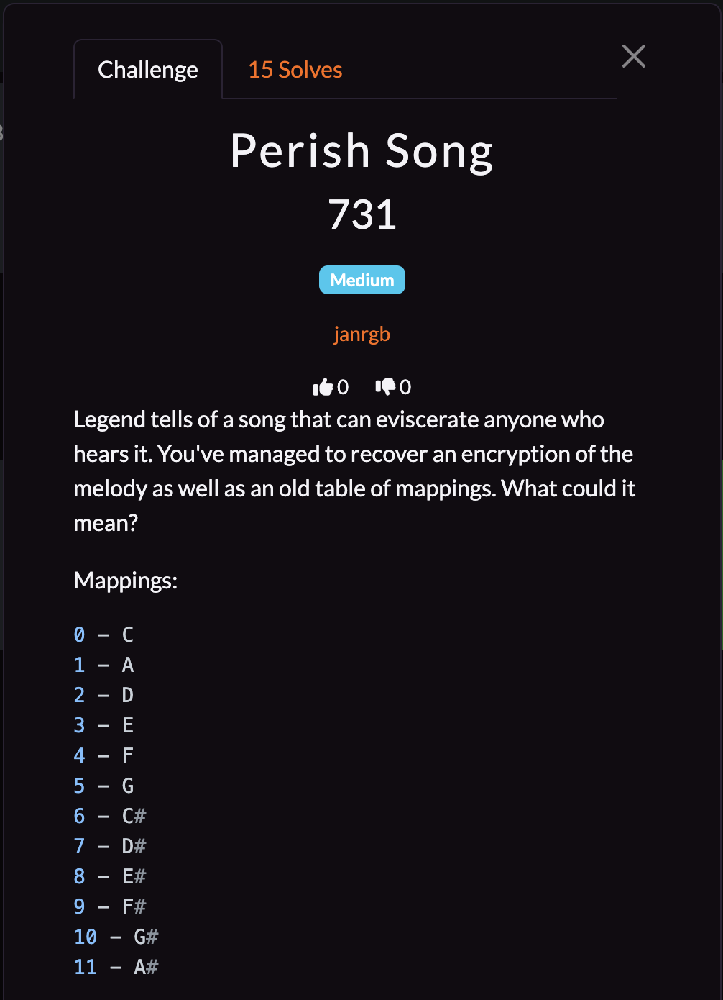
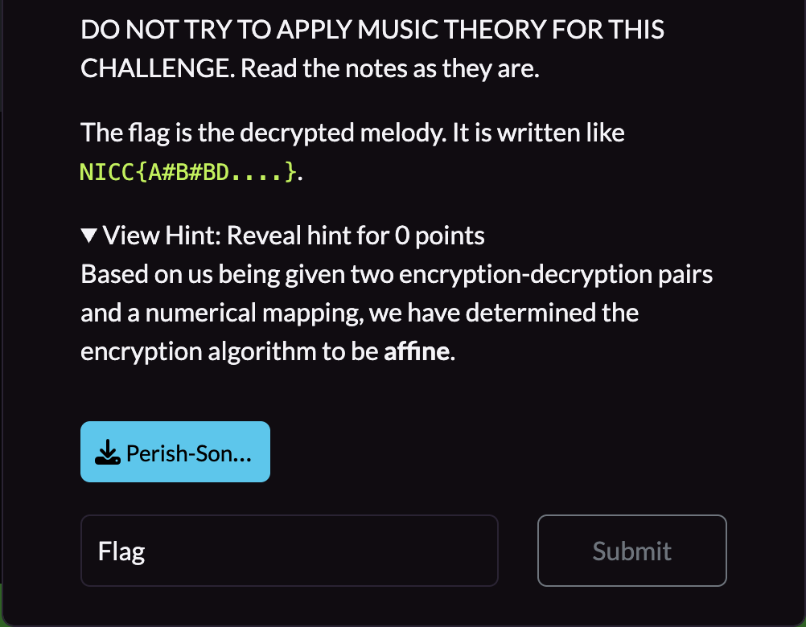
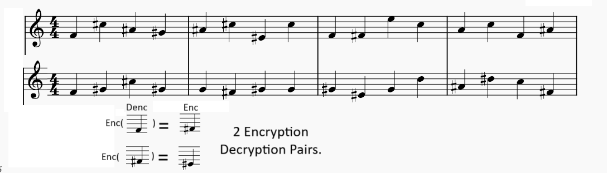

## **Perish Song**

### **Challenge Information**

<p align="center">
  
</p>
<p align="center">
  
</p>

#### **Challenge Files**



### **Solution**

From the hint, we know that this is an affine cipher. The affine cipher works like this: $E(x)=(ax+b) \bmod m$ and $D(x)=a^{-1}(x-b) \bmod m$ where $E(x)$ is the encryption function, $D(x)$ is the decryption function, and $m$ is the size of the alphabet. We are given enough information to find $a$ and $b$ and decrypt the music sheet.

First, we can see from the mapping table in the challenge information that there are 12 different notes in total, so we know that $m$ = 12. Then, in order to find $a$ and $b$, we must set up our equations. The two pairs in the image tells us $E(4) = 9$ and $E(9) = 8$. From there, we know that $(4a + b) \equiv 9 (\bmod 12)$ and $(9a + b) \equiv 8 (\bmod 12)$. We can do a nice trick where we subtract the first equation from the second one to get $5a \equiv -1 (\bmod 12)$. Multiplying by negative one on both sides, we get that $-5a \equiv 1 (\bmod 12)$, which means that $a$ is the modular inverse of $-5 (\bmod 12)$, which we can find by doing `pow(-5, -1, 12)` in python, which is 7. From there, we can find $b$ by just plugging $a$ into the first equation, which gives us `(9 - 4 * a) % 12`, which is 5. We can also find the modular inverse of $a$, which would be `pow(a, -1, 12)`, which is also 7. That gives us $D(x)= 7(x-5) \mod 12$.

Now, we are ready to solve for the flag. First, we can read the notes from the music sheet and use the mapping to get our ciphertext in numbers, which we will call $c$. Then, we have to run every $c$ through our decryption function, then match it with the mapping to get the flag. Thus, my script is:

[solution.py](assets/perish-song/solution.py)
```
cipher = ["F", "C#", "A#", "G#", "A#", "C#", "E#", "C", "F", "F#", "E", "C", "A", "C", "F", "A#", "F", "G#", "C#", "G#", "G", "F#", "G#", "G", "G#", "E#", "G", "D", "A#", "D#", "C", "F#"]
c = [4, 6, 11, 10, 11, 6, 8, 0, 4, 9, 3, 0, 1, 0, 4, 11, 4, 10, 6, 10, 5, 9, 10, 5, 10, 8, 5, 2, 11, 7, 0, 9]

a = pow(-5, -1, 12)
b = (9 - 4 * a) % 12
assert (4 * a + b) % 12 == 9
assert (9 * a + b) % 12 == 8

a_inv = pow(a, -1, 12)

def match(a):
    if a == 0:
        return "C"
    elif a == 1:
        return "A"
    elif a == 2:
        return "D"
    elif a == 3:
        return "E"
    elif a == 4:
        return "F"
    elif a == 5:
        return "G"
    elif a == 6:
        return "C#"
    elif a == 7:
        return "D#"
    elif a == 8:
        return "E#"
    elif a == 9:
        return "F#"
    elif a == 10:
        return "G#"
    elif a == 11:
        return "A#"
    else:
        print("fail")
        return ""

flag = "NICC{"
for i in c:
    flag = flag + match((a_inv * (i - b)) % 12)
flag = flag + "}"
print(flag)
```

The flag is: `NICC{GD#C#A#C#D#F#AGFG#AE#AGC#GA#D#A#CFA#CA#F#CEC#DAF}`