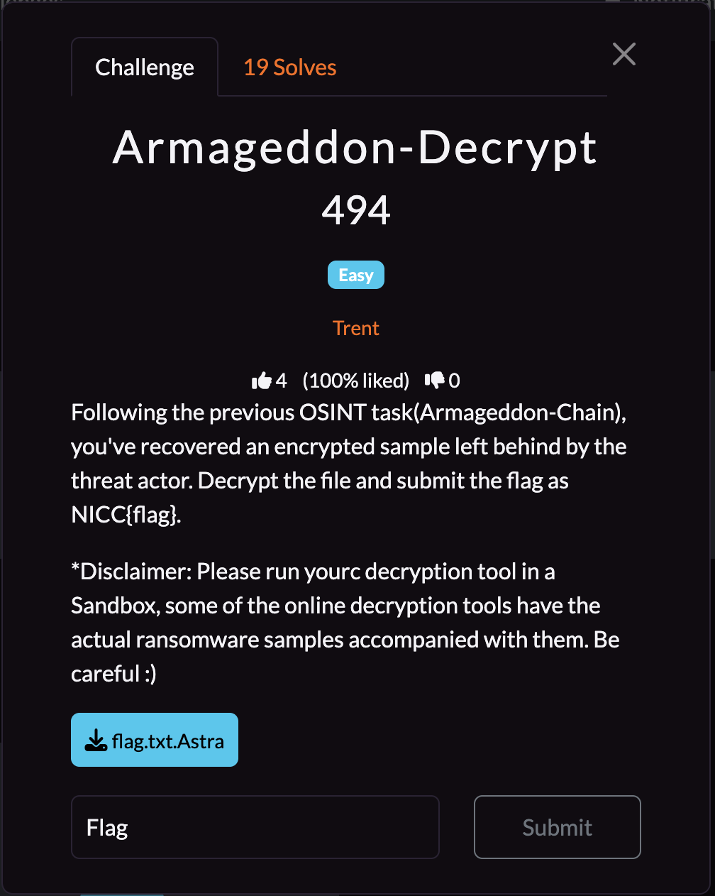

## **Armageddon-Decrypt**

### **Challenge Information**

  

#### **Challenge Files**

[flag.txt.Astra](assets/armageddon-decrypt/flag.txt.Astra)

### **Solution**

First, we can notice that our file has an interesting file extension. Before I do anything, I notice the disclaimer from the challenge information, which kind of hints at this file being a ransomware file and using online decryption tools. So I decided to do a Google search of "astra ransomware decryption" and came across [a decryption tool from Emsisoft called AstraLocker](https://www.emsisoft.com/en/ransomware-decryption/astralocker/).

I downloaded their tool, [decrypt_AstraLocker.exe](assets/armageddon-decrypt/decrypt_AstraLocker.exe), and ran it inside an isolated Windows VM. The decrypter created a text file called flag, with the content being "r381R7h_0f_pLa!NtExT", which is our flag.

The flag is: `NICC{r381R7h_0f_pLa!NtExT}`