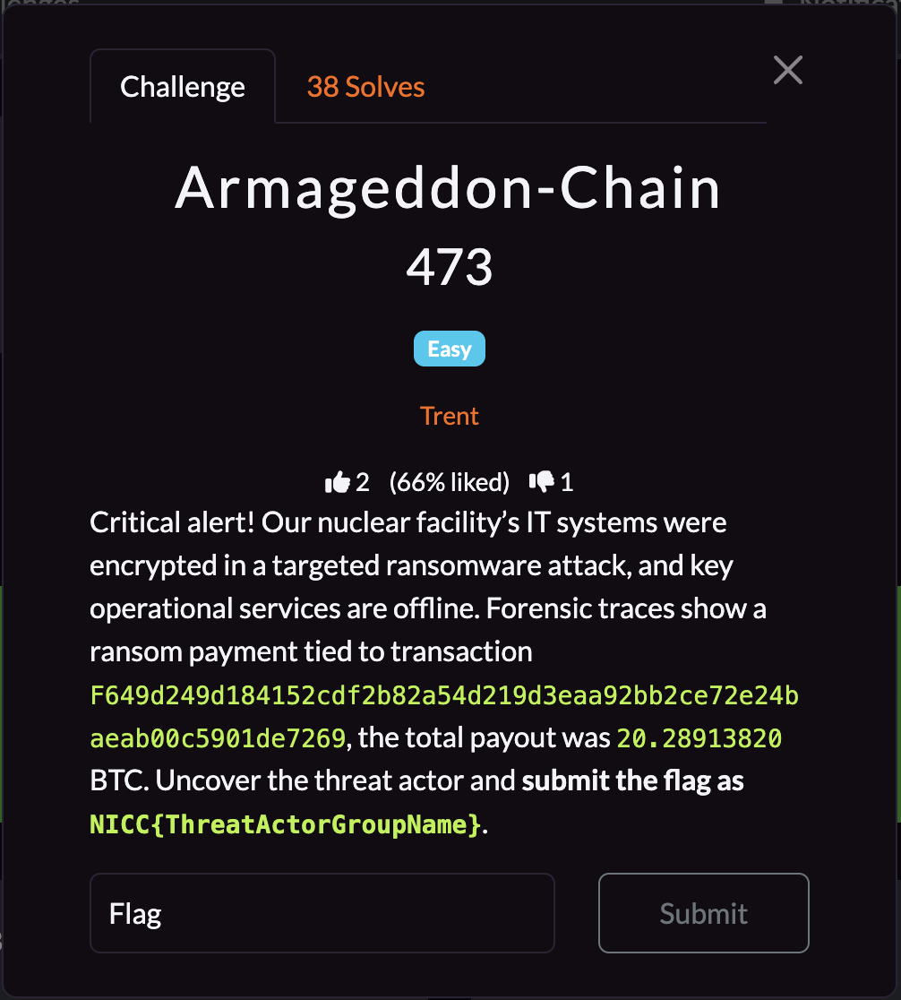
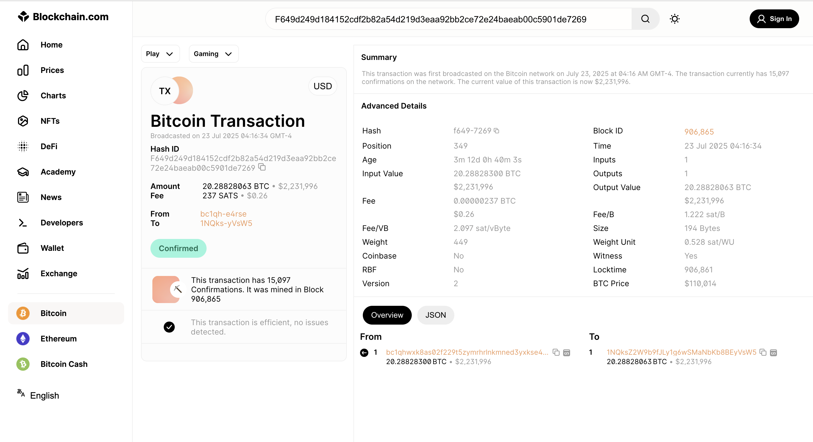
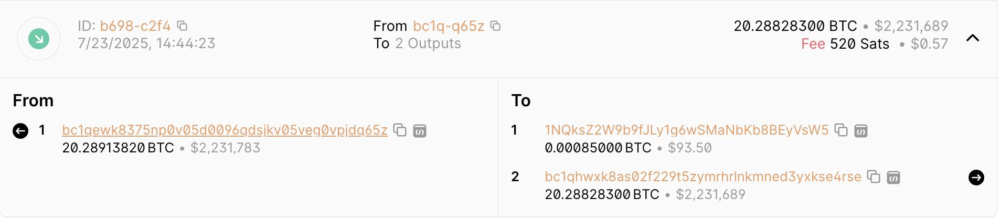
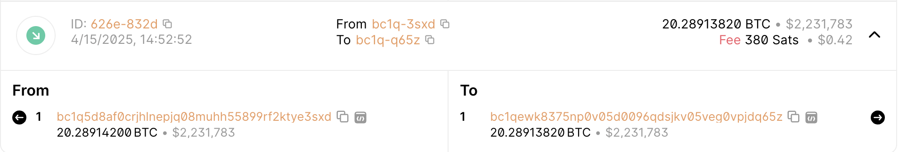
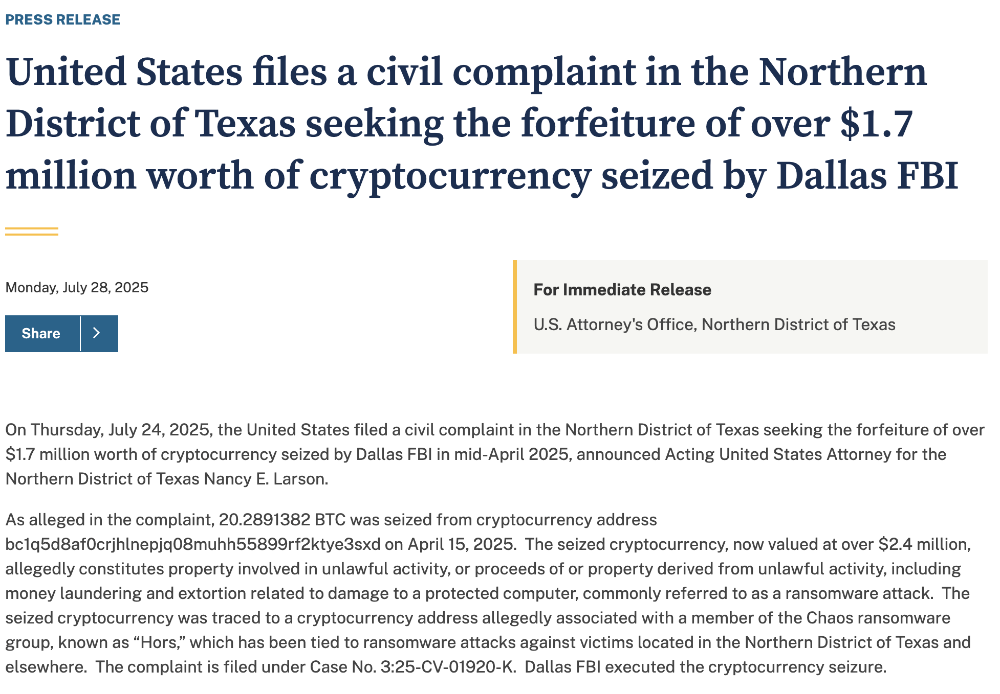

## **Armageddon-Chain**

### **Challenge Information**

  

### **Solution**

The first thing we can do is to go on [blockchain.com](https://www.blockchain.com/explorer/mempool/btc) to look for the transaction. I found it here:

From here, we notice that the bitcoin came from [bc1qhwxk8as02f229t5zymrhrlnkmned3yxkse4rse](https://www.blockchain.com/explorer/addresses/btc/bc1qhwxk8as02f229t5zymrhrlnkmned3yxkse4rse) and went to [1NQksZ2W9b9fJLy1g6wSMaNbKb8BEyVsW5](https://www.blockchain.com/explorer/addresses/btc/1NQksZ2W9b9fJLy1g6wSMaNbKb8BEyVsW5). We can trace where the bitcoin came from by going to [bc1qhwxk8as02f229t5zymrhrlnkmned3yxkse4rse](https://www.blockchain.com/explorer/addresses/btc/bc1qhwxk8as02f229t5zymrhrlnkmned3yxkse4rse)'s profile, where we can see that the bitcoin actually came from another address, [bc1qewk8375np0v05d0096qdsjkv05veg0vpjdq65z](https://www.blockchain.com/explorer/addresses/BTC/bc1qewk8375np0v05d0096qdsjkv05veg0vpjdq65z), and they got their bitcoin from [bc1q5d8af0crjhlnepjq08muhh55899rf2ktye3sxd](https://www.blockchain.com/explorer/addresses/BTC/bc1q5d8af0crjhlnepjq08muhh55899rf2ktye3sxd) as shown here:

The chain continues with more and more addresses that all seem to start with "bc1q" but they don't matter anymore. A Google Search of the address `bc1q5d8af0crjhlnepjq08muhh55899rf2ktye3sxd` brings up [a press release from the Department of Justice](https://www.justice.gov/usao-ndtx/pr/united-states-files-civil-complaint-northern-district-texas-seeking-forfeiture-over-17), which is shown here:

From here, we can see that the bitcoin was seized from `bc1q5d8af0crjhlnepjq08muhh55899rf2ktye3sxd` and it belonged to a member of the Chaos ransomware group known as Hors. Thus, we know the threat actor group name is Chaos, which gives us the flag.

The flag is: `NICC{CHAOS}`