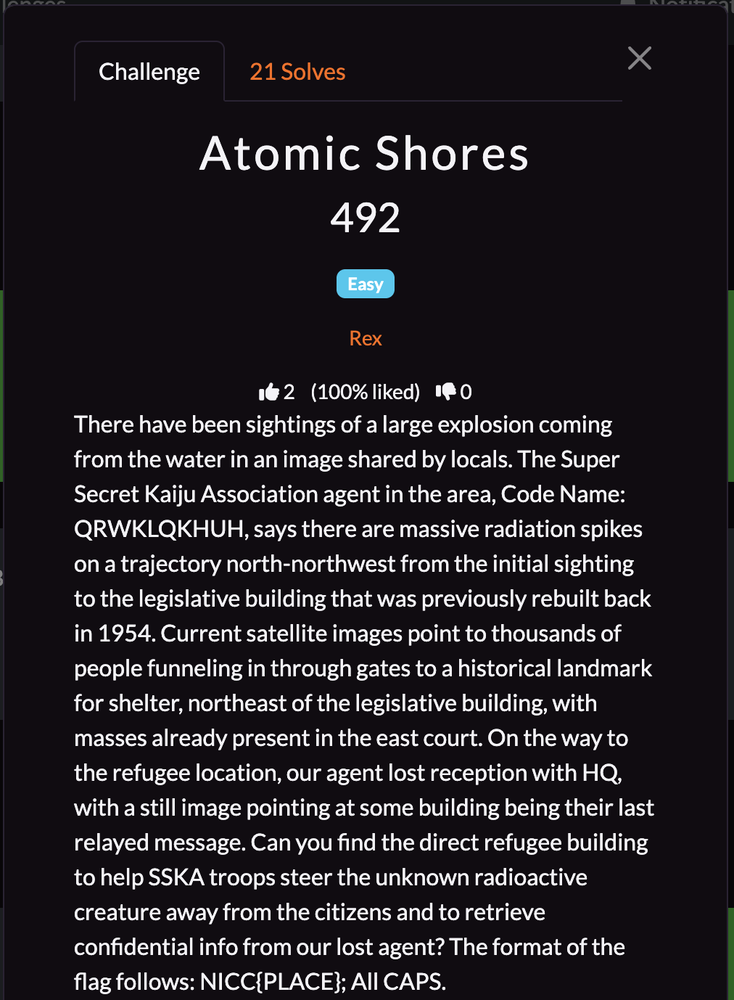
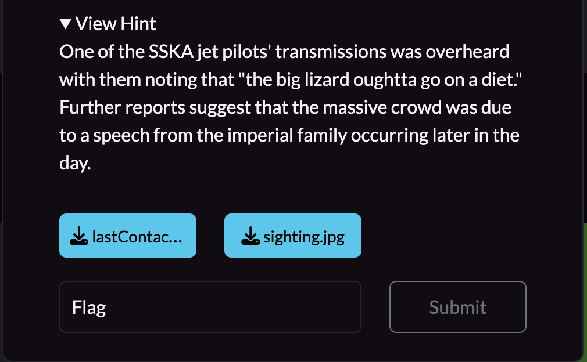
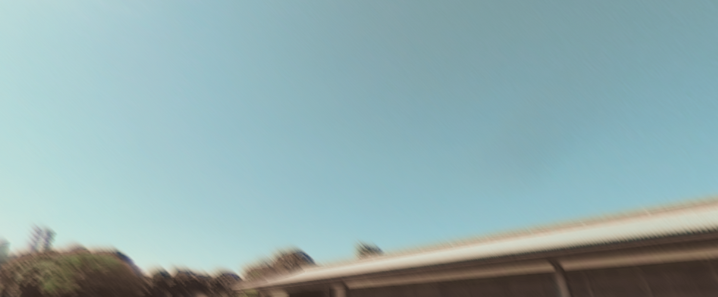
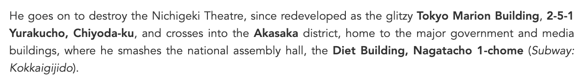

## **Atomic Shores**

### **Challenge Information**

  

  

#### **Challenge Files**

  

  

### **Solution**

From the hint, we can infer that this challenge has something to do with Godzilla as that's the big, atomic lizard that can cause radiation spikes. From that, we can see that the building rebuilt in 1954 might not be actually rebuilt in 1954, but it was destroyed by Godzilla in the first Godzilla movie, which was released in 1954.

Sure enough, a Google search of `famous buildings destroyed in godzilla 1954` leads to a [website](https://movie-locations.com/movies/g/Godzilla-1954.php) that gives a bunch of locations that Godzilla destroyed. From the website, we can see this:

When I got to here, the Diet Building caught my eye as the hint also mentioned that Godzilla must "go on a diet", which could be a sneaky way of pointing to the Diet Building. The Diet Building also happens to be Japan's legislative building, which matches up with the information from the challenge information.

Now that we have confirmed which legislative building the challenge information is talking about, we can try to find where all the refugees are. The challenge information mentions that all the people are funneling northeast to a historical landmark, and that there were already masses gathered in the east court. We also know from the hint that there are people gathered there because there will be a speech from the imperial family. Going to [Google Maps](https://www.google.com/maps/place/National+Diet+Building/@35.681297,139.7461341,1544m/data=!3m2!1e3!5s0x60188b88ebdbc8a7:0x220b927940c45f74!4m6!3m5!1s0x60188b89b2e1b089:0x48c7d4fa5e528690!8m2!3d35.675888!4d139.744858!16zL20vMDNxZ195?entry=ttu&g_ep=EgoyMDI1MTAyOS4yIKXMDSoASAFQAw%3D%3D), we can see that the Imperial Palace is close by and northeast of the Diet Building, so the masses must be there.

  

Now we just have to figure out which building specifically the refugees are in to get our flag. There aren't a lot of buildings in the area, so after a few tries, I was able to determine Chowaden as the correct building. Interestingly, I ended up not using the pictures as the hints were enough to point me in the right direction.

The flag is: `NICC{CHOWADEN}`