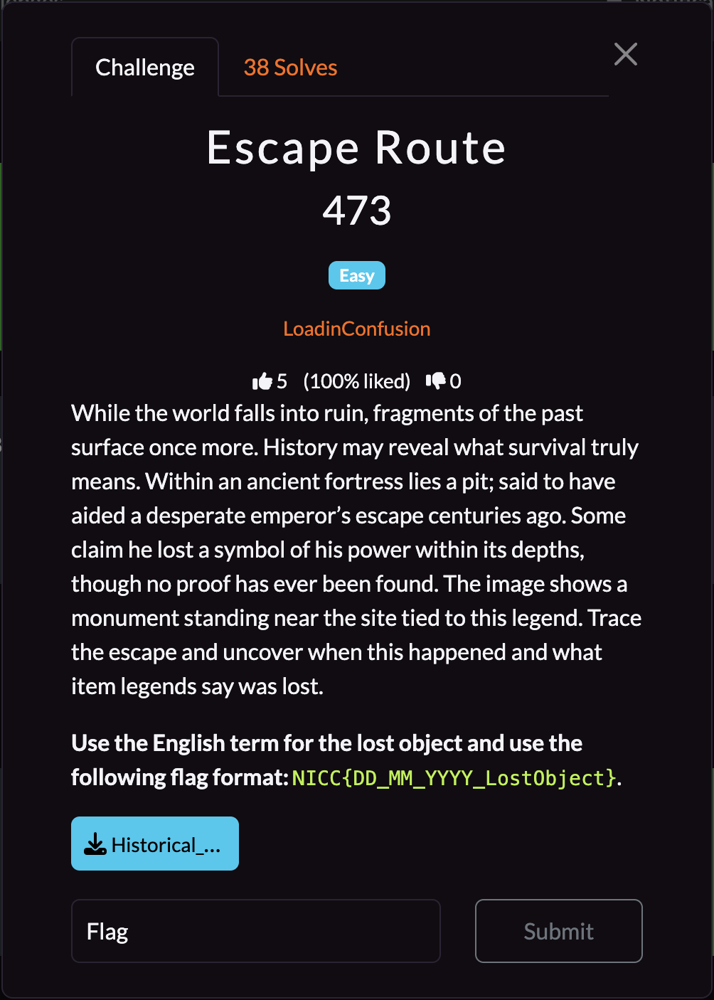
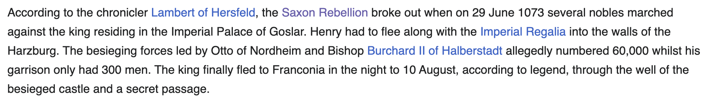
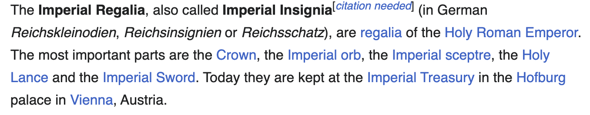

## **Escape Route**

### **Challenge Information**

  

#### **Challenge Files**

  

### **Solution**

First, we can zoom in on the picture and try to read the words off of the monument. It isn't in English, but it has English characters, and it says `AUS DANKBARKEIT IN FESTER ZUVERSICHT`.

With a quick Google search, we can see that this is the Canossasäule, or the Column of Canossa, in Braunschweig, Germany. From [Google Maps](https://www.google.com/maps/place/Column+of+Canossa/@51.8715039,10.5668594,160m/data=!3m1!1e3!4m6!3m5!1s0x47a514c4eb8104df:0xbdfe060a2c5b32!8m2!3d51.8719633!4d10.5662664!16s%2Fg%2F11bywvzf4x?entry=ttu&g_ep=EgoyMDI1MTAyOS4yIKXMDSoASAFQAw%3D%3D), we can see that there is a landmark nearby called Große Harzburg as shown here:

  

Große Harzburg is a former imperial castle, which matches well with the "ancient fortress" mentioned in the challenge information. From the [Wikipedia page](https://en.wikipedia.org/wiki/Harzburg), we can see that many rulers lived there, but a significant one is King Henry IV of the Holy Roman Empire.

The excerpt says that King Henry IV was attacked and on the night of 10 August, 1073, he escaped through the well. This matches up with the mentions of a pit helping the emperor escape mentioned in the challenge information. Now we have the date of the escape, we only need to find the lost object.

From the excerpt, we also see that King Henry IV had to flee along with the Imperial Regalia. From [Wikipedia](https://en.wikipedia.org/wiki/Imperial_Regalia), we can once again gleam some useful information.

The excerpt says that the Imperial Regalia includes the Imperial Crown, Imperial Orb, Imperial Sceptre, Imperial Lance, and Imperial Sword. Although it wasn't explicitly mentioned that the Imperial Regalia was lost anywhere, a crown does seem to match up with the challenge information's mention of "a symbol of his power". Thus, it is likely the lost item is one of these, and after trying a few combinations, I got the flag.

The flag is: `NICC{10_08_1073_crown}`