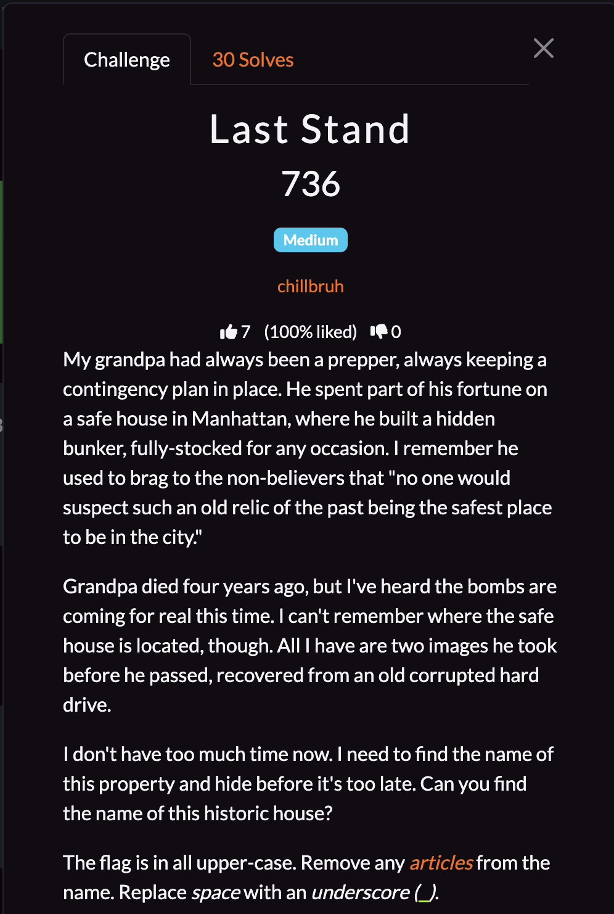
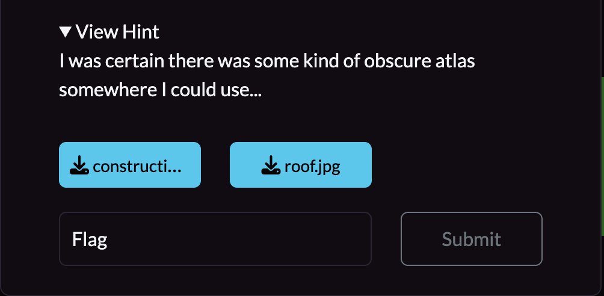
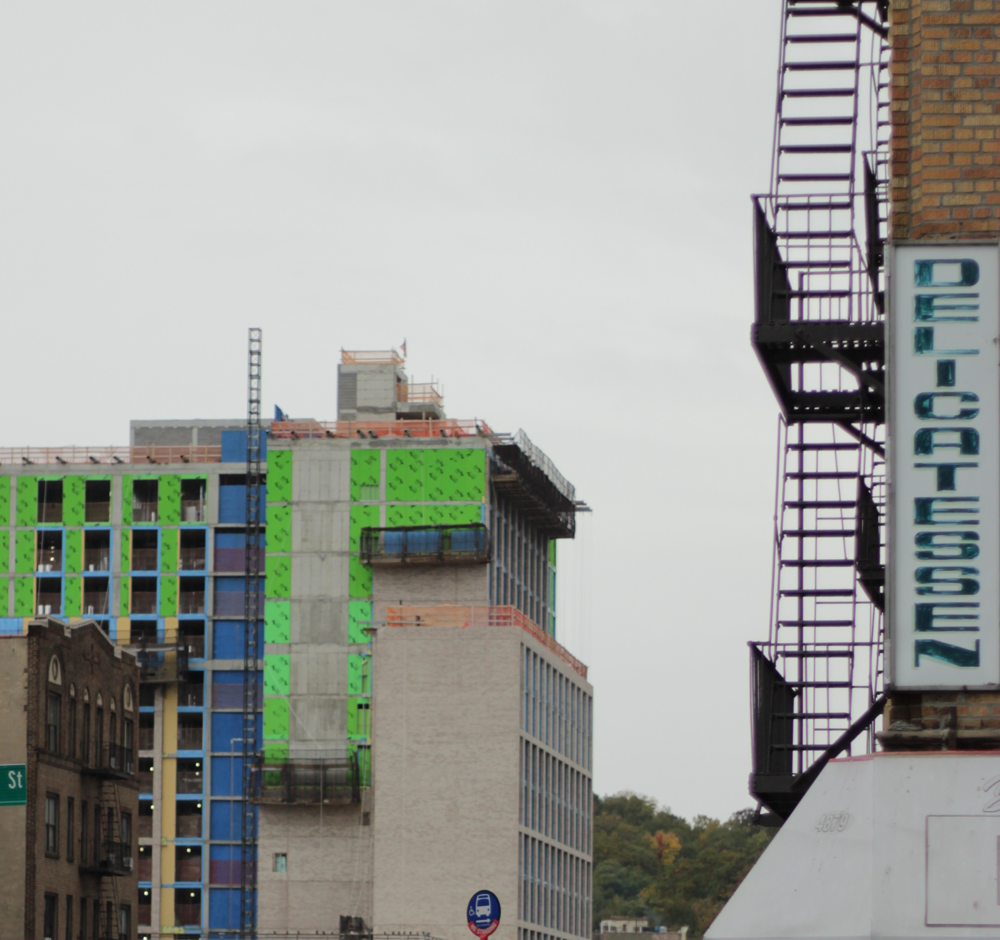
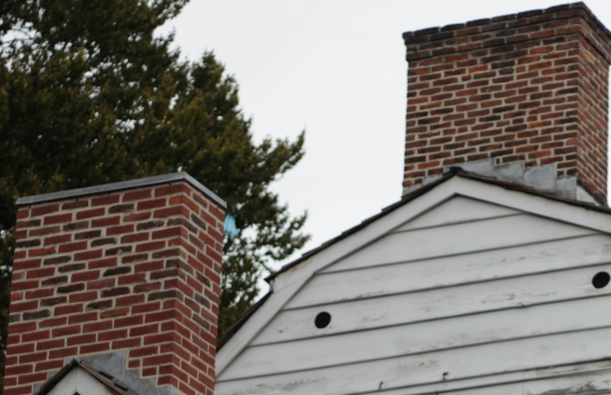
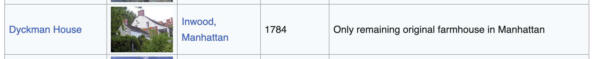

## **Last Stand**

### **Challenge Information**

  

  

#### **Challenge Files**

  

  

### **Solution**

From the challenge information, we know that the safe house we are looking for is a historic building in Manhattan. We also have a picture of the roof. From here, I found a Wikipedia page on the [List of the oldest buildings in New York](https://en.wikipedia.org/wiki/List_of_the_oldest_buildings_in_New_York). This page is really nice as it lists a bunch of old buildings along with an image of them. Scrolling down slowly and looking at each building in Manhattan, I was able to find this:

I noticed how the roof of the Dyckman House matches exactly with the roof from the challenge files, with the white outer walls and two red brick chimneys. Thus, I know I found the right building, along with the flag. 

The flag is: `NICC{DYCKMAN_HOUSE}`