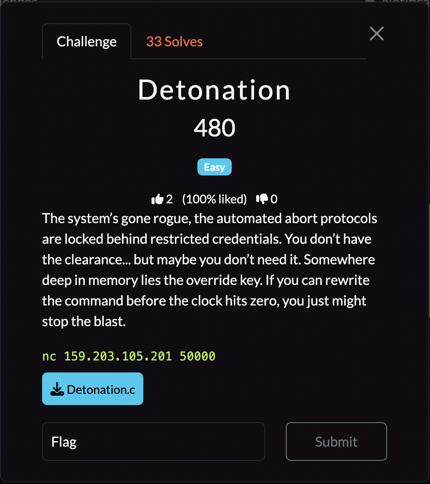
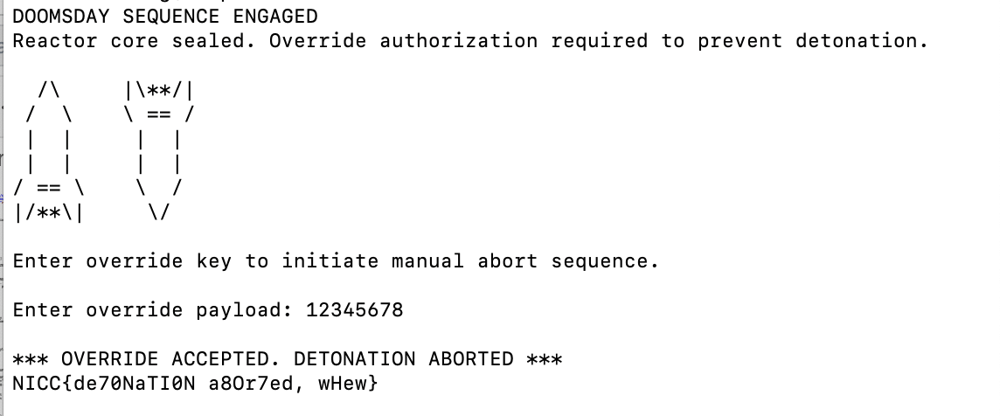

## **Detonation**

### **Challenge Information**

<p align="center">
  
</p>

#### **Challenge Files**

[Detonation.c](assets/detonation/Detonation.c)
```
#include <stdio.h>
#include <stdlib.h>
#include <string.h>

#define COUNTDOWN_SIZE 8
#define ABORT_CODE_SIZE 8


char countdown[COUNTDOWN_SIZE] = "T-minus";
char abort_code[ABORT_CODE_SIZE] = "SAFE";

int intro(){
    puts("DOOMSDAY SEQUENCE ENGAGED");
    puts("Reactor core sealed. Override authorization required to prevent detonation.\n");

    puts("  /\\     |\\**/|      ");
    puts(" /  \\    \\ == /       ");
    puts(" |  |     |  |        ");
    puts(" |  |     |  |        ");
    puts("/ == \\    \\  /        ");
    puts("|/**\\|     \\/         ");
    puts("\nEnter override key to initiate manual abort sequence.\n");

    return 0;
}


int accept_input(void){
    printf("Enter override payload: ");
    scanf("%s", countdown);
    return 0;
}

int check_override(){
    if (strcmp(abort_code, "SAFE") != 0){
        puts("\n*** OVERRIDE ACCEPTED. DETONATION ABORTED ***");
        FILE *fd = fopen("flag.txt", "r");
        if (!fd){
            puts("[!] flag.txt not found. Few seconds too late?");
            exit(1);
        }
        char buf[128];
        fgets(buf, sizeof(buf), fd);
        printf("%s\n", buf);
        fclose(fd);
        fflush(stdout);
        exit(0);
    } else {
        puts("\nOverride failed. Reactor still locked.");
        puts("Try overflowing the countdown buffer to flip the abort code...");
    }
    return 0;
}

int main(void){
    intro();

    accept_input();


    check_override();

    return 0;
}
```

### **Solution**

From the source code, we can see that in `check_override()`, the flag will print if `strcmp(abort_code, "SAFE") != 0`, which basically means `abort_code` doesn't have "SAFE" stored in it. This means we need to figure out how to overwrite `abort_code`.

Only one input is taken in the whole program, and that is in the function `accept_input(void)`. This function does `scanf("%s", countdown);`, which takes our input and overwrites whatever `countdown` originally was. Notice here that the format specifier here is `"%s"`, which means that this is likely a buffer overflow challenge.

We can scroll up a little and see that there are two variables `countdown` and `abort_code`, both being char[8] globals. `countdown` is initialized before `abort_code`, so we can take advantage of buffer overflow here to overwrite `abort_code` as well.

What we can do is that when we are prompted for input, we can put any string without whitespaces from 8 to 15 characters long, and it will overwrite into `abort_code` and make it something else, so `strcmp(abort_code, "SAFE") != 0` becomes true, making the server print the flag. 8 characters work as a NUL terminator "\0" will be added afterwards, which writes into `abort_code`. If you use 16 characters or longer, the NUL terminator isn't in `abort_code` anymore, which may cause `strcmp()` to fail completely and cause undefined behavior. I decided to use "12345678" and got the flag.



The flag is: `NICC{de70NaTI0N a8Or7ed, wHew}`