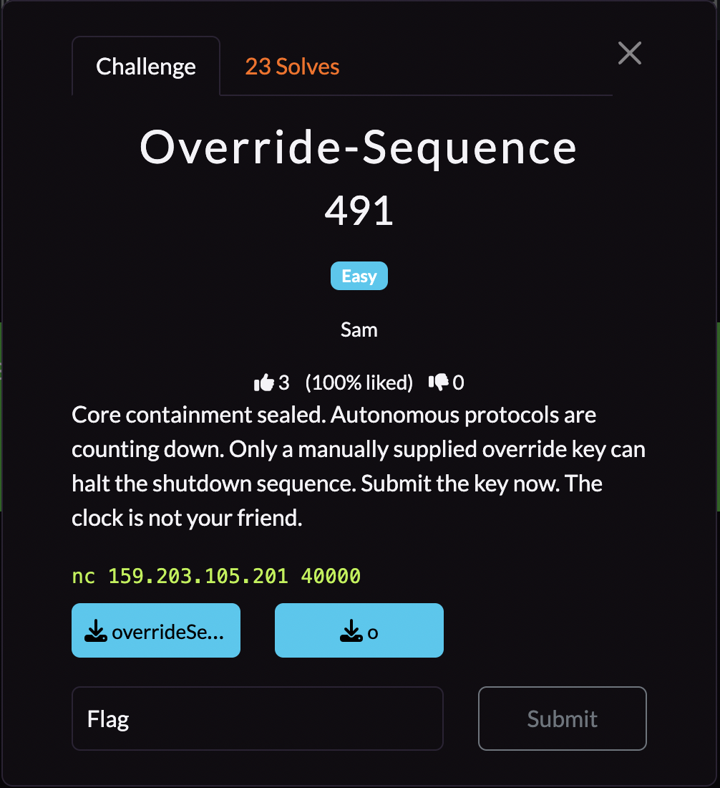
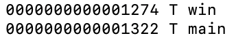
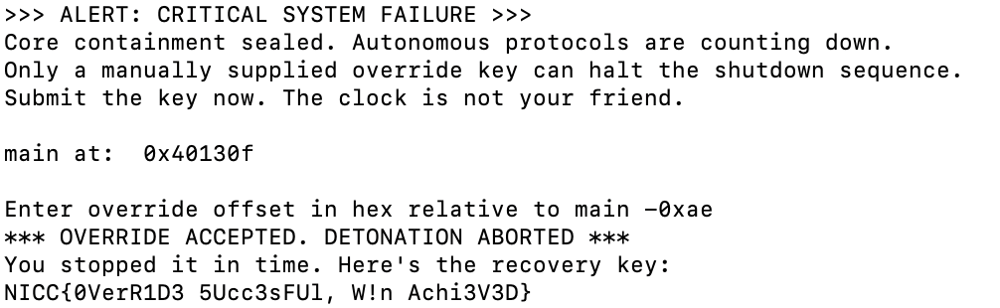

## **Override-Sequence**

### **Challenge Information**

<p align="center">
  
</p>

#### **Challenge Files**

[o](assets/override-sequence/o)
[overrideSequence.c](assets/override-sequence/overrideSequence.c)
```
#include <stdio.h>
#include <stdlib.h>
#include <string.h>

unsigned long jump_offset;

int intro(void){
    puts(">>> ALERT: CRITICAL SYSTEM FAILURE >>>");
    puts("Core containment sealed. Autonomous protocols are counting down.");
    puts("Only a manually supplied override key can halt the shutdown sequence.");
    puts("Submit the key now. The clock is not your friend.\n");
    return 0;
}

int win(void){
    puts("*** OVERRIDE ACCEPTED. DETONATION ABORTED ***");
    puts("You stopped it in time. Here's the recovery key:");
    FILE *fd = fopen("flag.txt", "r");
    char buf[128];
    fgets(buf, sizeof(buf), fd);
    printf("%s\n", buf);
    fclose(fd);
    fflush(stdout);
    exit(0);

    return 0;
}

int main(void){
    intro();


    printf("main at:  %p\n", (void*)main);

    printf("\nEnter override offset in hex relative to main ");
    if (scanf("%lx", &jump_offset) != 1) {
        puts("failed to read override offset");
        return 1;
    }

    unsigned long target = (unsigned long) main + jump_offset;


    if (target == (unsigned long)win) {

        void (*fptr)(void) = (void(*)(void))target;
        fptr();
    } else {
        puts("Override rejected: invalid offset.");

    }

    return 0;
}
```

### **Solution**

From the source code, we can see that `win()` would give us the flag, and `win()` will be called whenever `target == (unsigned long)win` where `target = (unsigned long) main + jump_offset` and `jump_offset` is our input. Doing a little rearranging, we can see that we need `jump_offset == (unsigned long) win - (unsigned long) main` to be true.

We are also given the binary of the code. This is really useful as this allows us to find both `win()` and `main()`'s memory addresses. We can run `nm -n o | egrep ' win$| main$'`. This searches in [o](assets/override-sequence/o) for the offsets of the memory addresses. Since we need the difference between them, we only need relative offsets.



Now we have the memory addresses, we just need to find their difference. We can do this by running [this short python script](assets/override-sequence/helper.py):
```
win = 0x1274
main = 0x1322
print(hex(win - main))
```

What this script does is that it takes the addresses of `win()` and `main()` in hex and does the subtraction and returns the hex value. Running this script gives us `-0xae`, which is what our `jump_offset` needs to be. Note that this can be negative as `scanf("%lx", &jump_offset)` also takes negative values and converts them to their unsigned version. Connecting to the server and inputting that gives us our flag.



The flag is: `NICC{0VerR1D3 5Ucc3sFUl, W!n Achi3V3D}`