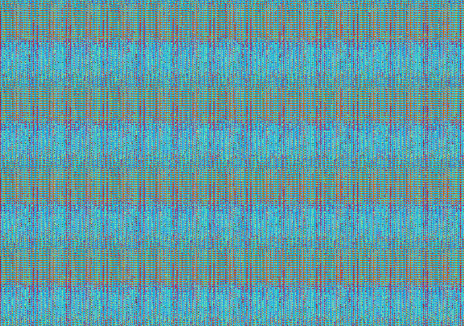
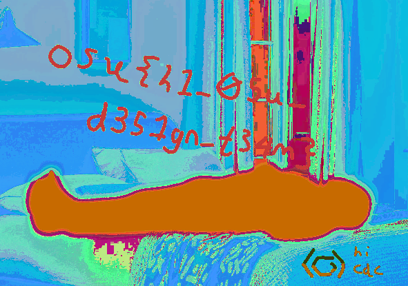

## **crypto/beyond-wood**

### **Challenge Information**

```
crypto/beyond-wood
392 solves / 106 points
spinning white floating glowing man in forest

expected difficulty: 1/5

Author: wwm
```

#### **Challenge Files**

script.py:

```
from PIL import Image
import random

FLAG = Image.open("flag.png")
width, height = FLAG.size

key = [random.randrange(0, 256) for _ in range(width+height+3)]

out = FLAG.copy()
for i in range(width):
    for j in range(height):
        pixel = FLAG.getpixel((i, j))
        pixel = tuple(x ^ k for x, k in zip(pixel, key))
        newi, newj = (2134266 + i * 727) % width, (4501511 + j * 727) % height 
        out.putpixel((newi, newj), pixel)

out.save("output.png")
```

output.png:



### **Solution**

I first noticed that it seems like the output of the script gives a fully jumbled png file. Looking more closely, we can see that the script does 2 things to "flag.png" before outputting it: 
1. It xors all the pixels with a randomly generated key
2. It then moves each pixel to a new location

We need to reverse these actions in order to get the flag.

We first want to move each pixel back to its original location. The formula for the move is:\
 `newi, newj = (2134266 + i * 727) % width, (4501511 + j * 727) % height ` \
 So we can just write out the inverse as so:\
  `i, j = (inv_w * (newi - 2134266)) % width, (inv_h * (newj - 4501511)) % height`\
where `inv_w` is the modular inverse of 727 modulo width and inv_h is the modular inverse of 727 modulo height. Note that we can do this because `gcd(727, width) = 1` and `gcd(727, height) = 1`.

So far, we have reversed the second step and have the script here:
```
from PIL import Image

INPUT = "output.png"
A1 = 2134266
A2 = 4501511
MUL = 727

def inverse(img):
    width, height = img.size
    inv_w = pow(MUL, -1, width)
    inv_h = pow(MUL, -1, height)

    flag = Image.new("RGB", (width, height))
    out = img.load()

    for newi in range(width):
        for newj in range(height):
            i, j = (inv_w * (newi - A1)) % width, (inv_h * (newj - A2)) % height
            flag.load()[i, j] = out[newi, newj]

    return flag

img = Image.open(INPUT).convert("RGB")
inverse(img).save("flag.png")
```
I saved the resutling image to `flag.png` to see how it looked and it ended up looking like this:



From here, we can see that the flag is already visible, and turns out we didn't need to reverse the xors after all.

The flag is: `osu{h1_05u_d351gn_t34m}`