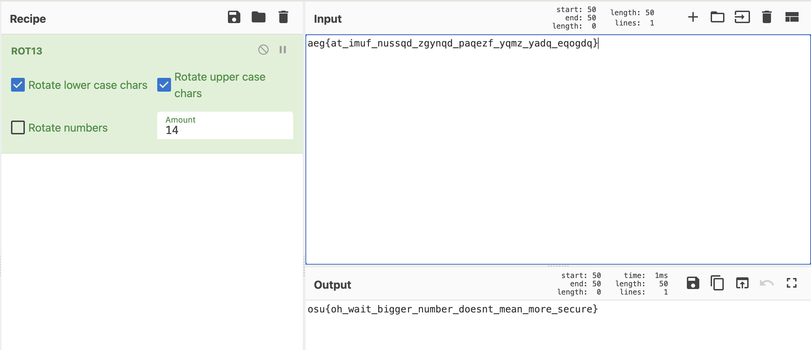

## **crypto/rot727**

### **Challenge Information**

```
crypto/rot727
648 solves / 103 points
i rotated my flag 727 times! that's super secure right

aeg{at_imuf_nussqd_zgynqd_paqezf_yqmz_yadq_eqogdq}

expected difficulty: 1/5

Author: wwm
```

### **Solution**

From the challenge description, we can deduce that `aeg{at_imuf_nussqd_zgynqd_paqezf_yqmz_yadq_eqogdq}` may be the flag but rotated 727 times. Notice that it is of the form "(3 letters){(other stuff)}", which fits the flag pattern of "osu{(flag)}". So we can put it into Cyberchef and rotate it 14 times, which gives us this:



The flag is: `osu{oh_wait_bigger_number_doesnt_mean_more_secure}`